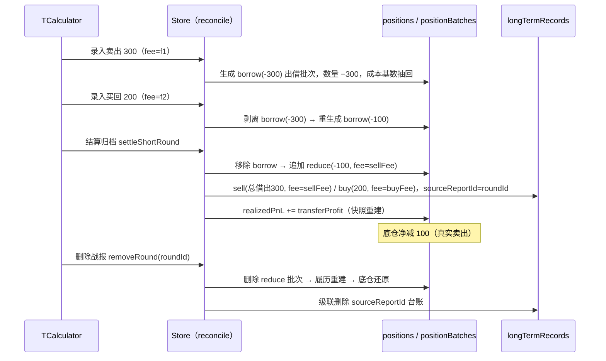
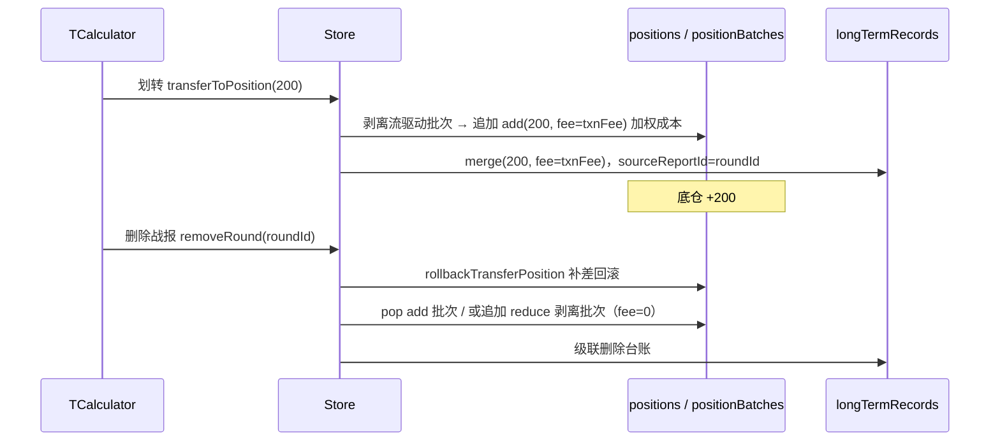
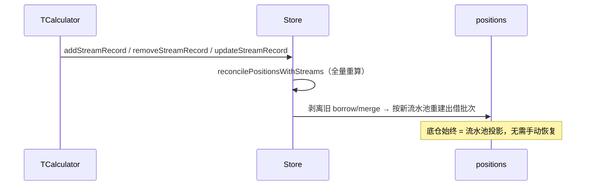

# 做T × 中长期底仓：预期行为说明（行为契约）

> 版本：草案 v1（对齐当前实现，非目标态）
> 范围：做T删除后中长期仓位如何恢复、做T与中长线两侧的手续费口径、全程数据流转
> 关联：参数桥（positionLedger）解耦提案 —— 本文档是"现状行为基线"，重构后行为需保持不变

---

## 0. 角色与数据所有权

| 数据 | 拥有者 | 写入口 |
|---|---|---|
| `tRounds` / `tTransactions` | 做T侧（TCalculator） | `addStreamRecord` / `removeStreamRecord` / `updateStreamRecord` / `clearStreams` / `removeRound` |
| `positions` / `positionBatches` | 中长线侧（CostAveraging） | `addPosition` / `addBatch` / `deletePositionBatch` / `removePosition`，**以及做T归档/删除时的桥接写入** |
| `longTermRecords` | 中长线台账 | `addLongTermRecord` / `removeLongTermRecord`，做T归档时由桥接逻辑写入 |
| `feeConfig` | 全局共享 | `setFeeConfig` |

三条核心约定（当前实现即如此）：

1. **在途（OPENED）不落真实批次**：做T流水只通过 `kind='borrow'` 出借批次挂载"临时占用视图"，随流水池全量重算；
2. **归档（COMPLETED）才落定真实批次**：倒T产生 `reduce` 真实卖出批次、正T/划转产生 `add` 批次；
3. **删除归档战报时，底仓通过两条互斥路径恢复**：`adjustmentBatchIds` 删批次重建（履历式）或 `transferAmount` 补差回滚（近似式），见 §4。

---

## 1. 生命周期总览

```
做T战报生命周期                        底仓侧对应
──────────────────────────────────────────────────────────────
OPENED（流水在途）  ──────────────►  kind='borrow' 出借批次（临时占用视图）
                                    （随流水增删自动剥离/重建，无需手动恢复）
        │
        ├─ settleShortRound（倒T结算）──► 移除出借 + 未回补部分转真实卖出 reduce 批次
        ├─ transferToPosition（划转） ──► 新增 add 划转批次（round.transferAmount）
        │
COMPLETED（归档）  ──────────────►  固化履历（settledAdjustmentIds 保护，
                                     reconcile 不再剥离这些批次）
        │
        └─ removeRound（删除战报）──►  恢复底仓
                                       路径A：按 adjustmentBatchIds 删批次 + 履历重建
                                       路径B：rollbackTransferPosition 补差回滚
```

---

## 2. 做T在途：底仓的"出借"视图

### 2.1 触发时机

TCalculator 每次增/删/改流水后，store 全量对账：

```
activeStreams（仅 OPENED Round 的流水）
  └─► reconcilePositionsWithStreams(positions, streams, feeConfig, rounds)
       ① 收集 settledAdjustmentIds
          （COMPLETED 轮次 transactions 上的 borrowBatchId/mergeBatchId
           → 归档批次视为「固化履历」，reconcile 不再剥离）
       ② 剥离未固化的流驱动批次（kind='borrow' | 'merge'）→ 回到批次履历基线
       ③ 重置幂等标记（baseDeductedAmount / baseMergedAmount / borrowBatchId / mergeBatchId）
       ④ normalizeShortTDeductions：
           净借出 = max(0, Σ卖出 − Σ买入)
           若 > 0 → 生成 1 个 kind='borrow' 出借批次
                    type='reduce', price=卖出加权均价,
                    costPrice=底仓成本, costAfter 不变
       ⑤ processAllStreams 撮合 → results
       ⑥ applyShortExcessMerge：倒T CLEARED 且超额买入>0 → kind='merge' 归并批次
       ⑦ applyIdempotencyMarks 回写 borrowBatchId / mergeBatchId
  └─► set({ tRounds, positions }) + safePersist（persistPositionDiffs）
```

### 2.2 出借批次的显示语义（recomputePositionSnapshot 的 borrow 分支）

- `totalAmount -= 出借量`（数量减少，CostAveraging 显示底仓少了）；
- `totalInvested -= 底仓成本价 × 出借量`（成本基数同步抽回，`currentCost` 不变）；
- **不产生 realizedPnL**（借仓卖出，非真实落袋）。

→ 效果：中长期账本诚实显示"已出借 X 股"；批次带 `kind='borrow'` 标签，不进入真实卖出统计。

### 2.3 在途恢复是"免费"的

在途删除/修改流水 → reconcile 自动剥离并重建出借批次 → 底仓与流水池始终一致，**无需手动恢复**。

示例（倒T：卖出300 → 买回200）：

| 动作 | 净借出 | 底仓批次变化 |
|---|---|---|
| 卖出 300 | 300 | 新增 borrow(-300)，数量 −300 |
| 买回 200 | 100 | 剥离旧 borrow(-300) → 重生成 borrow(-100) |
| 删除买回 200 | 300 | 剥离 borrow(-100) → 重生成 borrow(-300) |
| 删除卖出 300 | 0 | 剥离全部 borrow → 底仓还原 |

### 2.4 在途结仓拦截

`getCloseBlockReason`：该标的若存在非 CLEARED 的撮合结果，或存在 OPENED / 无 closedAt 的 Round
→ CostAveraging 结仓（手动结仓 / 清仓自动结仓）一律被拦截。
这是"出借占用"在交互层的另一面：借出期间不允许把底仓结掉。

---

## 3. 归档：倒T结算 / 正T划转

### 3.1 倒T结算 `settleShortRound(fullCode)`

前置：该 fullCode 流水已撮合（`processAllStreams`）。

数据流转（内存 → DB）：

```
① 收集 adjustmentBatchIds = Σ(borrowBatchId) ∪ Σ(mergeBatchId) ∪ 本方法新建的 reduce 批次 id
② 移除全部出借批次：batches.filter(b => b.kind !== 'borrow')   ← 解除出借
③ 若有未回补（shortPendingAmount > 0，即 settleType='partial'）：
   追加真实卖出批次：
     type='reduce', amount=-shortPendingAmount
     fee = calcTradeFees(avgSellPrice, unmatchedAmount, 'sell', feeConfig, kind).total
     note='倒T未回补转真实卖出（…）'
     → 该批次 id 加入 adjustmentBatchIds
④ 写中长期台账 longTermRecords（sourceReportId = round.id）：
   解除出借：type='sell', amount=总借出量（=已回补+未回补）, fee=sellFee
   回补    ：type='buy',  amount=buyAmount, fee=buyFee
   ★ 台账 fee 是「整批均价重算」，不是做T逐笔流水 fee 之和（仅展示层）
⑤ recomputePositionSnapshot 重建快照
   realizedPnL = snap.realizedPnL + transferProfit（做T波段利润并入底仓已实现盈亏）
⑥ Round → COMPLETED（settleType='clear' | 'partial'；adjustmentBatchIds 存入 round）
⑦ DB 持久化（两段）：
   completeRoundClear（单事务：tRounds.put + tTransactions.bulkPut）
   persistPositionDiffs（positions 快照 + positionBatches 全量替换）
   putLongTermRecord × N
```

### 3.2 正T / 倒T划转 `transferToPosition(fullCode, transferAmount?, transferPrice?)`

```
① 取撮合结果，toTransfer = min(指定量, netPendingAmount)；avg = 指定价或 stream.avgPrice
② txnFee = calcTradeFees(avg, toTransfer, 'buy', feeConfig, kind).total
   ★ 划转按「买入」计手续费，并计入底仓成本
③ 剥离流驱动批次 → 履历基线 → cleanSnap（真实底仓快照）
④ 追加 add 划转批次：
     type='add', price=avg, amount=toTransfer, fee=txnFee
     addInvested = avg*toTransfer + txnFee
     newCost = (oldInvested + addInvested) / (oldAmount + toTransfer)
   （若底仓不存在 → 新建持仓，批次 type='open'，fee=txnFee）
⑤ 中长期台账：type='merge', amount=toTransfer, fee=txnFee, sourceReportId=round.id
⑥ Round → COMPLETED（transferAmount=toTransfer；★不写 adjustmentBatchIds，与倒T结算互斥）
⑦ DB：completeRoundWithMerge（单事务：tRounds + tTransactions + longTermRecords
                               + positions + positionBatches 全量替换）
```

### 3.3 倒T超额买回归并（reconcile 自动路径，未走 transferToPosition）

倒T已 CLEARED 且 `excessBuy = buyAmount − realizedSellAmount > 0` 时：

```
生成 kind='merge' 的 add 批次：
  type='add', price=stream.avgPrice, amount=excessBuy
  newCost = (oldCost*oldAmount + mergePrice*excessBuy) / newAmount
  ★ 无 fee 字段 —— 见 §5.5 风险①
同时：
  该标的全部 buy 流记录共享 mergeBatchId（同一批次 id）
  baseMergedAmount 按比例分摊（幂等，防止多次 reconcile 重复加回）
  生成一条 longTermRecord type='merge'，fee=0
```

---

## 4. 删除战报：中长期仓位如何恢复

### 4.1 总入口 `removeRound(id)`

```
removeRound(id)
├─ 路径 A：round.adjustmentBatchIds 非空（倒T结算归档）
│    → 按批次 ID 删除 + recomputePositionSnapshot 履历重建
├─ 路径 B：round.transferAmount > 0（划转归档）
│    → rollbackTransferPosition 补差式回滚
├─ 公共：
│    → longTermRecords 过滤 sourceReportId === id（台账级联删除）
│    → set({ tRounds 去掉该 round, positions, longTermRecords })
│    → safePersist: deleteRoundWithCascade（单事务）
│        tRounds.delete(id)
│        tTransactions.where(roundId).delete
│        longTermRecords.where(sourceReportId).delete
│        positions.put + positionBatches 全量替换
```

### 4.2 路径 A：删批次 + 履历重建（倒T结算归档）

```
adjustmentBatchIds 实际包含：
  - borrow 出借批次 id —— settleShortRound 时已被 filter 移除 → 删除时命中不到，幂等无害
  - 未回补转真实卖出的 reduce 批次 id —— 真实批次，本次删除的对象
  - 超额归并 merge 批次 id —— 若存在则一并删除
→ 剩余批次 recomputePositionSnapshot → 精确还原到「从未发生这笔倒T」的履历状态
★ 精确性：基于完整批次履历重建（非补差）。即使删除前用户又在中长线侧
  加/减过仓，重建结果依然正确（加减仓批次保留，只移除做T产生的批次）。
★ 手续费：被删批次的 fee 一并消失（totalInvested/realizedPnL 按剩余履历重算）→ 完全干净。
```

### 4.3 路径 B：补差式回滚 `rollbackTransferPosition`（划转归档）

```
① 无匹配底仓 / 已平仓 → 直接 ok，不动底仓
② pos.currentAmount < transferAmount → 拒绝删除，报错：
   「无法删除该战报：底仓数量不足，后续交易已消耗该归并持仓」
③ 回退成本（用 round.avgPrice，不是真实批次价格）：
   newAmount = currentAmount − transferAmount
   newTotalValue = currentCost×currentAmount − avgPrice×transferAmount
   newCost = newTotalValue / newAmount
④ 批次处理（二选一）：
   - 最后一笔是 add 且 |amount−transferAmount|<0.001 且 |price−avgPrice|<0.001
       → pop 删除该 add 批次（干净回滚）
   - 否则 → 追加一笔 reduce 剥离批次，fee=0
       note='剥离归并持仓（回滚 Round）'
⑤ totalInvested = Σ(price×amount + fee)（按剩余履历重算）
⑥ newAmount <= 0 → isClosed=true, closedAt=now
★ 精确性风险（与路径 A 不对等）：
   - 回退值用 avgPrice（加权划转价），与真实批次成本可能不一致；
   - 不匹配时追加的 reduce 剥离批次会参与 realizedPnL 计算（按摊薄成本），
     制造出「本来没发生过的卖出」；
   - fee 回退为 0，划转时计入底仓的 txnFee 残留在 totalInvested；
   → 若期间用户在中长线侧加/减过仓、或删除过批次，路径 B 的结果
     与「完全重放履历」可能不一致（见 §5.5 风险②）。
```

### 4.4 恢复结果核对表

倒T 卖出300 → 买回200 → 结算 → 删除：

| 阶段 | 底仓数量 | 底仓批次变化 |
|---|---|---|
| 结算前 | 底仓 −100（借出视图） | ... + borrow(-100) |
| settleShortRound 后 | 底仓 −100（真实卖出） | ... + reduce(-100, fee=sellFee)，borrow 已移除 |
| 删除战报后 | 底仓（还原） | ...（无 borrow、无该 reduce）|

正T 划转 200 股 → 删除：

| 阶段 | 底仓数量 | 底仓批次变化 |
|---|---|---|
| transferToPosition 后 | 底仓 +200 | ... + add(200, fee=txnFee) |
| 删除战报后 | 底仓（还原） | pop add 批次；若期间有后续操作则不匹配 → 追加 reduce 剥离批次 |

### 4.5 边界条件

- **完全回补倒T**（shortPendingAmount=0，settleType='clear'）：无 reduce 批次，
  adjustmentBatchIds 仅含已被移除的 borrow id → 删除战报后底仓无任何变化 ✓
- **底仓被后续操作消耗**：路径 B 在 `currentAmount < transferAmount` 时**拒绝删除**
  （路径 A 无此限制，重建后数量不足会自动 isClosed）。
- **删除在途 OPENED 战报**：走 `clearStreams` 语义（tRounds 移除 + reconcile 自动剥离 borrow）→ 底仓还原。
- **删除后 CostAveraging 即时一致性**：Zustand 内存态先更新（set），DB 异步删除
  （`deleteRoundWithCascade` 经 safePersist）；`useArchivedRounds` 对本地 tRounds
  做 ID 过滤，避免 UI 读到删除前的脏数据。

---

## 5. 手续费全景

### 5.1 做T侧（流水自含）

- 录入时：TCalculator 计算
  `fee = calcTradeFees(price, amount, direction, feeConfig, kind).total`
  （印花税仅卖出、佣金免五/最低5元、过户费双向；先各自四舍五入到分再合计）→ `record.fee` → `tTransactions`。
- 撮合 `realizedFee` 只计**已配对**部分的规费：
  - 正T = 全部卖出费 +（本轮买入费 − 未平仓买入费）
  - 倒T = 全部买入费 +（本轮卖出费 − 未回补卖出费）
- Round 概览 `totalFees` = `result.totalFee`。
- 做T收益 `netProfit` / `transferProfit` 为净额口径（已扣规费）。

### 5.2 中长线侧（CostAveraging 手工操作）

- 建仓/加仓：`totalInvested += price×amount + buyFee`；`batch.fee = buyFee`。
- 减仓：`realizedPnL += (price×amount − sellFee) − 摊薄成本基数`；`batch.fee = sellFee`。
- 快照重建（`recomputePositionSnapshot` / `recalculatePosition`）同口径：
  买入入本、卖出按净回款计盈亏、borrow 只抽回成本基数不计盈亏。

### 5.3 桥接手续费（归档瞬间，做T → 底仓）

| 归档动作 | 产生的手续费 | 去向 |
|---|---|---|
| 倒T未回补转真实卖出 | `sellFee`（按未回补量） | reduce 批次 fee → 进入底仓履历（计入 realizedPnL） |
| 倒T解除出借台账 | `sellFee`（按总借出量） | longTermRecord（仅展示，不入底仓） |
| 倒T回补台账 | `buyFee`（按回补量） | longTermRecord（仅展示，不入底仓） |
| 倒T已回补部分 | 无新增（已在做T流水 fee 计过） | — |
| 正T/倒T划转 | `txnFee`（按划转量，方向='buy'） | add 批次 fee → 计入底仓成本 |
| 倒T超额归并（自动） | **无 fee** | merge 批次（口径缺口，见 §5.5 风险①） |

### 5.4 删除战报时手续费怎么走

| 恢复路径 | 手续费去向 |
|---|---|
| 路径 A（删批次重建） | reduce/merge 批次的 fee 随批次删除而消失，totalInvested/realizedPnL 按剩余履历重建 → 完全干净 |
| 路径 B（补差回滚） | 划转 txnFee **不退还**（`rollbackTransferPosition` fee=0）；追加的 reduce 剥离批次 fee=0，按「零手续费卖出」进入履历 → 与「从未发生」不一致 |
| 台账 | `longTermRecords`（sourceReportId）级联删除，展示性 fee 一并消失 |

### 5.5 已知不一致点 / 风险清单

1. **超额归并无手续费**：`applyShortExcessMerge` 的 merge 批次无 fee，
   而 `transferToPosition` 的 add 批次含 txnFee —— 两条「做T超额归并底仓」路径口径不一致。
2. **补差回滚不精确**：`rollbackTransferPosition` 用 avgPrice 回退成本、fee=0，
   不匹配时追加 reduce 剥离批次（制造虚假 realizedPnL）—— 与路径 A 的履历重建精度不对等。
3. **台账 fee ≠ 流水 fee**：解除出借/回补台账按整批均价重算，与做T逐笔流水 fee 之和可能不同（仅展示层，不影响底仓）。
4. **两套快照算法**：`recomputePositionSnapshot`（store/utils，底仓履历口径）与
   `recalculatePosition`（utils/calculator，含做T对冲台账口径）。
   归档时手动 `realizedPnL += transferProfit`，导致 CostAveraging 与 Statistics 展示的
   realizedPnL 语义不同。
5. **结仓拦截依赖双向读**：`getCloseBlockReason` 读撮合结果 + tRounds；
   做T在途时 CostAveraging 结仓被拦。这是特性，但也证明「做T ↔ 中长线」的依赖无法物理消除，只能接口化。

---

## 6. 核心场景时序图

### 6.1 倒T：卖出300 → 买回200 → 结算 → 删除



### 6.2 正T：划转 200 股 → 删除



### 6.3 在途流水变更（增/删/改）→ 底仓自动对账



---

## 7. 附录：关键代码索引

| 主题 | 位置 |
|---|---|
| 在途对账（剥离/出借/归并/幂等回写） | `src/store/index.ts` `reconcilePositionsWithStreams` |
| 出借批次生成（净借出） | `src/store/index.ts` `normalizeShortTDeductions` |
| 超额买回归并批次 | `src/store/index.ts` `applyShortExcessMerge` |
| 快照重建（底仓履历口径） | `src/store/utils.ts` `recomputePositionSnapshot` |
| 快照重建（含做T对冲台账口径） | `src/utils/calculator.ts` `recalculatePosition` |
| 划转归档（add 批次 + 台账） | `src/store/index.ts` `transferToPosition` |
| 划转归档 DB 事务 | `src/db/index.ts` `completeRoundWithMerge` |
| 倒T结算归档（移除出借 + reduce 批次 + 台账） | `src/store/index.ts` `settleShortRound` |
| 倒T结算 DB 事务 | `src/db/index.ts` `completeRoundClear` |
| 删除战报（双路径恢复） | `src/store/index.ts` `removeRound` |
| 删除战报 DB 级联事务 | `src/db/index.ts` `deleteRoundWithCascade` |
| 补差式回滚 | `src/store/utils.ts` `rollbackTransferPosition` |
| 结仓拦截（双向读） | `src/store/utils.ts` `getCloseBlockReason` |
| 手续费计算（单边） | `src/utils/mathUtils.ts` `calcTradeFees` |
| 撮合 realizedFee / transferProfit 口径 | `src/utils/tStreamEngine.ts` `processStockStream` |
| 做T录入手续费 | `src/views/TCalculator.tsx`（addStreamRecord 调用处） |
| 中长线手工加减仓手续费 | `src/views/CostAveraging.tsx` `handleBatchConfirm` |

---

## 8. 展望：与「参数桥（positionLedger）」提案的映射

行为契约落定后，参数桥应保证以下现有行为等价：

| 现有行为 | 参数桥后的形态 |
|---|---|
| `normalizeShortTDeductions` 直接写 borrow 批次 | `applyRoundAdjustments({ action:'borrow', qty, roundId })`（出借视图由中长线侧持有） |
| `applyShortExcessMerge` 写 merge 批次（无 fee） | `applyRoundAdjustments({ action:'merge-excess', qty, roundId })`，fee 由中长线侧统一计算（补上风险①） |
| `settleShortRound` 移除出借 + 未回补转真实卖出 | `applyRoundAdjustments({ action:'reduce', qty, roundId })` + 台账落账 |
| `transferToPosition` 内联加权加仓 | `applyRoundAdjustments({ action:'merge', qty, price?, roundId })`，成本由中长线侧自快照重算 |
| `removeRound` 双路径恢复（A 删批次 / B 补差） | `reverseAdjustment(roundId)`：按 roundId 定位已应用命令，逐条逆向（统一为履历式，消除风险②） |
| 手续费三处 `calcTradeFees`（批入/批出/划转） | 收敛：中长线侧统一计算，做T只发 `qty` + 参考 `price` |
| `getCloseBlockReason` 读撮合 + tRounds | 中长线侧订阅「出借中」视图（Σborrow − Σ已回补 > 0 即拦截结仓） |

