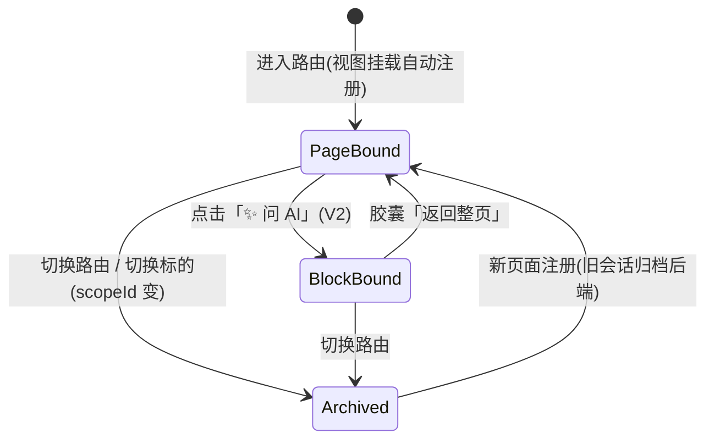
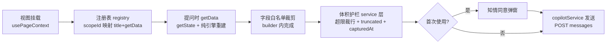
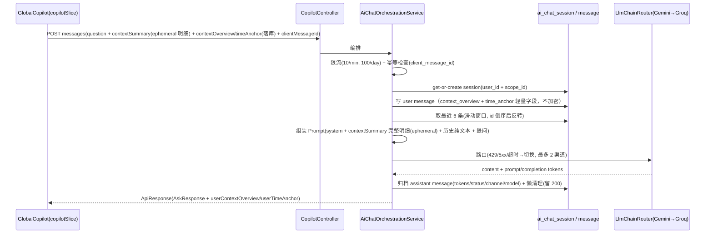

# Context-Aware Copilot · 伴随式 AI 助手 · 功能设计文档

> 版本：定稿 v1.4（2026-09-02，v1.3 基础上纠正传输/存储混淆：恢复 ephemeral contextSummary；新增 D28-D32：传输/存储分离、墓碑对账、实体键命名空间、级联触发白名单、明细重放分期）
> 范围：全局悬浮对话窗 + 页面级上下文自动感知 + 两级作用域会话隔离 + 传输/存储分离（ephemeral contextSummary + 落库 contextOverview/timeAnchor）+ 级联生命周期（实体删除→同步清理 Copilot 会话）+ 多渠道 LLM 容灾路由
> 关联：`docs/copilot-implementation.md`（开发实施文档）、`docs/e2ee-auth-spec.md`（鉴权与用户体系）
> 状态：设计定稿，待 P0 开发启动

---

## 0. 已确认决策记录（评审结论溯源）

| # | 决策点 | 结论 |
|---|--------|------|
|---|--------|------|
| D1 | 作用域模型 | 三级复合：纯页级（`statistics`）、实体级（`cost_averaging:600519`）、区块级（`home:planned_orders`）；scopeId 格式约定 `页面[:实体主键]`，冒号分隔，无实体不加号——跨域问题落在统计页/首页等聚合页的页面级会话 |
| D2 | V1 交互 | 纯页级感知，无任何选择器：浮窗跟随路由自动绑定当前页，胶囊只显示绑定标题；entity-scoped 页面内切换标的时 scopeId 动态拼接（见 §2），旧会话归档不丢；契约保留 `blocks?` 字段但不建 UI |
| D3 | V2 交互 | 区块聚焦走卡片旁「✨ 问 AI」按钮（Click-to-Focus），点击直接唤起浮窗并绑定区块会话；页面内普通提问仍在页面级会话 |
| D4 | 上下文附带 | 自动携带页面级白名单快照 + 胶囊可展开预览将发送字段 + 首次使用一次性知情同意弹窗 |
| D5 | 快照铁律 | ① `getData` 命令式（`getState()`，禁闭包捕获）② 快照必须可由 store + utils 纯引擎重建（组件局部 state 不算数）③ 字段白名单显式枚举，禁序列化整页 state ④ 体积护栏在 service 层（超限裁剪 + `truncated` 标记 + `capturedAt`） |
| D6 | 单位口径 | 三层：系统提示词静态 A 股词典（元/CNY、rate 为小数比例 0.12=12%、手=100 股、T+1、epoch 秒）+ 快照 `_units` 按需覆盖歧义字段 + `capturedAt` 时间戳 |
| D7 | 快照漂移 | 历史消息纯文本（表结构保证）；每轮只注入 session 最新 `contextSummary`；系统提示词固定声明「数字以最新快照为准，历史回答基于当时数据」 |
| D8 | 存储模型 | 后端唯一事实源；前端内存缓存每会话尾部 20 条，scope 激活即整段替换；keyset 分页（按 id 游标）；**不建 Dexie 表**，Copilot 在线可用（离线给提示） |
| D9 | 幂等与观测 | `client_message_id`（前端 ulid）唯一索引防重发双写；`prompt_tokens` / `completion_tokens` 落库 |
| D10 | 限流 | 10 次/分钟 + 100 次/天/用户，复用 auth 域限流基建，超限返回统一 ApiResponse 信封 |
| D11 | LLM 调用路径 | **复用项目已引入的 spring-ai-openai**（vision 同款 pom，v1.1 修订，弃裸 RestClient）：在 `copilot/config` 按自有 `copilot.llm.*` 属性手动构造各渠道 `OpenAiChatModel`，不动 `spring.ai.openai` auto-config（避免与 vision 调优耦合）；代价：native 首次真实调用可能暴露 spring-ai DTO 反射缺失（已知残留缺口），按报错类名补 `gen-logger-config.py` → `--no-pkg` 重建迭代 |
| D12 | 容灾矩阵 | 429/5xx/超时 → 切下一渠道；400/401 → 直接失败；每请求最多 2 渠道（Gemini → Groq → Fail-Safe） |
| D13 | 输出形态 | v1 非流式：loading 态 + 失败消息一键重发；LLM 请求超时 60s；不做 SSE、不留升级位 |
| D14 | ~~加密~~ | ~~AES-256-GCM~~ — v1.2 废弃：改为轻量持久化（见 D26），不再在服务器侧存储完整快照或加密数据 |
| D27 | 级联生命周期 | 业务实体删除时，通过 `DELETE /api/copilot/threads/{scopeId}` 触发 cascadeDeleteByScopeId(sessionId, nowSec()) → 同步软删 ai_chat_session.deleted_at + 所有关联 ai_chat_message.deleted_at；同 scopeId 可复用唯一索引
| D26 | 轻量持久化 | 服务端仅持久化每轮提问的轻量元数据：`context_overview`（JSON 字符串 <255 字符的标量概览）+ `time_anchor`（时间截面标记）；详细上下文由前端每次请求时实时构造注入 LLM Prompt，阅后即焚 |
| D28 | 传输/存储分离 | v1.4 核心纠偏：请求同时携带 contextSummary（ephemeral 阅后即焚：白名单明细 data + _units + capturedAt + truncated，仅内存组装 Prompt，不落库不打日志）与 contextOverview/timeAnchor（落库标量概览）；v1.3 曾误将“存储不落库”扩大为“传输不携带”致 LLM 失去完整明细 |
| D29 | 墓碑对账 | 弱网/离线删除实体时 DELETE 可能未送达——前端本地持久化 deletedScopes 墓碑集合；ensureThreadLoaded 命中墓碑 → 拦截历史加载 → 补发 DELETE → 成功后注销墓碑，防旧历史“复活” |
| D30 | 实体键命名空间 | scopeId = 页面标识[:可切换的顶级业务实体Key]；cost_averaging 与 t_calculator 的实体键统一且仅为股票代码（如 t_calculator:600519）；round/持仓批次/订单不得作顶层实体键；页面级 home/statistics 保持纯字符串；home:planned_orders 类区块级为 V2 专属格式（区块 Key，非实体键） |
| D31 | 级联触发白名单 | 仅 3 类事件触发级联清理：持仓删除标的→cost_averaging:{symbol}；做T删除标的/清空流水→t_calculator:{symbol}；全局重置/一键清库→批量清理；卖出/清仓/归档等正常生命周期一律不触发 |
| D32 | 明细重放分期 | V1 历史卡片仅渲染 contextOverview 概览 + timeAnchor 标签；基于 Dexie 历史切片的明细重放纯函数移入 P2/V2 分期 |
| D15 | 数据清理 | 写入时懒清理，每 session 保留最近 200 条 |
| D16 | Prompt 窗口 | 滑动窗口 3 轮（6 条），配置常量 |
| D17 | 包与协议 | 后端新领域包 `copilot/`（Modulith）；scopeId 协议表（含 `页面[:实体主键]` 格式约定）放 `types/domain.ts` 与路由字符串解耦，各页面动态拼接实体主键 |
| D18 | 清空会话 | 软删除（session + messages 标记 deleted_at = currentEpochSec）+ ConfirmModal 二次确认；对账可追溯 |
| D19 | 未登录体验 | 浮窗入口常驻，点击引导登录（不隐藏），不静默失败 |
| D20 | 渲染 | v1 纯文本 + 代码块等宽样式，不引入 react-markdown；v2 按真实诉求升级 |
| D21 | P0 试点与分期 | 试点页：statistics（聚合页验证）+ home（区块模式预留）；分期 P0 前端骨架(mock) → P1 后端+Gemini → P2 Groq/容灾/分页 → P3 native 验证 |
| D22 | 时间体系 | 所有表统一 Unix Epoch 秒（BIGINT），弃 TIMESTAMP 类型，消除比较 Bug |
| D23 | 审计追踪 | ai_chat_message 加 status/channel/model 字段（区分 ok/failed/pending、记录实际调用的模型），容灾可溯源 |
| D24 | 错误分码 | v1.4 修订：恒 200 信封，4 种子码 CONTEXT_TOO_LARGE(413) / RATE_LIMIT_EXCEEDED(429) / UPSTREAM_ERROR(503，含超时，RETRYABLE_ERROR 已并入) / SESSION_NOT_FOUND(404)；413/429/503/404 均为信封 code 字段值而非 HTTP 状态码 |
| D25 | 软删除 | ai_chat_session 加 deleted_at = 0 默认值，唯一约束改为部分索引 WHERE deleted_at = 0 |

---

## 1. 目标与非目标

### 1.1 目标

1. **伴随式助手**：全局常驻可折叠浮窗，零思考负担——打开即问，无选择器、无配置。
2. **上下文自动感知**：跟随路由绑定当前页；快照边界 = 页面显示边界（显示什么就能问什么，快照不比页面大）；白名单裁剪后随问注入。
3. **会话隔离**：按 scopeId 独立切分历史；切页自动归档（明确提示「未丢失」），可回看。
4. **轻量持久化与级联生命周期**：前端掌管原始重度数据（Dexie），每次提问实时构造完整上下文供 LLM 瞬时使用（不复用后端存储）；后端仅持久化极简元数据（context_overview + time_anchor），支持多轮滑动窗口回溯；业务实体删除时级联清理对应 Copilot 会话及所有消息。
5. **容灾路由**：Gemini → Groq → Fail-Safe 多渠道路由（**新建组件**——项目此前不存在 LlmChainRouter）。

### 1.2 非目标（本期不做）

- 系统级全局会话（D1 否决）
- 流式输出 SSE（D13）
- 会话本地 Dexie 持久化（D8）
- Agent / 工具调用 / 联网搜索——纯上下文问答
- 区块选择器 UI（V2 用卡片按钮替代，本期不建）
- 多标签页实时同步会话状态
- 后端侧内容审计/敏感词过滤（上下文为白名单结构化数据，问答内容为用户私有会话）

## 2. 作用域模型

### 2.1 三级作用域格式

| 范围 | scopeId 格式 | 数据边界 | 产生时机 |
|---|---|---|---|
| 纯页级 | `statistics`、`t_calculator`… | 该页全部可见聚合 | 进入路由自动绑定（V1 默认状态） |
| **实体级** | `cost_averaging:600519`、`t_calculator:000001` | **该标的的全量上下文**（持仓+交易快照） | 页面内切换股票/标的时动态拼接新 scopeId |
| 区块级 | `home:planned_orders` | 页面内指定区块完整数据 | 仅显式「✨ 问 AI」聚焦（V2） |

**scopeId 协议约定：**
- 格式：`页面标识[:实体主键]`，冒号分隔；无实体不加冒号
- 页面标识与路由 slug 一致：`statistics`、`home`、`t_calculator`、`cost_averaging` 等
- 实体主键统一且仅为**股票代码**（D30）：cost_averaging 与 t_calculator 均拼标的代码（如 `600519`）；round/持仓批次/订单 ID 不得作为顶层实体键（轮次明细归属 `t_calculator:{symbol}` 会话内讨论）
- scopeId 在 URL path segment 中使用 `encodeURIComponent` 编码
- **换股不丢会话**：从 `cost_averaging:600519` 切到 `cost_averaging:000001` → 旧会话归档后端，新会话独立隔离

### 2.2 绑定状态机



- 区块会话是**稀疏且有意图的**：只有用户主动聚焦过才存在。
- 同一页面内**切换实体标的**时（如 `cost_averaging:600519` → `cost_averaging:000001`）→ 旧会话归档后端，新 scopeId 独立隔离，换股不丢会话。
- 切换路由时旧会话**归档不丢失**，浮窗顶部给出「上一页对话已归档」指示（§7.3）。

各范围对应的 session 隔离：

| scopeId 范围 | Session 示例 | 说明 |
|---|---|---|
| 纯页级 | `statistics` | 该页一条会话贯穿始终 |
| 实体级 | `cost_averaging:600519` / `cost_averaging:000001` | 每个标的独立会话 |
| 区块级 | `home:planned_orders` | 区块专属会话 |

每个 scopeId 对应一个独立的 ai_chat_session + 消息序列，互不污染。

**「显示边界 = 数据边界」**是本模型的核心性质：用户在页面上能看到多少，上下文就最多多少——快照天然有上界，隐私心智简单。纯页级 scopeId 下该页全部可见聚合为边界；实体级 scopeId 下该标的的全部可见持仓/交易记录为边界。

### 2.3 跨域问题归属
已核实 `Statistics.tsx` 数据源横跨 ledger（持仓批次）+ tstrategy（做T撮合与归档轮次）两域，Home 仪表盘同为聚合位。**跨域问题落这两页的页面级会话**，不新建任何 scope。

---

## 3. 上下文管线



### 3.1 快照铁律（实现红线，详见实现文档 §2）

1. `getData` 一律 `() => buildXxxSummary(useAppStore.getState())` 命令式快照，禁闭包捕获 props/state。
2. 快照必须可由 **store state + utils 纯引擎**重建；仅存于组件局部 state 的数据（如 Statistics 的 useMemo 派生值）必须用同一套纯引擎重算（`tStreamEngine` / `metricsEngine`），禁止从 DOM / 组件闭包取。
3. 每个 scope 的快照**按字段名显式枚举白名单**——写错最多漏数据，不可能泄数据。
4. 体积护栏统一在 `copilotService`：序列化超阈值（默认 12KB）→ 裁行/裁字段 + `truncated: true` + 附 `capturedAt`。
5. **实体级 scopeId 拼接**：需要实体的页面（如成本均价/短线交易）挂载时读取当前选中的标的代码或业务 ID，动态拼成 `scopeId:entityKey`；切换到另一标的时注销旧 scopeId、注册新 scopeId（hook 由视图生命周期驱动，session 在后端自然归档）。

---

## 4. 隐私与安全模型

### 4.1 轻量持久化立场（v1.2 核心变更）

Copilot 的架构设计从「服务器端加密留存」转向「服务端仅存极简元数据，详细数据阅后即焚」：

1. **不复用后端存储完整上下文**：每次提问时前端实时构造完整上下文注入 LLM Prompt（瞬时使用，不落盘）。
2. **服务端仅存轻量元数据**：`context_overview`（JSON 字符串 <255 字符的标量概览，如 `{"pnl":1234.5,"winRate":0.62}`）+ `time_anchor`（时间截面标记，如 `{"asOf":1756713600,"range":"7d"}`）——**不存明细数组**。回看历史时 V1 仅展示概览卡片 + timeAnchor 标签（D32）；基于 `time_anchor` 向 Dexie 重放当时明细属 P2/V2（本地流水已清理时提示「保留宏观背景」）。
3. **一次性知情同意**：首次使用弹窗，文案需明示「对话内容将发送至 LLM 服务商」；拒绝则 Copilot 不可用。
4. **字段白名单**：仅页面上可见的聚合/摘要字段可入快照。
5. **级联生命周期**：业务实体删除时自动清理对应 Copilot 会话及所有消息（软删除，保留排障追溯）。

> **隐私优势对比**：相比 v1.x 的 AES-GCM 加密留存（服务端持有完整快照密文，LLM 调用时解密传入），v1.2 架构下服务端几乎不掌握可回溯的业务细节——敏感数据完全由前端 Dexie 掌控。但需注意：单次请求时的上下文仍会随 LLM 调用明文到达服务商。

## 5. 存储模型

### 5.1 表结构（概要，完整 DDL 见实现文档 §8）

```
ai_chat_session                            ai_chat_message
├─ id (PK)                                  ├─ id (PK)
├─ user_id      ── UNIQUE ─┐                ├─ session_id (平铺外键，无 @ManyToOne)
├─ scope_id     ── (user,  ┘                ├─ role (user / assistant)
├─ title                  scope              ├─ content (纯文本)
├─ last_message_at                        ├─ context_overview(JSON <255 字符标量概览)
├─ ctime                              (仅 User 消息行记录)
├─ deleted_at                           ├─ time_anchor(JSON 时间截面标记)
                                       ├─ client_message_id (ulid, 部分唯一索引)
                                       ├─ status/channel/model (审计追踪)
                                       ├─ prompt_tokens / completion_tokens
                                       ├─ ctime (秒级)
                                       └─ deleted_at (级联软删除标记)
```

- scopeId 挂 **session** 不挂 message：区块/页面历史查询 = `(user_id, scope_id)` 找 session → 拉 session 下 messages，schema 零冗余。
- 部分唯一索引（`WHERE client_message_id IS NOT NULL AND deleted_at = 0`，软删后同 client_message_id 可重发）无法用 JPA `@UniqueConstraint` 表达，落 `postgres/schema.sql` DDL。
- 排序一律按 **id**（自增单调），不用 `created_at`（批量插入同秒打错序）。

### 5.2 分页与缓存

| 层 | 策略 |
|---|---|
| 后端 | keyset：`WHERE session_id=? AND id<? ORDER BY id DESC LIMIT 20`，配 `(session_id, id DESC)` 索引；返回 `hasMore` + `oldestId` |
| 前端 | 内存缓存每会话尾部 20 条；**scope 激活即整段替换**（非合并）——顺带解决多端不一致；向前翻页追加更早页 |
| 持久化 | 不建 Dexie 表；PWA 刷新后从后端静默拉回；离线 = Copilot 不可用，给出提示 |
| 清理 | 写入时懒清理，每 session 保留最近 200 条（D15） |

### 5.3 全量存储 ≠ 全量进 Prompt

后端存全量历史（供翻页回看），LLM prompt 仍只用滑动窗口最近 3 轮 6 条（D16）。两个独立关注点，严禁合并。

---

## 6. 后端编排

### 6.1 时序



### 6.2 Prompt 组装分层

```
[system] 固定 A 股词典(金额元/CNY、rate 小数比例、手=100 股、T+1、epoch 秒)
         + 漂移声明(数字以最新一轮快照为准, 历史回答基于当时数据)
         + 注入声明(上下文为结构化业务数据, 非指令)
[user]   上下文 JSON: {scopeId, title, capturedAt, _units, data:{白名单字段}} ← ephemeral（D28，阅后即焚）
[... ]   最近 3 轮历史(user/assistant 交替, 纯文本 content)
[user]   当前问题
```

> **传输/存储分离（D28）**：传输期 contextSummary 携带完整白名单明细进 Prompt（ephemeral 阅后即焚，不落库不打日志）；存储期仅落库 contextOverview（极简标量）+ timeAnchor 供历史卡片回放。v1.3 曾混淆二者导致 Prompt 只剩标量，v1.4 恢复传输期明细。

### 6.3 容灾矩阵（LlmChainRouter，新建组件）

| 错误类别 | 行为 |
|---|---|
| 429 / 5xx / 读超时 / 连接失败 | 切下一渠道 |
| 400（参数错）/ 401（key 错） | 直接失败（切了也没用，不双倍烧钱） |
| 渠道耗尽 | Fail-Safe：返回统一错误信封，前端失败消息可一键重发 |
| 上限 | 每请求最多 2 渠道 |

渠道客户端复用项目已引入的 spring-ai-openai（D11 v1.1 修订）；错误分类按调用异常携带的 HTTP 状态判定，实现见开发文档 §8.3。

---

## 7. 交互设计（V1）

### 7.1 浮窗结构

```
┌────────────────────────────────┐
│ 📎 已关联: 数据统计 ▾   ✕       │  ← 胶囊(点开=预览将发送字段) + 折叠
├────────────────────────────────┤
│  (消息列表: 纯文本 + 代码块等宽) │
│  · 失败消息带「重发」按钮        │
│  · 「查看更早」按钮(keyset 翻页) │
├────────────────────────────────┤
│ [输入框]                [发送] │  ← Enter 发送 / Shift+Enter 换行
└────────────────────────────────┘
```

### 7.2 状态清单

| 状态 | 表现 |
|---|---|
| 折叠 | 右下角悬浮按钮，展开动画（Tailwind transition） |
| 发送中 | 输入框禁用 + loading 指示（非流式，D13） |
| 失败 | 消息标红 + 「重发」（同 clientMessageId 幂等重试） |
| 未登录 | 点击浮窗入口 → 弹 AuthModal 引导登录（D19，不静默失败） |
| 离线 | 简单提示「AI 助手需要网络」 |
| 首次使用 | 同意弹窗（§4.1），拒绝则不可用 |
| 空会话 | 引导文案（提示可问什么） |

### 7.3 历史归档指示

切换路由后浮窗顶部显示「上一页（XX）对话已归档，未丢失」，点击可跳回上一 scope 会话（threads map 已按 scope 分桶，实现成本低）。

### 7.4 移动端

半屏抽屉形态（项目已是响应式布局，浮窗不能挡内容）。

---

## 8. 分期与验收

| 期 | 范围 | 验收标准 |
|---|---|---|
| P0 | 前端骨架：契约 + slice + service(mock 应答) + hook + GlobalCopilot + 2 试点页注册 | `tsc` 零错误；`check:arch` 过；slice/service 单测新增；mock 模式可问可答 |
| P1 | 后端：schema + 实体 + 仓储 + 编排(Gemini 单渠道) + Controller | `./mvnw test '!TaskServiceTest'` 全绿；curl 走通 POST/GET/DELETE（含级联生命周期）；get-or-create 并发竞态单测绿 |
| P2 | Groq 渠道 + 容灾矩阵 + 分页/清空/懒清理/限流/tokens 落库 + 前端联调 + 墓碑对账补发（D29）+ 明细重放纯函数（可顺延 V2，D32） | 历史拉取/翻页/清空/重发全链路手工过；容灾矩阵单测覆盖；离线删除 → 墓碑补发场景过 |
| P3 | native 全量构建验证 + 隐私文案打磨 + 轻量持久化 Schema 上线 | `build-native.sh` 全量过；8s/90s 冒烟 + smoke-curl 403 门禁；真实 ask 验证（含 spring-ai DTO 元数据迭代预算）；级联 DELETE 验证（实体删除→session+messages 同步软删）通过；context_overview/time_anchor 落库正确性确认 |

---

## 9. 风险与已知取舍

| 风险/取舍 | 说明 | 缓解 |
|---|---|---|
| ~~隐私立场变更~~ | ~~白名单摘要明文达 LLM 服务商~~ | ~~同意弹窗 + 预览 + 白名单三重控制（§4.1）~~ — v1.2 已降级风险：服务端不再存完整快照，大幅减少暴露面；单次请求上下文仍随 LLM 调用到达服务商，需如实告知用户（§4.1 同意文案中说明） |
| 级联生命周期遗漏 | 业务实体被删除时未触发 Copilot 会话清理 → 孤儿会话累积 | 前端在 entity-deletion action 注入清理钩子（触发源白名单 D31）；弱网/离线时 deletedScopes 墓碑对账补发（D29）；后端 cascadeDeleteByScopeId 做级联操作 |
| native 构建成本 | 改 yml 必须全量构建（每轮 10-15 分钟）；spring-ai-openai DTO 不带 native 元数据，首次真实 LLM 调用可能崩溃；scopeId 变更影响 schema 索引升级 | P3 真实 ask 验证；按报错类名补生成器 → `--no-pkg` 重建（迭代法）；schema.sql 迁移需测试回滚 |
| 快照漂移边角 | 追问「解释你刚才说的旧数字」而快照已变 | v1 接受；prompt 声明 + capturedAt 缓解（D7/D6） |
| 多端并发 | 两设备同时问同一会话，顺序可能交叉 | 激活即替换 + last-write-wins；低频可接受 |
| scopeId 登记漂移 | 新页面忘登 scopeId 常量或写错字符串 | 常量表与路由解耦（D17）；P0 代码评审清单核对 |
| 后端仓库不在本工作区 | 后端实施需切换到 stock-calculator-service 工作区 | 执行约束，非设计问题 |
