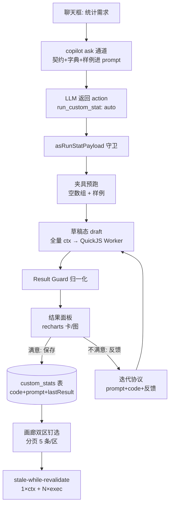

# 自定义统计 · 前端技术文档

> 版本：v1.2（2026-09-07：v1.0 评审修订 Worker 消息协议/批量刷新/草稿覆盖规则；v1.2 新增 D17 服务端持久化，见 §8 与 custom-stats-server-sync.md）
> 范围：契约定义 / 沙箱执行器 / Guard / 服务层 / 状态 / UI / 图表 / 缓存 / 服务端同步 / 测试
> 关联：`docs/custom-stats-spec.md`（需求文档，D1~D17 决策编号沿用）；后端仓 `docs/custom-stats-api.md`、`docs/custom-stats-backend-support.md`
> 状态：设计定稿，待 P0 开发启动

---

## 1. 总体架构



关键不变量：

1. **数据两路分离**（spec D3）：LLM 请求只含契约+字典+样例；全量 ctx 只在端上沙箱注入。
2. **沙箱是唯一安全边界**（spec D6）：信任只决定要不要弹确认卡，不决定隔离强度——已保存定义与草稿代码物理上走同一 runner。
3. **AI 只产数据**：生成代码返回纯数据结果，宿主声明式渲染；recharts 与文本渲染全部在宿主侧。

## 2. 分层落点（护栏合规）

| 内容 | 落点 | 依赖方向 |
|---|---|---|
| 契约类型 | `types/domain.ts`（`CustomStatsContext/Result/Def` + `CopilotRunStatPayload`） | R3 零依赖叶子 |
| 沙箱执行器 | `utils/customStats/`：`runner.ts`（QuickJS 调度）、`worker.ts`（Worker 入口）、`guard.ts`、`fixtures.ts`、`helpers.ts` | R2：只接收已组装 ctx，禁碰 store/db（已核实 utils 层现无任何 db 动态 import，risk 的动态 import 是「仅限审计落库」特例，不扩散） |
| 服务层 | `services/customStatsService.ts` | 惰性 `import('../db/index')`（沿用 ledgerService 模式）；组装全量 ctx；`custom_stats` CRUD |
| 状态 | `store/slices/customStatsSlice.ts`；`copilotActionSlice` 登记 auto 执行器 | slice 依赖 db/services/types |
| UI | `views/Statistics/CustomStatsPanel.tsx`（画廊）；`components/copilot/CustomStatResultPanel.tsx`（结果面板）；`components/copilot/CustomStatCharts.tsx`（recharts 映射，React.lazy） | R1：经 store/services 取数，不 import db |
| hooks | `hooks/useCustomStats.ts`（画廊数据桥接，可选） | — |

文件命名统一带 `customStat` 关键词，`scripts/feature-map.mjs` GROUPS 登记后自动归组。

## 3. 契约定义（v1.1 定稿）

### 3.1 执行契约 `CustomStatsContext`

```ts
/** 自定义统计执行契约（schemaVersion 演进，Runner 与生成代码共同遵守） */
export interface CustomStatsContext {
  schemaVersion: 1;
  /** 宿主注入时间锚点（ISO）。沙箱内无 Date.now，保证可复现可测试 */
  now: string;
  /** 已归档轮（COMPLETED 全量标量：netProfit/fees/holdingDays/win...） */
  rounds: TRoundArchive[];
  /** 进行中轮（OPENED，标量摘要） */
  openRounds: TRoundArchive[];
  /** 逐笔做T流水（tTransactions 全量，含 roundId 关联，timestamp 升序）——按天/星期统计的原料 */
  txns: RoundTxn[];
  /** 持仓全量（含已平仓） */
  positions: Position[];
  /** 进行中轮撮合结果（tStreamEngine 管线重算，与统计页同口径；类型从 engine 导出） */
  activeStreams: StreamResult[];
  /** 费率配置（净额口径用） */
  feeConfig: FeeConfig;
  /** 宿主注入纯函数工具（QuickJS 内无 decimal.js，金额口径靠这里对齐 mathUtils） */
  helpers: {
    round2(n: number): number;
    pct(part: number, total: number): number;   // 除零返回 0，0-1 小数
    groupBy<T>(xs: T[], f: (x: T) => string): Record<string, T[]>;
    sumBy<T>(xs: T[], f: (x: T) => number): number;
    fmtMoney(n: number): string;                // 千分位 + 2 位小数 + 负号
  };
}
```

注意：

- `StreamResult` 当前未导出——实现时从 `tStreamEngine.ts` 补导出（若定义在 store/types 则下沉 types 层，R2 约束）；
- `activeStreams` 注入前做**序列化安全子集**裁剪（剔除函数/组件引用类字段，仅保留标量与数组）；
- helpers 全同步（RELEASE_SYNC variant 的前提，见 §4.1）。

### 3.2 结果契约（XOR 判别联合）

```ts
/** 一次生成 = 一个标题卡 或 一个统计图表 */
export type CustomStatsResult = CardStat | ChartStat;

export interface CardStat {
  kind: 'card';
  title: string;
  caption?: string;   // 口径说明
  /** 关键数字 ≤3 */
  kpis: { label: string; value: string; tone?: 'default' | 'good' | 'bad' }[];
}

export interface ChartStat {
  kind: 'chart';
  title: string;
  caption?: string;
  chart:
    | { type: 'bar';  data: { label: string; value: number }[] }   // 排行，降序，≤50 点
    | { type: 'line'; data: { x: string; y: number }[] }           // 趋势，升序，≤50 点
    | { type: 'pie';  data: { label: string; value: number }[] };  // 占比，≤8 片
}
```

### 3.3 生成载荷与存储实体

```ts
/** copilot 动作载荷（LLM → 前端） */
export interface CopilotRunStatPayload {
  name: string;         // ≤40
  description: string;  // 口径说明（结果面板展示）
  prompt: string;       // ≤2048 UTF-8 字节 · 规范化需求种子，可复现本统计（与后端存储限长口径一致）
  code: string;         // ≤16384 UTF-8 字节 · (ctx) => CustomStatsResult 完整箭头函数表达式
}

/** 存储实体（custom_stats 表；被非 db 模块引用，权威定义在 types/domain.ts，schema re-export） */
export interface CustomStatsDef {
  id: string;               // ulid
  name: string;
  description?: string;
  prompt?: string;          // 生成时的种子提示词快照（删除时可复制保全）
  code: string;
  schemaVersion: number;    // 运行前校验
  kind: 'card' | 'chart';   // 冗余 lastResult.kind，分区与列表渲染直读（保存时写入）
  lastResult?: CustomStatsResult;  // stale-while-revalidate 的缓存
  lastRunAt?: string;       // 「截至 HH:mm」角标
  favorite?: boolean;
  pinned?: boolean;         // 画廊双区钉选（区由 kind 推导）
  pinnedAt?: string;
  runCount?: number;
  originMessageId?: string; // 溯源：来自哪条 AI 会话
  createdAt: string;
  updatedAt: string;
  isDeleted?: 0 | 1;        // 软删，与全库惯例对齐，为 P1 同步铺路
}
```

### 3.4 code 形态契约

- **完整箭头函数表达式** `(ctx) => { ... return result; }`（D16-③）；
- Runner 执行：`evalCode('(' + code + ')')` 求值得到函数引用 → `fn.call(ctx)` 调用 → 返回值序列化出沙箱；
- 收益：异常行号直接对应生成代码行、签名错误在 eval 阶段即暴露、AI 最不容易写错。

## 4. 沙箱执行器设计

### 4.1 技术选型定稿

- **quickjs-emscripten，RELEASE_SYNC variant**（D16-④）：helpers 全同步、ctx 一次性 JSON 注入，无需 ASYNCIFY 的异步宿主函数能力；体积最小（~0.5-1MB wasm，懒加载）；
- Worker 构建形态：`new Worker(new URL('./worker.ts', import.meta.url), { type: 'module' })`，Vite 原生支持；生成代码以字符串 postMessage 投递，Worker 文件本身是静态打包产物（PWA 可预缓存）；
- Worker 内 QuickJS 实例**单例驻留**；copilot 浮窗打开时预热（发 init 消息触发 wasm 加载）。

### 4.2 消息协议（主线程 ↔ Worker）

```ts
// 主线程 → Worker
type RunnerRequest =
  | { type: 'init' }                                        // 预热
  | { type: 'ctx'; batchId: string; ctxJson: string }      // 批次注入 ctx（Worker 内缓存解析结果，批次内复用）
  | { type: 'run'; runId: string; batchId: string; code: string; deadlineMs: number }
  | { type: 'fixture'; runId: string; code: string };       // 夹具预跑（内置夹具数据）
```

// Worker → 主线程
type RunnerResponse =
  | { type: 'ready' }
  | { type: 'result'; runId: string; resultJson: string }
  | { type: 'error'; runId: string; message: string; line?: number }
  | { type: 'timeout'; runId: string };
```

- 每次 run 携带 `runId`；主线程设超时定时器，超时 → `worker.terminate()` → **重建 Worker 单例**（一次死循环不报废沙箱）→ 该次运行标记失败（已保存定义不受影响）；
- ctx 以 JSON 字符串传递；同一批次的多次 run 复用已解析的 ctx（`ctx` 消息注入一次，`run` 仅引用 `batchId`）——批量刷新兑现真正的 1× parse + N× 毫秒级执行，避免逐条重复 parse 几 MB JSON；
- 新批次注入时释放上一批 ctx 缓存，Worker 内存不随批次累积。

### 4.3 夹具预跑（fixtures.ts）

正式执行前两轮预跑，任一失败不进结果面板（转「一键 AI 修复」流程，携带 QuickJS 错误行号）：

1. **空数组夹具**：`rounds/openRounds/txns/positions/activeStreams` 全空——消灭 `rounds[0].x` 类崩溃；
2. **样例夹具**：每集合 2~3 行真实形状数据——验证结果形状 + Guard 热身。

夹具数据从 `fixtures.ts` 常量构造（非用户数据），用例可复用为单测。

### 4.4 Result Guard（guard.ts）

| 规则 | 处理 |
|---|---|
| `kind` 不是 `'card'`/`'chart'` | 整体拒绝 |
| CardStat：kpis > 3 | 截断至 3 |
| ChartStat：bar/line > 50 点、pie > 8 片 | 截断 + `caption` 追加「已截断至前 N 条」 |
| 数值 `Number.isFinite` 为假 | 单元格/点归一 `'—'` 或剔除（不整体拒绝） |
| 所有文本字段 | 强制 `String()` 化 + 长度裁剪（label/value ≤40，caption/title ≤80） |
| `tone` | 白名单 `default/good/bad`，越界归 `default` |
| 图表行键 | `/^[a-zA-Z0-9_]{1,32}$/` 校验，拒绝 `__proto__/constructor/prototype`（防原型污染） |
| title/caption 缺失 | 拒绝（LLM 契约必有，缺失视为异常输出） |

原则：**归一化做在 Guard 层，渲染层傻瓜化**（拿到什么渲染什么，零转换）；截断优于拒绝（统计场景友好），结构非法才拒绝。

## 5. 服务层（customStatsService.ts）

### 5.1 全量 ctx 组装 `buildFullContext()`

| 数据 | 查询 | 说明 |
|---|---|---|
| 已归档轮 | `tRounds.where('[status+isDeleted]').equals(['COMPLETED', 0])` | v6 复合索引，单查询 |
| 进行中轮 | `tRounds.where('status').equals('OPENED')` | — |
| 逐笔流水 | `tTransactions.where('isDeleted').equals(0).toArray()` 后按 timestamp 升序 | v8 索引；**禁用 `fetchTransactionsByRoundId` 循环拼全量（N+1）** |
| 持仓 | 复用 `fetchAllPositionsIncludingClosed()` | 现成 |
| activeStreams | `tStreamEngine` 管线重算（`buildBasePositionCosts → activeStreamsFromRounds → processAllStreams`） | 与 `buildStatisticsContext` 同口径 |
| feeConfig | store 现有费率态（由调用方传入，service 不 import store——见 5.3） | 净额口径 |

### 5.2 批量刷新 `refreshLoaded(ids: string[])`

刷新范围 = **已加载条目**（分页天然限定；视口外未加载条目不刷新，「加载更多」时扩入下批）：

1. `buildFullContext()` **一次**，经 `ctx` 消息注入 Worker（批次内复用，不逐条重传）；
2. 逐定义投递沙箱执行（单例 Worker 串行），**分批让出**：单批 ≤6 条，批间让出宏任务间隙，长列表刷新不积压；
3. 每条完成即经 Guard 归一 → `db.transaction` 单条原子写回 `lastResult/lastRunAt/runCount`，对应卡片渐进替换（边刷边显，不等待整批）。

画廊 stale-while-revalidate 与手动刷新共用此入口。设计取舍：未采用「视口追踪 + 预取 1 页」——分页列表中「已加载」≈「已渲染」，分批 + ctx 复用后 30 条全量刷新也在秒级，视口追踪的增量复杂度不划算。

### 5.3 CRUD 与不可变性

- 提供：`saveDef / replaceDef（存新+软删旧+钉选迁移） / togglePin / toggleFavorite / softDelete / listDefs（分页读元数据） / refreshLoaded`；
- **不提供 `updateCode`**——不可变性由接口面保证（spec D8）；
- service 不 import store（保持可测）；feeConfig 等由调用方（slice/hooks）传入。

## 6. 状态设计

### 6.1 customStatsSlice（新增）

```ts
interface CustomStatsState {
  draft: CustomStatsDraft | null;   // 单槽位草稿，内存态，刷新即失
  galleryStats: CustomStatsDef[];   // 画廊元数据（含 lastResult），进入 custom tab 时加载
  refreshing: boolean;              // 批量刷新进行中
  lastSeenAt: string;               // NEW 角标基准（localStorage 持久化）
}
interface CustomStatsDraft {
  code: string;
  name: string;
  description: string;
  prompt: string;          // 原始需求锚点（迭代协议组成部分）
  originDefId?: string;    // 重新生成来源（保存弹层「替换」选项依据）
  attempt: number;         // 第 N 版
  lastResult?: CustomStatsResult;
  running: boolean;
  error?: string;
}
```

Actions：`setDraft / updateDraftResult / bumpAttempt / clearDraft / saveDraft(option: 'new' | 'replace') / togglePin / toggleFavorite / softDelete / loadGallery / refreshLoaded / markSeen`；`startDraft`（由 `run_custom_stat` 执行器调用）覆盖语义：旧草稿存在且未保存 → 直接替换并触发 toast「已加载新草稿」（单槽位，spec FR3）。

### 6.2 copilotActionSlice（增量）

`handleCopilotActions` 的 auto 分支新增：

```ts
case 'run_custom_stat': {
  const p = asRunStatPayload(a.payload);
  if (p) void get().startCustomStatDraft(p);   // 守卫 → 夹具预跑 → 全量执行 → setDraft
  break;
}
```

`ACTION_TIERS` 登记 `run_custom_stat: 'auto'`（spec D5：只读计算+本地渲染，与 notify/focus_block 同级；副作用唯一的「保存」由用户显式点击）。

## 7. UI 设计

### 7.1 结果面板 `CustomStatResultPanel.tsx`（聊天浮窗内）

```
┌─────────────────────────────┐
│ 各股做T收益排行   [第 2 版]   │  ← name + attempt
│ 统计已平仓轮净收益按股票求和…  │  ← description（口径说明，必展示）
│ ┌─────────────────────────┐ │
│ │ ▐█▇▆▅▃▂▁ bar/line/pie   │ │  ← recharts（React.lazy chunk）
│ └─────────────────────────┘ │
│ ▸ AI 生成代码（折叠可查）      │  ← 透明不设卡（spec D6）
│ [保存] [丢弃]  · 未保存标识    │  ← 刷新即失的视觉提示（D16-⑥）
└─────────────────────────────┘
```

- 错误态：友好卡片 + [一键让 AI 修复]（注入错误行号 + code + 反馈到聊天输入）；
- 空态：图表 data 空 → 空态组件；库无数据 → 引导文案。

### 7.2 画廊 `CustomStatsPanel.tsx`（Statistics 页 custom tab）

```
┌ 自定义统计 ──────────────────────────── [手动刷新] ┐
│ 数字卡区（card 类钉选）                             │
│  [本月净收益 ¥2,340·截至14:32·新] [胜率 62%] …      │
│  [加载更多]（visibleCount=5 起步）                  │
│ 图表区（chart 类钉选）                              │
│  [各股收益排行 ▐█▇▆▅] [近30天累计 📈] …             │
│  [加载更多]                                        │
│ ▸ 全部定义（折叠列表，含未钉选 + 管理）              │
└───────────────────────────────────────────────────┘
```

- 两区各自独立 `visibleCount` 游标，页大小 5；元数据+lastResult 一次轻量读入后 UI 切片（个人量级几十条；Dexie offset/limit 真分页留给量级涨大后的一行改动）；
- 定义卡操作：运行 / 重新生成 / 钉选·取消 / 删除（弹层含提示词复制）；
- NEW 角标：`pinnedAt > lastSeenAt`；页外新内容 → 区头「↑ 顶部有 N 条新钉选」胶囊。

### 7.3 图表映射 `CustomStatCharts.tsx`

- recharts 三组件映射：bar→`BarChart`（layout="vertical" 排行更易读）、line→`LineChart`、pie→`PieChart`；tooltip/图例默认开启；
- **固定调色板**（对齐现有 tailwind 主题色），AI 不控制颜色；`tone` 色彩映射**红涨绿跌**（A 股习惯，good=红），宿主统一控制（D16-⑤）；
- `React.lazy(() => import('./CustomStatCharts'))` 独立 chunk，仅在面板渲染图表时拉取；copilot 打开预热时顺带 `import()` 预取。

## 8. 存储与 PWA

- `db/schema.ts`：`custom_stats` 表，索引 `id, kind, pinned, pinnedAt, updatedAt, isDeleted`；`STORES_V13` + upgrade；
- 软删对齐全库惯例：`isDeleted` 墓碑即服务端同步的删除传播载体（远端确认删除后本地物理清理，防累积）；
- 服务端持久化（D17，v1.2 新增）：登录用户定义备份到服务端（非核心数据，明文 JSONB 直存，不走 E2EE 快照通道）——
  - `services/customStatsSyncService.ts`：GET/PUT/DELETE `/api/custom-stats`（Bearer token，无需 MEK）+ 服务端定义防御性收窄（非法条目跳过）；
  - `syncCustomStatsFromServer`（customStatsSlice）：打开画廊对账（拉取 LWW 合并 + 推送较新 + 墓碑删除传播），保存/删除后即时补推；全程静默降级，未登录跳过；
  - `toCustomStatEntity` 保留调用方 `updatedAt`（LWW 排序键，不再被 now() 覆盖）；
  - 契约与后端实现指引见 `docs/custom-stats-server-sync.md`；
- workbox `globPatterns` 补 `**/*.wasm` 条目**已不适用**：QuickJS 采用 RELEASE_SYNC 单文件变体（wasm base64 内嵌 JS，零外部资产），recharts 为 js chunk 由现有模式自动覆盖。

## 9. 测试计划（`src/__tests__/`，白名单豁免分层）

| 测试件 | 覆盖 |
|---|---|
| `customStatGuard.test.ts` | kind 收窄 / 截断与归一 / tone 白名单 / 行键原型污染 / 恶意载荷（`<script>` 文本断言转义） |
| `customStatFixtures.test.ts` | 空数组夹具 / 样例夹具 / 常见 AI 错误模式（`rounds[0].x`）被拦截 |
| `customStatRunner.test.ts` | eval / 调用 / 超时 interrupt / Worker terminate 重建 / runId 配对 |
| `customStatsService.test.ts` | ctx 组装形状（txns 升序、activeStreams 子集）/ refreshLoaded 分批上限与让出、单条原子写回 / CRUD 与不可变（无 updateCode） |
| `customStatsSlice.test.ts` | 草稿生命周期 / attempt 计数 / **覆盖规则（旧草稿未保存被替换）** / saveDraft new+replace（钉选迁移）/ lastSeenAt / 服务端同步（LWW 合并、推送、墓碑传播、未知 schemaVersion 跳过、失败静默） |
| `customStatsSyncService.test.ts` | list 收窄（非法条目跳过）/ upsert 剥离 isDeleted / DELETE 幂等 / HTTP 与业务码错误路径 |
| `copilotActions.test.ts`（增量） | `asRunStatPayload` 守卫：长度上限 / 非法字段丢弃 |

预计新增 30~40 用例；`npx tsc --noEmit`、`npm test`（pretest 自动 check:arch）、`npm run map:features`（未归类=0）全过为 DoD。

## 10. 风险与对策（汇总）

| 风险 | 对策 | 落点 |
|---|---|---|
| AI 代码死循环/内存爆炸 | interrupt 时限 + 内存上限 + terminate 重建 | runner |
| 空数据崩溃 | 夹具预跑 + helpers 除零保护 + 友好空态 | fixtures/helpers |
| 结果形状爆炸 | Guard 截断+标注（结构非法才拒绝） | guard |
| XSS / className 注入 / 原型污染 | Guard 归一化 + 白名单 + 键校验 + 恶意载荷回归测试 | guard |
| 多轮迭代口径漂移 | 迭代协议带 prompt 锚点 + code（D15/D16-①） | slice/服务 |
| 沙箱冷启动卡顿 | copilot 打开预热 + 单例驻留 + 「计算中」Loading | runner/UI |
| 旧定义契约失效 | schemaVersion 编译预检 + 「AI 修复」入口 | runner/服务 |
| LLM 输出非法动作 | asRunStatPayload 守卫静默丢弃（沿用管线纪律） | copilotActions |
