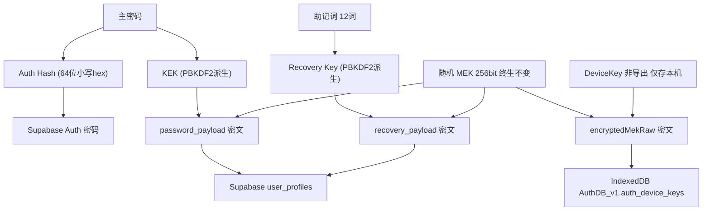
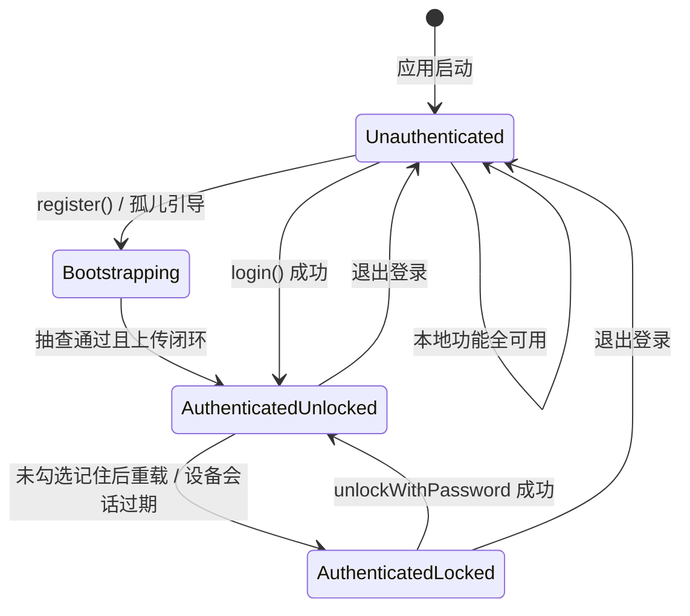
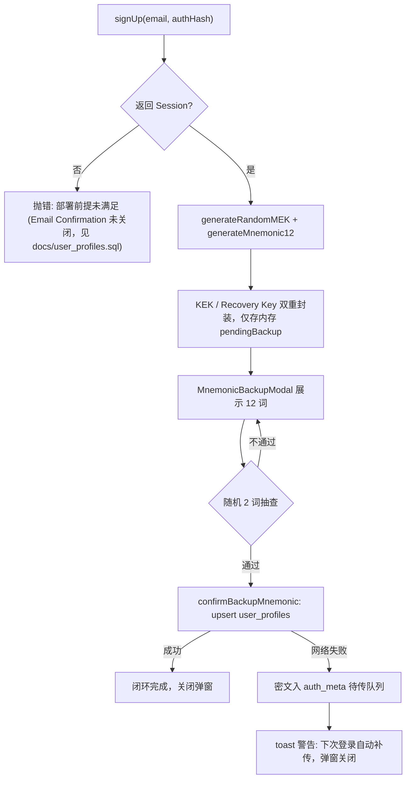
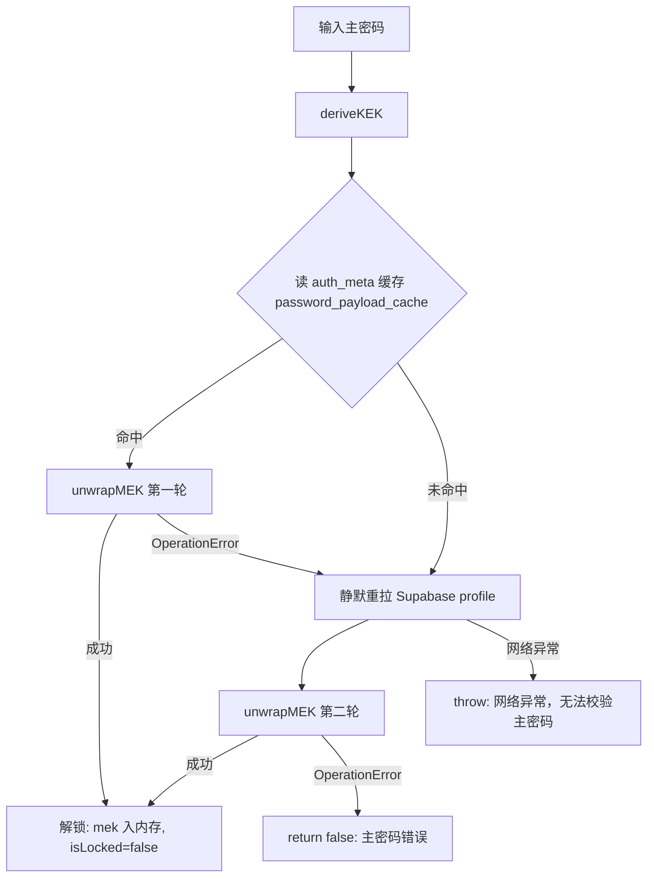

# E2EE 鉴权与密钥管理系统 · 功能实现文档

> 版本：定稿 v1.0（2026-08-31，基于两轮方案评审的已确认结论）
> 范围：账号体系 + 随机 MEK 双重封装密钥管理 + 锁屏 + 助记词找回闭环；云端密文同步为二期预留
> 关联：`docs/user_profiles.sql`（本期随开发产出）、`.env.example`、`src/types/auth.ts`
> 状态：待最终确认后进入开发

---

## 0. 已确认决策记录（评审结论溯源）

| # | 决策点 | 结论 |
|---|--------|------|
| D1 | MEK 来源 | 随机 256-bit（方案 A），主密码 / 助记词仅作封装密钥（KEK / Recovery Key），MEK 终生不变 |
| D2 | 注册时序 | 本地生成 → 抽查通过 → 上传 Supabase → 失败进 `auth_meta` 待传队列 → 孤儿账号引导兜底 |
| D3 | 滑动续期 | 恢复 `touchSession()`，挂载至 `visibilitychange`（切回前台）与 `initSession` |
| D4 | 解锁链路 | 读本地缓存解封 → 失败触发 Supabase 静默重拉再解封 → 仍失败报错（三级兜底） |
| D5 | 本地存储 | 独立 `AuthDB_v1`（`auth_device_keys` + `auth_meta` 两表），严禁污染 `TradingLedgerDB_v3` |
| D6 | 未登录体验 | 不拦截任何路由与功能，本地 Dexie 账本零阻碍使用 |
| D7 | 登出边界 | 仅销毁内存 MEK、设备免密缓存、Supabase Session；保留本地账本数据与待传队列 |
| D8 | 部署前提 | Supabase 关闭 Email Confirmation、Recovery 邮件模板含 `{{ .Token }}`，写入 SQL 文件头部注释 |
| D9 | 不变量 | `recovery_payload` 只能为「用户已通过抽查证明已记录」的助记词上传 |

---

## 1. 目标与非目标

### 1.1 目标

1. **渐进式账号体系**：未登录用户全功能可用（做T、计算、统计、导入导出）；登录后激活 E2EE 密钥体系。
2. **方案 A 密钥架构**：随机 MEK（终生不变）+ 三层封装（密码 KEK / 助记词 Recovery Key / 设备 DeviceKey）。
3. **完整闭环**：注册备份抽查 → 登录 → 免密滑动续期 → 锁屏三级兜底解锁 → 助记词重置密码（MEK 无损恢复）→ 登出（保留本地数据）。
4. **二期预留**：通用密文接口 `encryptPayload` / `decryptPayload` 本期无业务调用方，以单测保障正确性。

### 1.2 非目标（本期不做）

- 云端密文同步业务（Supabase 数据同步表仅在设计上预留，见 §13）
- 多标签页锁定状态同步（backlog，已知限制见 §9）
- OAuth / Magic Link 等其他登录方式
- 本地 Dexie 账本数据的加密（E2EE 防的是服务器 / 传输 / DB 泄露，不覆盖本地明文，见 §9 威胁边界）

---

## 2. 架构总览

### 2.1 密钥层级与存储位置



### 2.2 关键架构原则

| 原则 | 说明 |
|------|------|
| 零知识 | Supabase 只见 Auth Hash（作为密码）与两份 MEK 密文，永不见主密码、助记词、MEK 明文 |
| 封装分离 | KEK / Recovery Key / DeviceKey 只用于加解密 MEK raw bytes，不直接加密业务数据 |
| MEK 不可再派生 | MEK 为注册时随机生成，任何单一封装方式丢失（改密 / 换设备 / 清浏览器数据）均不影响其余恢复路径 |
| 本地数据不动 | 认证体系不读写 `TradingLedgerDB_v3`；登出、锁定均不触碰账本数据 |
| 服务器状态可缺失 | profile 缺行（待传 / 孤儿）是合法中间态，所有流程必须显式处理 |

---

## 3. 密码学参数规范（严禁修改）

| 项目 | 参数 |
|------|------|
| KDF | `PBKDF2-HMAC-SHA-256`，迭代次数固定 `100,000` |
| Auth Hash | Salt = `auth_salt_` + `email.toLowerCase().trim()`；`deriveBits(256)` → 64 位小写 hex → 作为 Supabase Auth 密码 |
| KEK | Salt = `kek_salt_` + 同上归一化 email；派生 `AES-GCM-256`，`extractable: false`，usages `['encrypt','decrypt']` |
| Recovery Key | Salt = 固定字符串 `mnemonic_recovery_salt`；口令 = 归一化助记词（小写 + 空白归一，见 §5.3）；派生 `AES-GCM-256`，`extractable: false` |
| MEK | `AES-GCM-256`，`extractable: true`（导出 raw 供三层封装必需），usages `['encrypt','decrypt']` |
| DeviceKey | `crypto.subtle.generateKey(AES-GCM-256, extractable: false)`，原生存入 IndexedDB，永不出浏览器 |
| AES-GCM | IV 每次随机 `crypto.getRandomValues(new Uint8Array(12))`；TagLength 默认 128 位 |
| 编码 | 二进制 ↔ Base64 标准 `btoa/atob`，`Uint8Array` 分块转换防栈溢出；hex 小写 |

**安全注记（必须写入代码注释）：**

1. PBKDF2 100k 低于 OWASP 2023 建议（600k），属评审接受的约束：Auth Hash 仅作为"发给 Supabase 的密码"，服务端另有 bcrypt(10) 兜底；KEK / Recovery Key 被离线爆破的前提是攻击者已持有对应密文。
2. MEK `extractable: true` 是封装必需；运行时纪律：raw bytes 不落盘、不进 localStorage、不跨业务组件明文传递（仅在 services 与 store 内部流转）。
3. Recovery Key 的口令熵 ≈ 助记词 128-bit，远高于口令熵，固定 salt 无实际削弱。

---

## 4. 数据结构定义

### 4.1 Supabase 表 `public.user_profiles`（RLS 开启，详见 §11）

```typescript
// src/types/auth.ts
export interface UserProfile {
  id: string;               // references auth.users(id)
  password_payload: string; // Base64: KEK 加密 MEK raw bytes 的密文
  password_iv: string;      // Base64: 12 字节 IV
  recovery_payload: string; // Base64: Recovery Key 加密 MEK raw bytes 的密文
  recovery_iv: string;      // Base64: 12 字节 IV
  updated_at: string;       // ISO 字符串，客户端写入
}
```

### 4.2 本地 IndexedDB：独立 Dexie 实例 `AuthDB_v1`

```typescript
// src/services/sessionPersistence.ts 内部建库
// new Dexie('AuthDB_v1')，version(1).stores({
//   auth_device_keys: 'id',   // 单记录免密会话
//   auth_meta: 'key',         // 通用键值（缓存 / 待传队列）
// })

export interface DeviceSessionRecord {
  id: 'current_session';    // 固定主键，单浏览器单账号
  encryptedMekRaw: string;  // Base64: DeviceKey 加密的 MEK raw bytes
  deviceIv: string;         // Base64: 12 字节 IV
  deviceKey: CryptoKey;     // 非导出设备密钥（structured clone 原生存储）
  expiresAt: number;        // 过期时间戳 (ms)
  ttlMs: number;            // 滑动续期步长，如 7 * 24 * 3600 * 1000
}

export interface AuthMetaRecord {
  key: string;
  value: unknown;
}
```

**`auth_meta` 预定义键（常量 `META_KEYS`）：**

| key | value 结构 | 写入时机 | 清除时机 |
|-----|-----------|---------|---------|
| `password_payload_cache` | `{ payload: string; iv: string }` | 登录成功 / 解锁重拉成功后 | 登出、无 Session 初始化 |
| `pending_profile_upload` | `PendingProfileUpload`（下） | 注册抽查通过但上传失败 | 补传成功后 |

> 安全性：两个值均为密文（前者 KEK 封装、后者 KEK+Recovery 双封装），落盘无明文泄露风险。`pending_profile_upload` 在登出时**保留**（D7）——它是用户已备份助记词对应的唯一 MEK 线索。

```typescript
export interface PendingProfileUpload {
  passwordPayload: { payload: string; iv: string };
  recoveryPayload: { payload: string; iv: string };
}
```

### 4.3 注册期内存态（不入库、不入 store 持久化）

```typescript
// src/types/auth.ts —— 注册 / 孤儿引导期间的待备份状态，仅存 Zustand 内存
export interface PendingBackup {
  mnemonic: string;                                      // 12 词，展示给用户
  passwordPayload: { payload: string; iv: string };      // KEK 封装产物
  recoveryPayload: { payload: string; iv: string };      // Recovery Key 封装产物
}
```

### 4.4 环境变量（`.env.example`）

```bash
# Supabase 项目配置（Dashboard → Project Settings → API）
VITE_SUPABASE_URL=https://<your-project-ref>.supabase.co
VITE_SUPABASE_ANON_KEY=<your-anon-public-key>
```

- `src/vite-env.d.ts` 补充 `ImportMetaEnv` 类型声明；
- anon key 为可公开凭据（RLS 兜底），但 URL/key 缺失时 `supabaseClient` 必须启动即抛出中文错误；
- Vercel 部署需在 Project Settings → Environment Variables 同步配置。

---

## 5. 模块规格

### 5.1 `src/services/supabaseClient.ts`（单例）

```typescript
import { createClient } from '@supabase/supabase-js';

const url = import.meta.env.VITE_SUPABASE_URL;
const anonKey = import.meta.env.VITE_SUPABASE_ANON_KEY;
if (!url || !anonKey) {
  throw new Error('Supabase 环境变量缺失：请配置 VITE_SUPABASE_URL / VITE_SUPABASE_ANON_KEY（参见 .env.example）');
}

export const supabase = createClient(url, anonKey, {
  auth: {
    flowType: 'pkce',
    persistSession: true,     // Session 持久化于 localStorage（Supabase 默认）
    autoRefreshToken: true,
  },
});
```

### 5.2 `src/services/cryptoService.ts`（原生 WebCrypto，全 async）

```typescript
export async function generateRandomMEK(): Promise<CryptoKey>;
// generateKey({ name:'AES-GCM', length:256 }, true /*extractable*/, ['encrypt','decrypt'])

export async function deriveAuthHash(password: string, email: string): Promise<string>;
// PBKDF2(100k, auth_salt_ + 归一化email) → deriveBits(256) → 64 位小写 hex

export async function deriveKEK(password: string, email: string): Promise<CryptoKey>;
// PBKDF2(100k, kek_salt_ + 归一化email) → deriveKey AES-GCM-256, extractable:false

export async function wrapMEK(mek: CryptoKey, wrappingKey: CryptoKey)
  : Promise<{ payload: string; iv: string }>;
// exportRawKey(mek) → AES-GCM 加密（随机 12B IV）→ Base64

export async function unwrapMEK(payload: string, iv: string, wrappingKey: CryptoKey)
  : Promise<CryptoKey>;
// Base64 解码 → AES-GCM 解密 → importRawKey(AES-GCM-256, extractable:true)
// 密钥不匹配 / 密文篡改 → WebCrypto 抛 OperationError（原样透传，调用方语义化）

export async function encryptPayload(data: unknown, mek: CryptoKey)
  : Promise<{ cipherText: string; iv: string }>;
// JSON.stringify → TextEncoder → AES-GCM → Base64（二期云同步用）

export async function decryptPayload<T>(cipherText: string, iv: string, mek: CryptoKey): Promise<T>;
// Base64 → AES-GCM 解密 → TextDecoder → JSON.parse as T

// ---- 内部工具，导出供单测 ----
export async function exportRawKey(key: CryptoKey): Promise<Uint8Array>;
export async function importRawKey(raw: Uint8Array): Promise<CryptoKey>;
export function bytesToBase64(bytes: Uint8Array): string;
export function base64ToBytes(b64: string): Uint8Array;
```

**实现要点：**
- PBKDF2 口令与 salt 均以 `TextEncoder` UTF-8 编码；importKey 时 `extractable:false, usages:['deriveKey'|'deriveBits']`；
- email 归一化集中在私有函数 `normalizeEmail(email)`（lowercase + trim），派生与登录请求使用同一归一化结果；
- `JSON.stringify` 可能因循环引用抛错，`encryptPayload` 需 try/catch 包装为语义化中文错误。

### 5.3 `src/services/mnemonicService.ts`

```typescript
import { generateMnemonic, validateMnemonic as bip39Validate } from '@scure/bip39';
import { wordlist } from '@scure/bip39/wordlists/english';

export function normalizeMnemonic(mnemonic: string): string;
// trim + 小写 + 按 /\s+/ 切分后单空格重组（支持一键粘贴多行/多空格输入）

export function generateMnemonic12(): string;
// generateMnemonic(wordlist, 128) → 12 词

export function validateMnemonic(mnemonic: string): boolean;
// normalizeMnemonic → bip39Validate(…, wordlist)；任何异常返回 false

export async function deriveRecoveryKey(mnemonic: string): Promise<CryptoKey>;
// PBKDF2(100k, 口令=normalizeMnemonic(mnemonic), salt='mnemonic_recovery_salt')
// → deriveKey AES-GCM-256, extractable:false
```

> **注意**：此处刻意**不使用** `@scure/bip39` 的 `mnemonicToSeed*`（其内部是 2048 轮 PBKDF2-BIP-39 约定 salt `mnemonic`），而是按本规范以助记词字符串作口令直接 100k 轮派生。两条派生路径不得混用。

### 5.4 `src/services/sessionPersistence.ts`（独立 Dexie 实例 `AuthDB_v1`）

```typescript
import Dexie from 'dexie';

class AuthDB extends Dexie {
  authDeviceKeys!: Dexie.Table<DeviceSessionRecord, 'current_session'>;
  authMeta!: Dexie.Table<AuthMetaRecord, string>;
  constructor() {
    super('AuthDB_v1');
    this.version(1).stores({
      auth_device_keys: 'id',
      auth_meta: 'key',
    });
  }
}

export const META_KEYS = {
  PASSWORD_PAYLOAD_CACHE: 'password_payload_cache',
  PENDING_PROFILE_UPLOAD: 'pending_profile_upload',
} as const;

// ---- 设备免密会话 ----
export async function saveSessionMEK(mek: CryptoKey, ttlDays: number): Promise<void>;
// 1. deviceKey = generateKey(AES-GCM-256, extractable:false, ['encrypt','decrypt']) —— 每次调用重新生成，旧记录整体覆盖
// 2. encryptedMekRaw = wrapMEK(mek, deviceKey)
// 3. 落库 { id:'current_session', …, expiresAt: Date.now() + ttlDays*24*3600*1000, ttlMs }

export async function loadSessionMEK(): Promise<CryptoKey | null>;
// 1. 无记录 → null
// 2. Date.now() > expiresAt → clearSessionMEK() 并返回 null
// 3. 有效 → unwrapMEK(encryptedMekRaw, deviceIv, record.deviceKey)
//    解封失败（deviceKey 缺失/损坏）→ clearSessionMEK() + null
// 4. 成功 → 滑动续期：expiresAt = Date.now() + ttlMs 写回 → 返回 MEK

export async function touchSession(): Promise<void>;
// 有记录且未过期 → expiresAt = Date.now() + ttlMs 写回；无记录或已过期 → 静默忽略/清理

export async function clearSessionMEK(): Promise<void>;
// 删除 current_session 记录（含 deviceKey 引用），幂等

// ---- auth_meta 键值 ----
export async function getMeta<T>(key: string): Promise<T | null>;
export async function setMeta(key: string, value: unknown): Promise<void>;
export async function removeMeta(key: string): Promise<void>;
```

**实现要点：**
- `deviceKey` 以 `CryptoKey` 对象直接存入记录属性，依赖 IndexedDB structured clone；`loadSessionMEK` 中 `unwrapMEK` 抛出的任何异常（含 DataCloneError 还原失败）都按"会话不可用"处理，绝不向上抛；
- 所有方法内部 try/catch Dexie 异常并转为带上下文的中文错误（QuotaExceededError → "本地存储空间不足"等）；
- 滑动续期的写回与读取在单事务内完成，防多标签页竞态覆盖。

### 5.5 `src/store/useAuthStore.ts`（全局状态机）

```typescript
import type { User } from '@supabase/supabase-js';

interface AuthState {
  // ---- 状态 ----
  user: User | null;
  mek: CryptoKey | null;          // 运行时仅存内存，禁止明文 raw 落盘/跨组件传递
  isAuthenticated: boolean;       // Supabase 是否持有合法 JWT
  isLocked: boolean;              // isAuthenticated === true 且 mek === null
  isLoading: boolean;             // initSession/register/login/unlock/reset 进行中
  initialized: boolean;           // initSession 是否已跑完（防 modal 闪烁）
  pendingBackup: PendingBackup | null; // 注册/孤儿引导待备份态（内存态）
  authModalOpen: boolean;         // 登录/注册弹窗（未登录入口）
  resetModalOpen: boolean;        // 找回密码弹窗

  // ---- Actions ----
  initSession(): Promise<void>;
  register(email: string, password: string): Promise<void>;
  confirmBackupMnemonic(input: string): Promise<boolean>; // true=上传闭环；false=已入待传队列
  login(email: string, password: string, remember: boolean, ttlDays?: number): Promise<void>;
  unlockWithPassword(password: string): Promise<boolean>;
  resetPasswordWithMnemonic(email: string, code: string, mnemonic: string, newPass: string): Promise<void>;
  logout(): Promise<void>;
  touchSession(): Promise<void>;
  setAuthModalOpen(open: boolean): void;
  setResetModalOpen(open: boolean): void;
}
```

**状态机：**



| 状态 | isAuthenticated | mek | isLocked | UI 表现 |
|------|-----------------|-----|----------|---------|
| 未登录 | false | null | false | 全功能可用；header 显示"登录" |
| 已登录已解锁 | true | 非null | false | 全功能可用；header 显示账号 |
| 已登录锁定 | true | null | true | 全屏 SessionLockModal 覆盖 |

**约定：**
- 错误契约：Actions 失败一律 `throw new Error(用户可读中文消息)`，UI 层 catch 后 toast + 表单内联提示；`unlockWithPassword` 例外（见 §6.4）；
- `isLoading` 在启动阶段**不阻塞**本地功能渲染，仅决定是否渲染锁屏/弹窗（`initialized === false` 时两者都不渲染，防闪烁）；
- 抽查题的生成与校验是纯 UI 状态，放在 `MnemonicBackupModal` 组件内部，不入 store。

---

## 6. 核心流程时序

### 6.1 `initSession()`（应用启动）

1. 注册全局监听（仅一次，防 HMR 重复订阅）`supabase.auth.onAuthStateChange`：
   - `SIGNED_OUT`（含他端登出）：执行与 `logout` 相同的本地清理（不再调 `signOut`）；
   - `SIGNED_IN`（他端登录）：`initialized === true` 时重跑会话同步；
   - `INITIAL_SESSION`：忽略（启动同步由本流程串行处理，避免竞态）。
2. `getSession()`：
   - **无 Session** → `clearSessionMEK()` + `removeMeta(PASSWORD_PAYLOAD_CACHE)`（**保留** `pending_profile_upload`）→ 重置未登录态，返回；
   - **有 Session** → 拉取 profile（`select('id').eq('id', uid).maybeSingle()`）：
     - 有 `pending_profile_upload` → 自动补传 upsert → 成功则 `removeMeta` 待传队列，失败则保留队列并 toast 警告（不阻塞后续）；
     - profile 缺行（明确 null，非网络错误）且无待传队列 → **孤儿引导**：`generateRandomMEK` + 新助记词 → 双封装 → `pendingBackup` 置位（UI 打开备份弹窗；见 §6.2 步骤 E 起）。
3. `loadSessionMEK()`：
   - 恢复成功 → `set({ user, mek, isAuthenticated:true, isLocked:false })`；
   - 未恢复（过期/未勾选记住）→ `set({ user, mek:null, isAuthenticated:true, isLocked:true })` 锁屏待解锁；
4. `touchSession()`（设备记录存在时顺带续期，D3）；`initialized = true`。

> profile 拉取网络异常不视为缺行：跳过孤儿/补传分支，正常走锁屏，下次启动重试。

### 6.2 注册闭环（D2 时序，不变量 D9）



**步骤明细：**

- A. `deriveAuthHash(password, email)` → `signUp({ email, password: authHash })`；邮箱归一化后请求；`User already registered` → "该邮箱已注册"；
- B. 若 Supabase 开启了 Email Confirmation，`signUp` 不返回 Session，后续 upsert 会被 RLS 拒绝 —— 代码显式检测并抛出"部署前提未满足"错误（不要静默吞掉）；
- D. `deriveKEK(password, email)` → `wrapMEK(mek, kek)`；`deriveRecoveryKey(mnemonic)` → `wrapMEK(mek, rk)`；全部在内存，**任何密文不先于抽查通过落盘上传**（D9）；
- F. 抽查失败换新题重试（不限次数）；
- G. `confirmBackupMnemonic(input)`：归一化比对 input 与 pendingBackup.mnemonic（不一致直接返回错误，不计入闭环）；upsert 成功 → 清内存态返回 true；失败 → `setMeta(PENDING_PROFILE_UPLOAD, …)` 返回 false（弹窗仍关闭，账号可用）；
- 孤儿兜底：注册后浏览器崩溃（抽查前）→ 下次登录 profile 缺行且无待传 → 孤儿引导重新生成（全新账号无数据，无实际损失）。

### 6.3 登录 `login(email, password, remember, ttlDays = 7)`

1. `authHash = deriveAuthHash(password, 归一化email)` → `signInWithPassword`；400 → "邮箱或主密码错误"，429 → "尝试次数过多，请稍后再试"；
2. `maybeSingle()` 拉 profile：
   - **有行** → `deriveKEK` → `unwrapMEK(password_payload)` → MEK；`OperationError`（服务端密码已验证但密文解不开）→ 抛 "密钥数据异常，请使用助记词找回密码"；
   - **缺行且有 `pending_profile_upload`** → 用刚验证过的 password 派生 KEK 解封待传密文恢复 MEK → 尝试补传 upsert（失败保留队列，不阻塞登录）；
   - **缺行且无待传** → 孤儿引导（同 §6.2 步骤 C 起，此时用户处于已登录态）；
3. `setMeta(PASSWORD_PAYLOAD_CACHE, { payload, iv })`；
4. `remember === true` → `saveSessionMEK(mek, ttlDays)`；否则跳过（重载后进锁屏）；
5. `set({ user, mek, isAuthenticated:true, isLocked:false })`；`authModalOpen = false`。

### 6.4 锁屏解锁 `unlockWithPassword(password)`（D4 三级兜底）



- **错误契约**：两级解封均为 `OperationError` → `return false`（UI 摇晃 + toast "主密码错误"）；网络/服务异常 → `throw Error(中文消息)`（UI toast，不判密码错误）；
- 第二轮成功后用新密文刷新 `password_payload_cache`（覆盖他端改密导致的过期缓存）；
- 解锁成功**不**自动恢复设备免密记录（"记住登录"仅登录时勾选生效）；
- 解锁成功后 `touchSession()`；
- 锁屏页仅提供"退出登录"入口；"忘记密码"经退出后登录弹窗的"找回主密码"进入（见 §7.5）。

### 6.5 助记词重置密码 `resetPasswordWithMnemonic(email, code, mnemonic, newPass)`

1. **前置校验**：`validateMnemonic(mnemonic)`（12 词 + 校验和）；newPass 长度 ≥ 8 且与确认一致；
2. Step 1 已执行 `resetPasswordForEmail(email)`（要求邮件模板含 `{{ .Token }}`，见 §11）；
3. `verifyOtp({ email, token: code, type: 'recovery' })` → 失败抛 "验证码错误或已过期"；成功即持有恢复会话；
4. 拉 `recovery_payload` → `deriveRecoveryKey(normalizeMnemonic(mnemonic))` → `unwrapMEK`：
   - `OperationError` → **助记词不正确**：`signOut()` 回收恢复会话 + 抛 "助记词不正确，无法恢复密钥"（严禁带着错误会话继续）；
5. `updateUser({ password: deriveAuthHash(newPass, 归一化email) })` → Supabase Auth 密码更新；
6. `deriveKEK(newPass, email)` → `wrapMEK(mek, kek)` → upsert `password_payload / password_iv / updated_at`（`recovery_payload` **不变** —— 助记词未更换）；
7. 刷新本地 `password_payload_cache`；
8. `set({ user, mek, isAuthenticated:true, isLocked:false })` —— 恢复会话即登录态，重置后直接进入已解锁应用，toast "✅ 密码已重置，数据无缝恢复"；
9. 注：Supabase 改密可能吊销其他设备会话，属预期安全行为（他端重载进锁屏）。

### 6.6 登出 `logout()`（D7）

1. `supabase.auth.signOut()`；
2. `clearSessionMEK()`；`removeMeta(PASSWORD_PAYLOAD_CACHE)`；
3. **保留** `pending_profile_upload`（已备份助记词的唯一补传线索）；
4. 重置 store（`user=null, mek=null, isAuthenticated=false, isLocked=false, pendingBackup=null`）；本地 Dexie 账本数据零触碰。

### 6.7 滑动续期挂载点（D3）

| 挂载点 | 说明 |
|--------|------|
| `visibilitychange` → `document.visibilityState === 'visible'` | 切回前台续期；App.tsx 全局监听一次 |
| `initSession()` 末尾 | 启动顺带续期 |
| `loadSessionMEK()` 内部 | 读取即续期 |

> 仅 `touchSession()` 静默执行（try/catch 吞 Dexie 异常），不弹任何提示。

---

## 7. UI 组件规格（Tailwind CSS，对齐现有 slate 深色风格）

### 7.1 门控与入口（`src/components/ui/AuthGate.tsx` + `App.tsx` 改造）

- `AuthGate` 挂载在 `AppLayout` 内（路由容器之外），职责：
  1. `useEffect` 调一次 `initSession()`；
  2. 订阅 store 决定渲染：`initialized === false` → 不渲染任何认证 UI；`pendingBackup` → 备份弹窗；`resetModalOpen` → 重置弹窗；`authModalOpen` → 登录弹窗；`isLocked` → 全屏锁屏；
- **未登录不拦截任何路由**（D6）；`isLoading` 不阻塞本地功能渲染；
- Header 右侧新增账号入口：未登录显示"登录"按钮（打开 AuthModal）；已登录显示邮箱（超长省略）+ 点击下拉"退出登录"；
- `SessionLockModal` 为全屏覆盖（`fixed inset-0 z-[60]`），锁定期间登录用户不可访问本地功能（规范确认的产品选择）。

### 7.2 `AuthModal.tsx`（登录 / 注册，Tab 切换）

| 项 | 规格 |
|----|------|
| 登录 Tab | Email（`type=email`）、主密码（`type=password`，可见性切换）、"记住登录" Checkbox；勾选后启用 7天/30天 下拉（`ttlDays: 7 | 30`，默认 7） |
| 注册 Tab | Email、主密码、确认主密码；校验：邮箱格式、密码 ≥ 8 位、两次一致 |
| 提交态 | 按钮 loading（禁用 + spinner）；进行中阻断蒙层关闭 |
| 成功后 | 登录：关闭弹窗 toast "✅ 欢迎回来"；注册：**不关闭弹窗层**，切换到 MnemonicBackupModal（`pendingBackup` 置位） |
| 失败 | catch store 抛出的中文消息 → 表单内联红字 + toast `❌ …` |
| 其他 | "忘记主密码？"链接 → `setResetModalOpen(true)`；蒙层点击可关闭（空表单时），进行中不可关闭 |

### 7.3 `MnemonicBackupModal.tsx`（助记词备份，两阶段）

**阶段一 · 展示**
- 3×4 网格卡片，序号 `01`–`12` 等宽字体；
- "复制所有"：`navigator.clipboard.writeText`（空格分隔 12 词）+ toast "✅ 已复制"；
- "下载 .txt"：Blob 下载，文件名 `股票计算助手-助记词备份-YYYYMMDD.txt`，内容含警示头 + 编号词表；
- 蒙层点击与 ESC **一律阻断**（`closeOnBackdropClick = false`，规范强制）。

**阶段二 · 抽查（点击"我已记录"后进入）**
- `useMemo` 生成 2 个不重复随机序号（1–12），如"请输入第 3 个单词""请输入第 9 个单词"；
- 两个输入框 + 提交按钮；答案比对前经 `normalizeMnemonic` 归一化（大小写/空格容错）；
- 错误 → toast "❌ 单词不匹配，请核对后重试" + **换新随机题**；正确 → 调 `confirmBackupMnemonic(全词)`：
  - 返回 true → 关闭弹窗，toast "✅ 备份完成，账号已就绪"；
  - 返回 false → 关闭弹窗，toast "⚠️ 云端暂不可达，已存本地待传队列，下次登录自动补传"；
- 此前若用户刷新页面：`pendingBackup` 丢失 → 下次登录走孤儿引导重新备份（可接受，全新账号无数据）。

### 7.4 `SessionLockModal.tsx`（锁屏）

| 项 | 规格 |
|----|------|
| 触发 | `isLocked === true` 全屏覆盖（z-[60]，深色遮罩 `bg-black/70 backdrop-blur`，风格对齐 ConfirmModal） |
| 内容 | 锁图标 + "应用已锁定" + 当前邮箱（只读展示，不可编辑）+ 主密码输入框 + 解锁按钮 |
| 失败反馈 | `unlockWithPassword` 返回 false → 输入框摇晃动画（`styles.css` 新增 `.animate-shake` keyframes）+ toast "❌ 主密码错误"；网络异常 → 仅 toast 错误消息不摇晃 |
| 辅助 | "切换账号 / 退出登录"按钮 → `logout()`（回未登录态，本地数据保留） |
| 行为 | 解锁成功后自动消失；不做"忘记密码"直接入口（经退出→登录弹窗→找回主密码） |

### 7.5 `ResetPasswordModal.tsx`（助记词找回，两步）

| 步骤 | 内容 |
|------|------|
| Step 1 | Email 输入 + "发送验证码"按钮 → `resetPasswordForEmail`；成功 toast "📧 验证码已发送，请查收邮箱"；60s 重发冷却倒计时 |
| Step 2 | 验证码（6 位）+ **单个多行 textarea**（支持一键粘贴 12 词，`normalizeMnemonic` 自动解析为词数组并实时显示 "已识别 n/12 词" + 合法性徽标）+ 新主密码 + 确认密码 → "重置密码" |
| 提交 | 调 `resetPasswordWithMnemonic`；成功关闭弹窗 + toast（§6.5 步骤 8）；失败保留在 Step 2 并内联红字 |
| 导航 | "上一步"可回 Step 1；蒙层点击进行中阻断 |
| 入口 | AuthModal 登录 Tab "忘记主密码？" |

### 7.6 Toast 约定

- 复用项目 `app-toast` CustomEvent 模式：`window.dispatchEvent(new CustomEvent('app-toast', { detail: '❌ …' }))`；
- 前缀约定：`✅` 成功 / `❌` 失败 / `⚠️` 警告 / `📧` 邮件提示；默认时长 4s。

---

## 8. 错误处理与文案映射

| 异常源 | 判定 | 用户文案 |
|--------|------|---------|
| `unwrapMEK` / AES-GCM 解密 | `OperationError` | 主密码错误 / 助记词不正确（按调用方语义） |
| `signInWithPassword` 400 | `AuthApiError.status` | "邮箱或主密码错误" |
| `signInWithPassword` 429 | 同上 | "尝试次数过多，请稍后再试" |
| `signUp` "User already registered" | message 匹配 | "该邮箱已注册，请直接登录" |
| `verifyOtp` 失败 | 任意 AuthApiError | "验证码错误或已过期" |
| 网络失败（fetch/Supabase 网络层） | `TypeError` / `error.name === 'FetchError'` 类 | "网络异常，请检查连接后重试" |
| profile upsert RLS 403 | status 401/403 | "会话已失效，请重新登录" |
| 服务端密码验证通过但 KEK 解封失败 | login 场景 | "密钥数据异常，请使用助记词找回密码" |
| `signUp` 无 Session 返回 | `!data.session` | "注册服务配置异常（Email Confirmation 未关闭），请联系管理员参见部署文档" |
| IndexedDB 异常 | Dexie Error | "本地存储异常：…"（Quota → "空间不足"） |
| `JSON.stringify` 循环引用 | encryptPayload 内部 | "数据序列化失败" |

**通用规则：** 每个 `try...catch` 必须产出用户级反馈（toast 或表单内联）；禁止静默吞错；禁止把原始英文异常直接展示给用户；`console.error` 保留原始错误供排查。

---

## 9. 安全边界与已知风险

### 9.1 威胁模型边界（必须写入代码注释）

| 防御覆盖 | 不覆盖 |
|----------|--------|
| 服务器 / Supabase DB 泄露（只见密文 + Auth Hash） | 已被注入 XSS 的浏览器环境（JS 可调用同一套 crypto API） |
| 传输链路窃听（HTTPS + 密文双保险） | 本地磁盘取证者对**本地明文账本数据**的读取（本期不动本地数据） |
| 零知识：服务端永不见主密码 / 助记词 / MEK 明文 | 设备层恶意软件 |

- MEK raw bytes 运行时纪律：仅存 Zustand 内存与 WebCrypto 内部，禁止 `localStorage` / `JSON.stringify` 入业务代码 / 业务组件间传递；
- auth_meta 落盘内容均为密文（KEK/Recovery 封装产物），无明文泄露面。

### 9.2 离线行为矩阵

| 场景 | 行为 |
|------|------|
| 未登录 | 全功能离线可用（现状不变） |
| 已登录 + 设备免密有效 | 离线全功能可用（DeviceKey 本地解封 MEK） |
| 已登录锁定 + 离线 | 解锁依赖本地 `password_payload_cache`（上次登录/重拉时写入）；无缓存则提示需联网 |
| 锁定 + 他端已改密 + 离线 | 本地缓存密文过期 → 三级兜底第二级需联网重拉；均失败按网络异常提示 |
| 注册/重置/登录 | 均需网络（Supabase 交互） |

### 9.3 已知风险与对策

| 风险 | 等级 | 对策 |
|------|------|------|
| Safari 对 IndexedDB 存储 `CryptoKey` 的 structured clone 兼容性 | 中 | 实现期真机验证；失败则 DeviceKey 降级为"设备指纹 + 本地随机 salt"派生方案（sessionPersistence 内部隔离，接口不变） |
| fake-indexeddb 不支持 CryptoKey 克隆，单测受阻 | 中 | 测试内注入薄抽象（deviceKey 存取器可替换为 JWK 序列化），**仅测试路径**，生产代码不变；实现期先验证 |
| 多标签页锁定状态不同步（A 锁 B 不锁） | 低 | 本期接受（backlog）；登出经 `onAuthStateChange` 跨 tab 同步 |
| PBKDF2 100k 低于 OWASP 建议 | 接受 | 评审约束；Auth Hash 有服务端 bcrypt 兕底；代码注释标明（§3） |
| 用户抽查通过后、补传前清空浏览器数据 | 低 | MEK 丢失但账号全新无数据 → 孤儿引导重建，无实际损失 |
| `pending_profile_upload` 与真实 profile 冲突 | 低 | 补传用 `upsert`（幂等）；仅在 profile 确认缺行时触发 |

---

## 10. 单元测试计划（Vitest）

环境：现有 `vitest` + `jsdom` + `fake-indexeddb`（已在 devDependencies）；Node ≥ 18 全局 `crypto.subtle` 可直接使用。

### 10.1 `src/__tests__/cryptoService.test.ts`

- `deriveAuthHash`：确定性（同输入同输出）；输出 64 位小写 hex；email 大小写/首尾空格归一化等价；不同 email 产物不同；
- `generateRandomMEK`：两次生成 exportRawKey 不同；`extractable === true`；
- `deriveKEK`：同输入派生可重现（回环验证用）；`extractable === false`；
- `wrapMEK` / `unwrapMEK`：回环后 `exportRawKey` 相等；错误 wrappingKey → rejects `OperationError`；密文篡改 1 字节 → rejects；
- `encryptPayload` / `decryptPayload`：嵌套对象回环相等；篡改 ciphertext → rejects；
- `exportRawKey`/`importRawKey`：32 字节回环；`bytesToBase64`/`base64ToBytes`：含 0 字节、全 255、非对齐长度回环。

### 10.2 `src/__tests__/mnemonicService.test.ts`

- `generateMnemonic12`：12 个词且全部在 english wordlist；`validateMnemonic` 为 true；
- `validateMnemonic`：大写/多空白/多行粘贴归一化后 true；交换任意两词（校验和破坏）→ false；11 词 / 13 词 → false；空串 / 乱码 → false；
- `normalizeMnemonic`：`" AbC\n def  GHI "` → `"abc def ghi"`；
- `deriveRecoveryKey`：确定性；配合 `wrapMEK`/`unwrapMEK` 完成助记词封装回环；错误助记词派生 → unwrap rejects。

### 10.3 `src/__tests__/sessionPersistence.test.ts`

- `saveSessionMEK` → `loadSessionMEK`：MEK 回环相等（exportRawKey 比对）；
- TTL 过期：写入 `expiresAt = Date.now() - 1`（直接操作 Dexie 表）→ load 返回 null 且记录被清；
- 滑动续期：load 后 `expiresAt` 前移 ≈ `Date.now() + ttlMs`；
- `touchSession`：更新 `expiresAt`；无记录时静默不抛；过期记录被清；
- `clearSessionMEK`：幂等；清后 load 返回 null；
- meta 三方法：set/get/remove 回环；get 不存在键返回 null；
- CryptoKey 克隆风险验证用例：若 fake-indexeddb 克隆失败，本文件顶部 `describe.skipIf` 标记降级，并用注入 JWK 存取器的替代路径覆盖相同断言（见 §9.3）。

---

## 11. Supabase 迁移与部署前提（`docs/user_profiles.sql`）

SQL 文件头部必须包含以下部署前提注释（控制台操作项，不满足则注册/重置闭环失效）：

```sql
-- ============================================================
-- 部署前提（Supabase Dashboard，执行建表前先确认）:
--   1. Authentication → Sign In / Providers → Email:
--      关闭 "Confirm email"（否则 signUp 不返回 Session，
--      user_profiles 将因 RLS 无法写入，注册闭环断裂）
--   2. Authentication → Emails → Templates → "Reset Password":
--      正文必须包含 {{ .Token }}（否则收不到 OTP 验证码，
--      默认模板只有魔法链接）
--   3. Authentication → URL Configuration: Site URL 指向 PWA 域名
--   4. 环境变量: VITE_SUPABASE_URL / VITE_SUPABASE_ANON_KEY
--      （本地 .env + Vercel Environment Variables 同步配置）
-- ============================================================
```

建表与 RLS（已评审确认版）：

```sql
create table if not exists public.user_profiles (
    id uuid primary key references auth.users(id) on delete cascade,
    password_payload text not null,
    password_iv varchar(32) not null,
    recovery_payload text not null,
    recovery_iv varchar(32) not null,
    created_at timestamptz not null default now(),
    updated_at timestamptz not null default now()
);

alter table public.user_profiles enable row level security;

create policy "Users can view own profile payload"
    on public.user_profiles for select
    using (auth.uid() = id);

create policy "Users can insert own profile payload"
    on public.user_profiles for insert
    with check (auth.uid() = id);

create policy "Users can update own profile payload"
    on public.user_profiles for update
    using (auth.uid() = id)
    with check (auth.uid() = id);
```

> 12 字节 IV 的 Base64 长度为 16 字符，`varchar(32)` 容量足够；无 delete 策略（账号删除由 `on delete cascade` 处理）。

---

## 12. 文件清单与实施顺序

### 12.1 文件清单

| 类型 | 文件 | 说明 |
|------|------|------|
| 修改 | `package.json` | 新增 `@supabase/supabase-js`、`@scure/bip39` |
| 新增 | `src/types/auth.ts` | UserProfile / DeviceSessionRecord / AuthMetaRecord / PendingProfileUpload / PendingBackup |
| 新增 | `src/services/supabaseClient.ts` | Supabase 单例（§5.1） |
| 新增 | `src/services/cryptoService.ts` | 密码学核心（§5.2） |
| 新增 | `src/services/mnemonicService.ts` | 助记词管理（§5.3） |
| 新增 | `src/services/sessionPersistence.ts` | AuthDB_v1 免密会话 + meta（§5.4） |
| 新增 | `src/store/useAuthStore.ts` | 全局状态机（§5.5） |
| 新增 | `src/components/ui/AuthGate.tsx` | 认证 UI 挂载协调器（§7.1） |
| 新增 | `src/components/ui/AuthModal.tsx` | 登录/注册（§7.2） |
| 新增 | `src/components/ui/MnemonicBackupModal.tsx` | 备份与抽查（§7.3） |
| 新增 | `src/components/ui/SessionLockModal.tsx` | 锁屏（§7.4） |
| 新增 | `src/components/ui/ResetPasswordModal.tsx` | 找回密码（§7.5） |
| 修改 | `src/App.tsx` | AuthGate 挂载 + header 账号入口 + visibilitychange 监听 |
| 修改 | `src/vite-env.d.ts` | ImportMetaEnv 类型声明 |
| 修改 | `src/styles.css` | `.animate-shake` keyframes（锁屏摇晃反馈） |
| 新增 | `src/__tests__/cryptoService.test.ts` 等 ×3 | 单测（§10） |
| 新增 | `docs/user_profiles.sql` | 建表 + RLS + 部署前提注释（§11） |
| 新增 | `.env.example` | 环境变量模板（§4.4） |

### 12.2 实施顺序（已确认）

1. 依赖安装：`@supabase/supabase-js`、`@scure/bip39`；
2. `cryptoService` + `mnemonicService` + 单测（回环 / 归一化 / 校验和）；
3. `sessionPersistence` + 单测（含 fake-indexeddb CryptoKey 克隆验证）；
4. `supabaseClient` + `useAuthStore` 状态机（含 onAuthStateChange / 孤儿引导 / 待传队列）；
5. 4 个 Modal UI + AuthGate；
6. `App.tsx` 门控挂载（未登录零阻碍 + 锁屏覆盖 + header 入口 + visibilitychange）；
7. `user_profiles.sql`（含部署前提）+ `.env.example` + 文档收尾；
8. 验证：`npm run test` 全绿 + `npm run build` 通过 + dev 环境手动冒烟（注册→备份→登出→登录→锁屏→解锁→重置）。

---

## 13. 二期预留（本期不实现）

- **云端密文同步表**（设想）：`user_data(user_id, data_payload, data_iv, version, updated_at)`，RLS 同 profile；
- 调用方式：本地账本导出 JSON → `encryptPayload(json, mek)` → 上传；新设备：下载 → `decryptPayload` → 合并导入；
- 同步冲突策略、增量同步、`version` 乐观锁等留二期设计；本期仅保证 `encryptPayload / decryptPayload` 接口可用且单测覆盖。

---

## 附：本期交付后的用户旅程速览

1. 未登录用户：一切照旧，零感知；
2. 注册：填邮箱 + 主密码 → 记录 12 词 → 抽查 2 题 → 闭环完成；
3. 日常：勾选“记住登录 7 天”→ 7 天内免密直达，前台切换自动续期；
4. 重载未勾选记住：锁屏输主密码 → 三级兕底解锁；
5. 忘记密码：登录页“找回主密码”→ 邮箱验证码 + 助记词 + 新密码 → 数据无缝恢复；
6. 换设备：新浏览器登录 → 待传队列 / 服务端密文双路径恢复 MEK；
7. 登出：本地账本数据原样保留。

---

## 14. 后端实施落地映射（自定义 Spring Boot 后端，替代 Supabase）

本规范撰写时以 Supabase 为假定 BaaS；实施阶段改为自研「E2EE 用户服务」
（Spring Boot 4.1.1，端口 18080，接口契约见《E2EE 用户服务 · 接口文档 v1.0》，
冒烟实测 2026-08-31 通过）。以下为本期实际落地的差异映射，与正文冲突处以本节为准。

### 14.1 依赖与文件清单差异（相对 §12）

- **不引入 @supabase/supabase-js**：改用轻量 fetch 封装——
  `src/services/apiClient.ts`（信封解析 / Bearer 注入 / 15s 超时 / 统一错误类型
  AuthApiError / SessionExpiredError）+ `src/services/authApi.ts`（8 个类型化端点包装）。
- **新增 `src/services/authSession.ts`**：会话令牌 localStorage 持久化
  （键 `stockcalc.e2ee.session.v1`，结构 {token, userId, email, expiresAt}）。
- **@scure/bip39 v2.4.0**：词表子路径必须带 `.js` 后缀
  （`@scure/bip39/wordlists/english.js`）；其 exports 映射不含无后缀路径，
  `vite build` 与 `vitest` 均会解析失败（已踩坑验证）。
- 密码学（§5.1）/ 会话持久化（§5.3）/ 状态机（§5.4）文件与 §12 清单一致。

### 14.2 Supabase API → 自研后端端点映射

| Supabase 调用 | 实际端点 | 说明 |
|---|---|---|
| auth.signUp | POST /api/auth/register | 注册即登录（token 固定 7 天，hasProfile=null） |
| auth.signInWithPassword | POST /api/auth/login | ttlDays 传给服务端；hasProfile 三态 |
| auth.signOut | POST /api/auth/logout | 幂等吊销当前会话 |
| from('user_profiles').select | GET /api/auth/profile | 404 = 档案缺行（合法中间态） |
| upsert | PUT /api/auth/profile | If-Match 乐观锁（见 14.3） |
| resetPasswordForEmail | POST /api/auth/recovery/request | 未知邮箱恒 200（防枚举） |
| verifyOtp | POST /api/auth/recovery/verify | 换 10 分钟 recovery 受限会话 |
| auth.updateUser | POST /api/auth/recovery/confirm | 原子改密 + 吊销他端全部会话 |

请求体中的 password 字段一律为前端 PBKDF2 派生的 64 位小写 hex authHash（§3），
零知识红线不变：服务端永不接触主密码明文与任何密钥材料。

### 14.3 会话与档案版本语义（对正文的修订）

- **会话令牌无条件持久化 localStorage**（无论是否勾选“记住登录”——记住登录仅控制
  设备层 MEK 封装的 7/30 天 TTL），等价原 Supabase persistSession 语义。
- **profileVersion**（Zustand 内存态）保存最近一次 GET/PUT/409 响应的 updatedAt 原文；
  PUT /profile 回传作 If-Match；409 携带 data.updatedAt 供冲突决策，禁止盲目重试覆盖。
- **多标签页同步**：监听 localStorage storage 事件（键变化 → 重跑 initSession），
  替代 Supabase onAuthStateChange。
- **滑动续期（D3）**：visibilitychange 切回前台触发 touchSession；initSession 亦触发。

### 14.4 孤儿引导与待传队列（D7/D9 落地）

- **注册时序**：本地生成 MEK + 助记词 → 用户抽查通过 → PUT /profile；
  网络/服务失败 → 入 `auth_meta.pending_profile_upload`（含 ifMatch 快照），
  **登出不清除**；下次 initSession / login 静默重放。
- **confirmBackupMnemonic 返回值语义**：true = 上传闭环；false = 已入待传队列
  （备份弹窗仍关闭，账号立即可用，toast 说明）。
- **孤儿引导（hasProfile=false 或 GET 404）需要主密码派生 KEK 重新封装**，
  故仅在 login / unlockWithPassword 路径触发；initSession 遇 404 且无待传队列时
  保持锁屏，不弹注册表单。
- **解锁三级兕底**：本地 password_payload_cache 解封 → 静默 GET /profile 重拉再解封 →
  仍失败经登录端点校验密码（防错误 KEK 进入引导）；密码错误返回 false 不抛网络错。

### 14.5 找回流程的本地缓存依赖

- recovery 受限会话**无档案读权限**（后端 scope 限制），故 resetPasswordWithMnemonic
  依赖本机 `RECOVERY_PAYLOAD_CACHE` 解封 MEK；未登录过该账号的设备无法完成找回，
  UI 底部已明示该前提（二期可由后端为 recovery scope 开放只读档案解除此限制）。
- 改密成功后：新全量会话落地、PASSWORD_PAYLOAD_CACHE 换新封装、
  recovery 缓存不变（助记词未更换）；他端会话由服务端全部吊销（前端收 401 转清理）。

### 14.6 部署前提（替代 §11）

- **docs/user_profiles.sql 不再需要**：DDL（users / user_profiles / auth_sessions /
  otp_codes 四表）由后端拥有并迁移。
- **统一代理模式部署（生产 Vercel）**：前端永不直连后端地址，统一请求同源相对路径
  `/api/auth/*`，由代理层转发到认证服务。上游地址统一配置在项目根目录
  **`proxy.config.js`**（防呆版）——
  - 结构：`UPSTREAMS.online / local` 两套地址 + `DEV_UPSTREAM_ENV` 开关；
  - 本地开发：`vite.config.ts` 读取 `UPSTREAMS[DEV_UPSTREAM_ENV]`（默认 'online'；
    联调本机后端时改为 'local'，仅影响 vite dev server）；
  - Vercel 线上：`middleware.js` 结构上只读 `UPSTREAMS.online`（本地开关对线上
    零影响，忘改回来也不会污染部署）；另有运行时护栏：线上/预览环境解析到
    本地地址时返回带明确中文提示的 502（fail-loud，非难排查的 Connection refused）；
  - vite dev server 启动时校验开关值（fail-fast）。
- 代理模式的价值：① 避免 HTTPS 站点直连 HTTP 后端触发浏览器混合内容拦截；
  ② 前端与后端同源，无需 CORS 预检；③ 后端地址不暴露在前端产物中。
- `VITE_AUTH_API_BASE_URL` 仅作为例外覆盖（直连调试），生产环境不应设置。
  前端默认基地址为 `/api/auth`（见 `apiClient.ts`）。
- Service Worker 导航回退已由既有 denylist 正则 `/^\/api($|\/)/` 覆盖 `/api/auth/*`，
  不会被 SPA 缓存拦截。
- 邮件找回依赖后端 SMTP 配置（SMTP_HOST/PORT/USERNAME/PASSWORD），
  未配置时 /recovery/request 对已知邮箱稳定 500，前端统一提示稍后重试。
