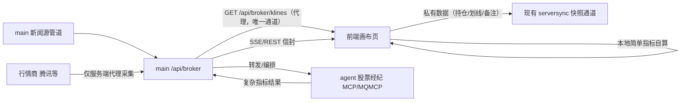
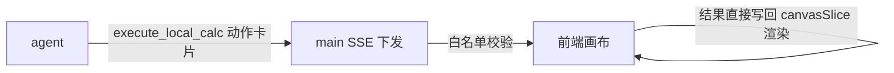

# 自由画布 · 后端对接方案（Agent × Main × 前端）

> 本文汇总自由画布前后端对接讨论结论：指标分层计算、计算即服务契约、本地计算代理（前端 MCP 形态）、降级链路与接口规范。配套设计规格见 `docs/free-canvas-spec.md`；本文档落地时归属 stock-calculator-service 仓库的正式 api 契约文档。

## 一、角色与职责划分



| 角色 | 职责 | 明确不做 |
|---|---|---|
| 前端画布 | 经代理拉 K 线（GET /api/broker/klines 唯一通道）；简单指标即时计算（MA/涨跌幅）；区块数据本地持久化（Dexie） | **不爬、不传、零数据管理**：不直连行情商，不上报原始行情，不做沉淀/缺口管理 |
| main :18080 | 唯一 API 出口：K 线代理转发、信封契约包装、鉴权限流收口、SSE 推送、新闻聚合 | 不要求前端上报原始行情（v3 角色反转：采集归服务端） |
| agent（MCP/MQMCP） | 复杂指标/研报级分析的**无状态计算服务**：收前端切片算完即弃 | 不持久化用户数据；不直连前端 |
| serversync（现状） | 用户私有数据密文备份（含画布区块数据） | 行情原始数据不入此通道 |

**核心决策记录**（讨论收敛结论）：
1. **简单指标前端算、复杂指标后端算**——端上有全量输入且无状态的留前端（metricsEngine 现成）；需全量历史或研报级推理的上收 agent。
2. **计算即服务（无状态）**——后端零数据维护：前端把原始 K 线切片（≤120 根）POST 给计算端点，算完即弃。代价：agent 结论基于前端窗口切片，不保证跨用户可复现（个人研究工具可接受）。
3. **画布 K 线唯一通道 = 服务器代理**（v3 角色反转定案，2026-09-24）：`GET /api/broker/klines` 为画布域获取行情的唯一入口（带用户 Bearer，401 → SessionExpiredError）。前端不再直连行情商，不再承担 Client-Side Data Relay 上传职责，§2.4 沉淀/补爬体系整体废弃（见该节 Tombstone）。**直连仅存量域保留**：沙盘/风控/做T 继续用现有 klineService 直连通道，画布域不再依赖 klineService。

## 二、接口契约（main → 前端）

统一约定：HTTP 200 + `{ code, message, data }` 信封（与 searchService/announcementService 同构）；401 → SessionExpiredError；流式走 SSE（复用 copilot 的 `streamQuestion`/`parseSseBlock` 管道）；token 一律 Authorization Bearer 注入。

### 2.1 POST /api/broker/indicators/compute —— 无状态复杂指标计算

- **前端功能**：metric/chart 区块选「agent 指标」数据源时调用；前端把 K 线切片（含复权因子表）交给后端算复杂指标，结果写回区块 data 渲染。
- **请求体**：
```json
{
  "fullCode": "sh601318",
  "adjustType": "qfq",
  "klines": [{ "date": "2026-01-05", "open": 10.2, "close": 10.5, "high": 10.6, "low": 10.1, "volume": 12345600 }],
  "adjustFactors": { "2026-01-05": 1.0, "2026-03-10": 0.87 },
  "indicators": ["macd", "kdj", "boll"]
}
```
  - `fullCode`：腾讯形态（§2.5-1）；`adjustType`：`'qfq' | 'raw'`（§2.5-7 透传）；`klines` 升序 ≤120 根；`adjustFactors` 逐日因子表（§2.5-3，精确比对主防线）；`indicators` 指标名白名单，白名单外 → code 400。
- **返回值**：
```json
{ "code": 200, "message": "ok", "data": { "version": 3, "indicators": { "macd": { "macd": [null, null, 0.12], "signal": [null, null, 0.08], "hist": [null, null, 0.04] } } } }
```
  - `version`：**数字自增**（与 GET /api/broker/indicators 统一，前端只比对相等，不做语义化排序）。
  - **数组对齐口径**：各指标数组长度/顺序与请求 klines 一一对齐；指标暖机期（如 MACD 前 33 根）算不出值的槽位用 **null 占位**（不截短、不回传起始下标），前端按 null 跳过渲染。
- **错误分支**：code 400 形状/白名单不合法（message 用户可读）｜code 401 SessionExpiredError｜code 429 限流（前端提示稍后重试）｜code 5xx agent 计算失败（metric 区块降级占位「agent 指标暂不可用」）｜网络失败 15s 超时（对齐 REQUEST_TIMEOUT_MS）。
- **幂等/频率**：无状态可重复调用；前端在 metric/chart 设置变更时才触发，不做轮询。

### 2.2 POST /api/broker/ask —— 经纪分析问询（SSE）

- **前端功能**：画布 AI 聊天窗问询（scopeId=`canvas` 线程）；带画布标号上下文让 agent 回答区块相关问题；agent 回复可携带动作卡片（`annotate_block`/`execute_local_calc`）。
- **请求体**：
```json
{
  "cid": "c-20260924-a1b2c3",
  "question": "结合 A1 的 K 线分析当前支撑位",
  "fullCode": "sh601318",
  "klines": [ "…同 2.1 切片结构…" ],
  "canvasContext": "画布区块：\nA1[kline] 贵州茅台 sh600519，日K 120根，水平线2条\nB2[text] 「关注放量突破」"
}
```
  - `cid`：幂等键，复用 `newClientMessageId()`（§2.5-6）；`canvasContext`：spec §6.2 摘要协议（每区块 ≤2 行、总 ≤30 行）。
- **返回值**：SSE 流（完全复用 copilot 既有事件协议 `streamQuestion`/`parseSseBlock`）：
  - `message` 事件：`{ delta }` 增量文本（AI 分析正文，前端逐段渲染）
  - `done` 事件：返回**权威响应体**，`actions` 数组随 done 一起返回（**不设独立 actions SSE 事件**——与 copilot 现网行为一致，前端事件分发零改动；动作引用的区块上下文先经正文解释，避免执行时序问题）。白名单守卫后 confirm 执行：`annotate_block` → 备注；`execute_local_calc` → 本地计算写回区块。done 后流即结束（单向发布模式，**前端不回传任何执行结果**）。
- **错误分支**：SSE 中 `error` 事件（code/message 用户可读）｜连接层 401 → SessionExpiredError｜断线复用 copilot 现有重连机制｜canvasContext 超限由前端截断（不是服务端错误）。

### 2.3 GET /api/broker/news/{fullCode} —— 个股新闻聚合（预留）

- **前端功能**：画布新闻类区块（二期）拉取该股相关新闻；main 聚合新闻源管道 + agent 产出。
- **参数**：path `fullCode`（腾讯形态）；query `page`（默认 1）、`pageSize`（默认 20，上限 50）。
- **返回值**：`data: { items: [{ id, title, summary, source, publishedAt, url }], page, pageSize, total }`——`url` 为原文外链，前端点击跳转不在画布内渲染正文。
- **错误分支**：同信封标准；空结果 `items: []`（非错误）。
- **状态**：一期仅登记契约，不强制实现。

### 2.6 GET /api/broker/indicators —— 能力端点（新增）

- **前端功能**：brokerService 初始化时拉取，缓存 `version` 与指标名清单；本地计算函数表与渲染以它为准（§2.5-8）。
- **参数**：无。
- **返回值**：`data: { version: 3, indicators: [{ name: "macd", label: "MACD", minBars: 33, applicableBlocks: ["metric","chart","kline"] }] }`——`minBars` 为该指标最少暖机根数（次新股/短切片占位渲染与前端本地校验依据）；`applicableBlocks` 限定该指标可挂的区块类型，前端据此过滤设置弹层选项。
- **错误分支**：同信封标准；拉取失败用上次缓存（首次失败则隐藏 agent 指标选项，不阻断画布）。

### 2.7 POST /api/broker/annotations —— 画布快照沉淀（预留，画布二期）

- **前端功能**：用户把「分析结论快照」（区块数据 + AI 结论摘要 + 日K形态）存到后端，跨设备恢复画布上下文（对应原 P2a「AI 结论快照落库」的后端侧；本地 Dexie 仍是主存储，此接口为可选云端副本）。
- **请求体**：`{ canvasId, snapshot: { blocks: [区块摘要], aiNotes: [AI备注] } }`——**不含行情原始数据**（行情采集归服务端代理，§2.4 已废弃），只含轻量结论。
- **返回值**：`data: { snapshotId, savedAt }`。
- **错误分支**：同信封标准；失败静默（本地已有，不阻断）。
- **鉴权与隐私声明（硬门槛）**：此通道为**明文业务数据**进 main 库，非 serversync 的 E2EE 密文通道——文档显式声明「画布快照非密文备份，敏感内容用户自理」，防用户误解。`canvasId` 必须服务端校验归属（按 userId 隔离，防跨用户读写他人快照）；若二期增设 GET 读接口，归属校验同为硬门槛。
- **状态**：预留契约，与画布二期一起评审。

### 2.4 数据沉淀与缺口补全（**已废弃 · Tombstone**）

> **状态**：v3 角色反转定案（2026-09-24）后整体废弃——画布前端不再直连行情商、不再上传切片，Client-Side Data Relay / 旁路沉淀 MQ / 缺口补爬三层体系不再实施。数据采集职责反转归服务端代理（main → 行情商），画布 K 线唯一通道为 `GET /api/broker/klines`（见 §一 核心决策 #3）。
>
> 数据管道设计（MQ 落库 Worker、缺口目录、爬虫缝合、三条生死线）迁移至 **stock-calculator-service 仓库 v3 文档 §3.4 / §四**，前端侧不再维护本节内容；compute 端点的 `adjustFactors` 字段仍保留（§2.5-3），仅用于计算端复权一致性，与沉淀无关。

### 2.5 契约对账（前后端核对 2026-09-24，定案修正）

后端对照前端代码逐项核对后，契约修正与确认如下（原则：**转换成本留在后端，前端零改动**）：

**契约修正（2 处）**：
1. **fullCode 采用腾讯形态**（如 `sh601318`）为规范输入——前端全仓主键即此形态（stockService/klineService/Dexie 缓存/持仓记录均以它为键），后端收到后自行归一化为字典形态做校验。前端各调用点禁出现第二套键形态。
2. **K 线时间口径为日期字符串** `date: "YYYY-MM-DD"`（非 Unix 毫秒）——klineService 的 `KlineItem.date` 即此形态，且它直接做缓存键/复权因子索引；交易所日历无自然日空洞，形状校验按字符串单调性判断。禁止要求前端做毫秒转换。

**契约收紧（1 处）**：
3. **复权一致性改用 Epsilon 容差比对**（v3 修订，原「因子精确比对」作废）——浮点因子表跨进程传输/序列化存在精度漂移，精确 `===` 比对会误杀合法数据；定案口径：**Epsilon 容差（1e-6）+ 定点归一化**（因子值按 `Math.round(f * 1e8) / 1e8` 定点化后比较，绝对差 ≤1e-6 视为一致）。`adjustFactors` 字段仍随切片 payload 携带，仅用于 compute 端复权一致性校验（与已废弃的沉淀管道无关，§2.4）。

**前端核对确认项（实现期落点）**：
4. `execute_local_calc` 与 sandboxEngine（customStats QuickJS VM）边界：一期声明式计算名**不走** VM 沙箱，函数表为纯本地白名单纯函数；sandboxEngine 仅归 customStats 域，禁止顺手混用扩大安全面。
5. 动作消费队列化：copilotActions 现为响应返回时一次性分发（无队列）；画布消费侧须在 canvasSlice 加同 blockId 串行队列（多 SSE 流并发防线）。
6. `/api/broker/ask` 幂等键复用 copilot 的 `newClientMessageId()`（copilotService.ts:168，可直接复用同规格 cid）。
7. KlineBundle 增加透传 `adjustType`（parse 已有 `'qfq'|'raw'` mode 参数，仅差透传到 payload）。
8. brokerService 初始化拉 `GET /api/broker/indicators` 缓存 version，渲染与本地计算函数表以它为准（能力端点，量小）。

### 2.8 对话通道的画布动作与 promptHints（copilot 线 · main 零新端点，2026-09-25 新增）

画布的对话互操作**不走 broker 端点**，走 copilot 标准通道（`POST /api/copilot/threads/{scopeId}/messages`，契约权威见 `docs/copilot-spec.md` v1.5 D33）。main 侧需要改的只有两项：

| # | 改动 | 说明 |
|---|---|---|
| 1 | `CopilotAskRequest` DTO 新增可选字段 `promptHints`（String） | 仅画布 scope（scopeId=canvas）会携带。按**不可信输入**处理：长度硬顶 8192 字节（超长截断）；原样拼接进系统提示**固定区段**（建议放基础提示之后、历史消息之前，位置固定利于 LLM 供应商 prompt 缓存）；ephemeral——**不落库、不打日志**。内容 = 前端组装的「公共段 + 模板专属段」能力说明（含 canvas_add_widget 图纸 schema），**后端不维护任何片段文本**：片段随命中请求上行、与前端守卫同版本，杜绝 prompt↔校验漂移 |
| 2 | 系统提示拼接位核对 | 基础系统提示**无需**描述画布动作（能力说明由 promptHints 承载）；仅需保证拼接区段位置固定、不被历史消息挤占 |

**LLM 响应中的画布动作**（信封不变 `actions: [{type, payload}]`；前端白名单 + 形状守卫 + 分级消费，后端只透传不解析）：

| 动作 | 前端分级 | 用途 |
|---|---|---|
| canvas_add_block / canvas_refresh_klines / canvas_add_widget | auto（直执行） | 新建七类区块 / 刷新行情 / 新建 DSL 动态面板（图纸 schema 经 promptHints 下发） |
| canvas_set_stock / canvas_update_text / canvas_set_metric / canvas_update_table / canvas_add_hline / canvas_add_trendline / canvas_remove_block / annotate_block | confirm（确认卡，用户拍板） | 换股 / 覆写文本 / 设指标 / 覆写表格 / 水平线 / 趋势线 / 删块 / 区块备注 |

分级与守卫全在前端（`utils/copilotActions.ts` + 模板注册表 `utils/canvasTemplates.ts`）。**预期降级**：promptHints 未携带的轮次（用户消息未命中触发词），LLM 收不到对应模板深规格，产出会被前端守卫静默丢弃——这是特性设计（常规对话零 token 开销），不是故障；如需观测丢弃率，建议在编排层按动作类型计数。

## 三、本地计算代理（前端 MCP 形态 · 单向发布模式）

### 3.1 定位与可行性结论

诉求：agent 可以往前端「发布本地计算任务」，让浏览器侧执行专属计算。

结论：**浏览器无法承载标准 MCP server**（无法监听 socket，stdio/SSE server 两种传输都起不来），「前端 MCP 服务」以标准协议形态不成立。但诉求本身可行——落地形态为**单向发布的本地计算代理（Fire and Forget）**：



**单向 vs 双向（决策记录）**：不做「任务下发 → 结果上报」的双向 RPC——那会引入异步悬停、长连接等待、后端状态唤醒全套复杂度。单向模式下 agent 把前端当成**带计算能力的富客户端执行引擎**：下发指令后 SSE 流直接结束，前端本地计算并渲染，agent 不等待、不知晓结果。

核心收益：零后端挂起（main/agent 无状态）、计算结果不回传大模型（省 token 与带宽）、完美复用 copilotActions 现有动作机制。

### 3.2 执行通道（复用现有机制，零新协议）

1. **任务下发**：agent 在 SSE 流中输出动作卡片——`{ type: 'execute_local_calc', payload: { blockId, calc: 'MA20' 等白名单计算名, params? } }`；前端在 `utils/copilotActions.ts` 白名单登记该类型，分级 `confirm`。**Agent 提示词约束（后端配合项）**：系统提示词须明确「你不需要自己计算实时指标，只需输出 execute_local_calc 动作，前端会自动计算并展示，你无需等待结果」
2. **本地执行**：前端按 calc 白名单名分发到本地计算函数（复用 metricsEngine/canvasExpr 等既有纯函数），从画布区块或 brokerService 代理响应缓存读取输入数据——**不执行 agent 下发的任意代码**（比 VM 沙箱执行脚本更收窄：一期只做「白名单计算名 + 参数」的声明式指令，不做代码传输，安全面最小）
3. **结果写回**：计算结果经 canvasSlice action 直接写入目标区块 data（如 metric 区块附加指标值），UI 响应式更新——**结果只进本地 store/Dexie，不上报后端**
4. **blockId 存活校验**：与 annotate_block 同规则——动作执行最后一刻（canvasSlice reducer 内）二次校验区块存活，不存在则静默丢弃

### 3.3 安全护栏（强制）

- `execute_local_calc` 未登记白名单 / calc 名不在函数表 / payload 形状不符 → 静默丢弃（对齐现有动作守卫纪律）
- **禁止传输与执行任意代码**：一期只允许声明式计算名；未来若需脚本级任务，再评估 VM 沙箱通道（customStats 模式），且必须 confirm + 隔离执行
- 严禁 eval / new Function / Function 构造器（对齐 spec §4.7 表达式安全口径）
- 本地计算输入只读（brokerService 代理缓存与区块 data），不写行情源数据

## 四、降级链路与故障边界

| 故障 | 行为 |
|---|---|
| broker 计算端点不可用 | metric/chart 区块的复杂指标位显示「agent 指标暂不可用」占位；简单指标前端自算不受影响 |
| **代理 K 线不可用（429/5xx/超时）** | K 线/图表区块显示「行情服务暂不可用」占位，**重试仍走代理**——画布域没有直连兜底（v3 定案），禁止故障时回退 klineService 直连 |
| **代理 401（未登录/会话过期）** | SessionExpiredError 现成链路弹登录；画布数据需登录后可见（产品定案 2026-09-24：不支持游客看画布） |
| agent 超时/异常 | main 信封 code 5xx 分支 + message 用户可读；前端 15s 超时（对齐 REQUEST_TIMEOUT_MS） |
| execute_local_calc 本地执行失败 | 结果不上报（单向模式）；本地 toast 提示，不阻断画布其他功能；agent 不感知亦无需感知 |
| SSE 断连 | 复用 copilot 现有重连机制；断连期间动作卡片不下发 |

## 五、前端消费封装（一期落点）

| 层 | 文件 | 职责 |
|---|---|---|
| services/brokerService.ts（新建） | 惰性动态 import；`computeIndicators(klines, names)` / `askBroker(...)` | 路由前缀切换点收敛于此；token 传参注入，禁 import store |
| utils/copilotActions.ts | 登记 `execute_local_calc`（及 annotate_block）白名单 + 载荷守卫 | 动作下发通道 |
| utils/canvasExpr.ts（新建） | 递归下降四则运算解析器（spec §4.7）+ 本地计算函数表（execute_local_calc 分发目标） | 本地简单指标 |
| store/slices/canvasSlice.ts | `refreshKlines`/复杂指标结果与本地计算结果写入区块 data 的 action（含 blockId 存活二次校验） | 状态唯一写路径 |

实施排期建议：后端 §2.1 契约先行评审 → brokerService + 计算按钮（画布二期）；本地计算代理（§三）独立小迭代，不阻塞画布一期。

