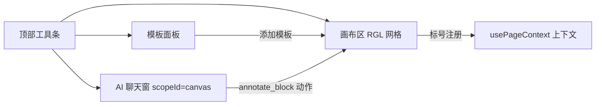

# 自由画布（Free Canvas）设计规格

## 一、概述与定位

自由画布是一个**自由排版 + AI 联动的个股分析工作台**：用户在空白画布上放置各类区块模板（K线、表格、图表、备注等），自由拖拽排列，AI 助手可读取任意标号区块的数据并写备注，形成「布局即分析」的个人研究台。

**与需求路线的关系**：本设计是原评估路线 P2a（单画布 + AI 结论快照）与 P2b（多画布实体）的具体化与合并。一期（本文档范围）落地单画布 + 全部区块模板 + 标号取数协议；多画布管理列表作为二期扩展，数据模型已预留。

**一期边界**：
- 单画布（数据模型支持多画布，UI 一期只呈现当前画布）
- 布局引擎引入 `react-grid-layout`（已确认决策）
- K 线划线一期范围 = 关键水平线（createPriceLine，带标签）+ 两点趋势线段（已确认决策）
- K 线数据源：**服务器代理 `GET /api/broker/klines`（画布域唯一通道，v3 定案：画布不直连、不上传、零数据管理；需登录，游客不可见）**；简单指标即时计算（MA/涨跌幅）；复杂指标走后端无状态计算通道（见 `docs/free-canvas-backend-integration.md`），分钟线数据源不可用

## 二、页面结构

- 路由：`/stock-canvas`，视图组件 `views/StockCanvas.tsx`
- 导航：菜单项「AI 选股台」（追加导航末尾），图标 `LayoutDashboard`
- Copilot 线程：独立 scopeId `canvas`（经 `copilotThreadKey` 天然隔离，与公告/日报区块会话互不叠加）
- 页面纵向结构：
  1. **顶部工具条**：画布标题、模板面板开关、保存状态指示
  2. **模板面板**（左侧抽屉，可收起）：七类模板卡片，点击/拖入添加区块
  3. **画布区**：react-grid-layout 网格，区块卡片自由拖拽/缩放
  4. **AI 聊天窗**（右侧，可收起）：复用 GlobalCopilot 的会话底座，scopeId 固定 `canvas`



## 三、数据模型

### 3.1 存储表（db/schema v15）

新增 `canvasBoards` 表（IndexedDB，Dexie），一期单行使用但按多行设计：

```ts
interface CanvasBoardEntity extends BaseEntity {
  /** 画布标题 */
  title: string;
  /** 区块数组（JSON 内嵌列） */
  blocks: CanvasBlock[];
  /** 默认画布标记（一期恒 true 的单画布） */
  isDefault: boolean;
}
```

索引：`id, isDefault, updatedAt`。实体 interface 定义在 `types/domain.ts`（非 db 模块引用），`db/schema.ts` re-export——遵循项目「类型下沉 domain」惯例。

### 3.2 区块结构（CanvasBlock）

```ts
interface CanvasBlock {
  /** 区块标号，画布内唯一，如 A1/B2（见 3.3 标号协议） */
  blockId: string;
  /** 模板类型 */
  type: 'kline' | 'table' | 'file' | 'chart' | 'metric' | 'image' | 'text';
  /** RGL 网格位置尺寸 */
  layout: { x: number; y: number; w: number; h: number };
  /** 模板数据（按 type 多态，见 3.4） */
  data: CanvasBlockData;
  /** 备注列表（手动 + AI 追加，见第六节） */
  notes: BlockNote[];
}
```

### 3.3 标号协议

- 标号格式：`<列字母><行号>`（A1、A2、B1…），**创建时按列优先顺序分配下一个空闲标号**，不因区块删除而复用（避免历史备注/图表引用悬空指向新区块）
- 唯一性约束：canvasSlice 添加区块时校验，标号不可编辑
- 取数语义：标号 = 区块数据的稳定句柄，AI 上下文与区块间引用（如单指标绑定图表数据）统一用它

### 3.4 各模板 data schema

| type | data 字段 | 说明 |
|---|---|---|
| kline | `fullCode, stockName, trendLines: TrendLine[], hLines: HLine[], maVisible` | 日K + 划线，见第五节 |
| table | `columns: {key,title}[], rows: Record<string,string>[]` | 自由列定义，单元格可编辑 |
| file | `fileName, fileType, dataRef?` | 一期为图片附件占位（IndexedDB Blob 单独存储，data 存引用），文件选择后填充 |
| chart | `seriesType: 'line'\|'bar', points: {label,value}[], sourceBlockId?` | 手填数据或绑定其他区块标号 |
| metric | `label, value?, sourceBlockId?, calc?` | 单值大字展示；可绑定来源区块 + 简单计算（如取 B2 最新收盘价） |
| image | `imageRef?` | 空图片模板：上传后存 Blob 引用 |
| text | `content` | 空文本区域，纯文本编辑 |

`TrendLine = { id, startTime, startPrice, endTime, endPrice }`；`HLine = { id, price, label }`。Blob 引用（dataRef/imageRef）存独立对象表 `canvasBlobs`（v15 同批新增，keyPath 为引用 id），避免区块 JSON 膨胀。

## 四、区块模板规格

每类模板统一外框：标题栏（标号 + 类型图标 + 删除按钮）+ 内容区 + 底部备注区（折叠态显示条数）。

### 4.1 K 线模板
- 默认拉取该股最近 120 根日 K（klineService 三级缓存复用）；Ma5/20/60 可切换显示
- 工具条：「水平线」「趋势线」两个划线模式按钮 + 清除全部
- 一期不做：K 线点击下单、沙盘订单标记、ATR 止损线（沙盘专用能力不迁移）

### 4.2 表格模板
- 添加时默认 3 列 × 4 行空表；列标题/单元格点击即编辑；行列可增删
- 表格数据纯手动维护，一期不与行情联动

### 4.3 文档区块（对外文案「文档」，type key 仍为 file）
- 上传文档（≤10MB，二进制存 canvasBlobs，区块 data 仅存 dataRef），上传后在区块内直接预览
- 预览形态：PDF → 浏览器原生 iframe 渲染；文本类（txt/md/csv/json 等）→ 读文本内联展示（超 2 万字符截断提示）；图片 → 按图预览；其余格式（Office 等前端不可解析）→ 降级为「可下载」占位
- 区块内提供元信息条（文件名 + 大小）、全屏放大预览（Portal + Esc 关闭）、下载与重新上传
- 图片区块（type=image）仍独立保留：≤2MB，仅图片；type key 不改（存量画布已落库 + AI 守卫白名单同此字符串）
- **正文进 AI 上下文**：文本类文档预取正文前 2000 字（`canvasDocText.prefetchDocExcerpts`，模块级缓存按 dataRef 失效），
  区块级快照（Click-to-Focus）给该块全文 2000 字，整页快照按 `DOC_CONTEXT_TOTAL_CHARS=4000` 总预算汇总后放入
  detail（`文档正文摘录` 键）；无文档块时该键省略（零 token）。PDF/图片/Office 前端不可提取正文 → 回一句占位说明
  （不静默省略，防 AI 误判文档为空）。

### 4.4 简单图表
- recharts 折线/柱状二选一；数据两种来源：手动录入 points，或绑定某 K 线区块（sourceBlockId）自动取收盘价序列
- 绑定来源的图表在来源区块删除后进入「数据失效」降级态（见第十节）

### 4.5 数据初始化交互流（从 0 到 1 创建）

各模板拖入画布后的首次赋值流程：

| 模板 | 初始态 | 首次赋值交互 |
|---|---|---|
| kline | 占位态（虚线框 + 「点击选择股票」提示，无行情请求） | 点击占位区 → 弹出 Smartbox 选股弹层（复用 StockAutocomplete）→ 选中后回填 fullCode/stockName 并拉取日K |
| table | 默认 3 列 × 4 行空表 | 无需初始化，直接可编辑 |
| file / image | 占位态 + 上传按钮 | 点击上传即完成首次赋值 |
| chart | 空数据占位（「录入数据或绑定 K 线」提示） | 设置弹层：录入 points 或选绑定 |
| metric | 占位态（「--」大字） | 设置弹层：手动值 / 绑定 / 表达式 |
| text | 占位态（「点击编辑」） | 点击进入编辑即赋值 |

**绑定数据源交互**（chart/metric 共用）：点击区块标题栏 ⚙ 设置图标 → 弹层内「数据来源」下拉框，列出当前画布全部 `type=kline` 区块（选项文案 = 标号 + 股票名，如「A1 贵州茅台」）→ 选中后回填 sourceBlockId 并立即取值渲染。下拉仅列存活区块，空列表时显示「画布上暂无 K 线区块」禁用态。

### 4.6 默认尺寸字典（Layout Defaults）

react-grid-layout 新增区块必须携带 w/h。addBlock 时不由调用方传尺寸，统一走 `utils/canvasLayout.ts` 的默认尺寸字典（按模板可读性预设，放置位置取当前画布首个空闲格子）：

| type | 默认 layout | 说明 |
|---|---|---|
| kline | w:6, h:8 | 半屏宽，保证 K 线可读 |
| table | w:6, h:6 | 半屏宽 |
| chart | w:4, h:6 | 中等 |
| metric | w:3, h:3 | 小卡片 |
| text | w:4, h:4 | 中等 |
| image | w:3, h:4 | 小卡片 |
| file | w:3, h:4 | 小卡片 |

最小尺寸约束（minW/minH）按 §七 网格参数执行（w≥2, h≥3）。

### 4.7 单指标
- 展示形态：标签 + 大字数值
- 三种取值方式：手动输入固定值；绑定区块取值（sourceBlockId + 取值路径，如「最新收盘」「区间涨跌幅」）；简单表达式（一期仅支持常量四则运算，不做脚本执行——复杂计算归 customStats 域）
- **表达式求值安全**：严禁 `eval()` / `new Function()`（后者仍可逃逸访问全局，不比 eval 安全）。一期不引数学库，用自写递归下降解析器（纯函数放 `utils/`，~80 行）：字符白名单 `[0-9+\-*/(). ]` → tokenize → AST → 求值；非法字符/不合法语法直接报「表达式无效」，可单测全覆盖
- **复杂指标通道（agent）**：metric/chart 区块可选「agent 指标」数据源——前端将 K 线切片 POST 至 `/api/broker/indicators/compute`（无状态、算完即弃、后端不存原始行情），结果写入区块 data。契约与降级链路见 `docs/free-canvas-backend-integration.md` §2.1/§四

### 4.8 空图片模板 / 4.9 空文本区域
- 图片：占位态显示上传按钮；文本：占位态显示「点击编辑」
- 文本区域支持 AI 备注追加（见第六节），是 AI 交互最常用的画布锚点

## 五、K 线模板互操作（划线）

底座：lightweight-charts 新建轻量组件 `components/canvas/CanvasKlineChart.tsx`——不复用沙盘 KlineChart（其 orders/snapshots/branchType/点击下单强耦合沙盘语义），仅复用 klineService 数据与 extractFactors 工具。

### 5.1 水平线
- 交互：进入划线模式后点击图上任意价位点 → 生成该价位水平线；或工具条输入精确价格
- 实现：`series.createPriceLine({ price, title: label })`；线可点击弹出编辑（改标签/删除）
- 标签默认「水平线 12.34」，可改为「支撑」「压力」等语义标签

### 5.1.1 行情保鲜（全局刷新）

- klineService 三级缓存（内存 → IndexedDB → 远端）意味着上午挂载的 K 线区块命中缓存后不会主动感知收盘后的新数据
- 对策：顶部工具条提供全局「刷新行情」按钮 → 派发 canvasSlice.refreshKlines → 遍历画布内全部 type=kline 区块，逐个调用 `services/canvasService.ts` 暴露的 `refreshAllKlines(codes)`（service 方法内部走 klineService 增量拉取并绕过内存缓存命中，合并回区块数据）
- 边界：刷新期间区块显示轻量 loading 态（不清空旧数据、不破坏已划线条），失败静默保留旧数据；刷新只更新行情序列，layout/notes/划线不受影响

### 5.2 趋势线段
- 交互：进入趋势线模式 → 点击起点（吸附最近 K 线的时间/价位）→ 点击终点 → 生成线段
- 实现：lightweight-charts 无原生线段工具，用一条只有两点的 `LineSeries`（`lineStyle: Solid, lineWidth: 1`）承载；两点坐标经 `coordinateToTime/coordinateToPrice` 换算存储为 TrendLine，重渲染时还原
- **交易日吸附细则**：K 线 X 轴是离散交易日（周末/节假日无 K 线）。`coordinateToTime` 返回的横坐标若不落在真实交易日上，必须吸附到序列中最近的有效 K 线时间戳（在 kline 数组内二分取最近 bar 的 time）后再存入 `startTime/endTime`——不吸附会导致 LineSeries 两点时间在数据序列外，线段画不出或渲染异常。存储的时间戳必须强等于 kline 序列中真实存在的业务时间戳
- 防抖约束：拖动过程不落 data，松手（第二次点击确认）才写入区块 data 并触发保存

### 5.3 划线持久化
- 划线即数据：任何线的新增/编辑/删除都改写所属区块 `data.trendLines/hLines`，随画布自动保存（见 8.3），刷新后完整还原

## 六、备注系统与 AI 联动

### 6.1 备注（BlockNote）

```ts
interface BlockNote {
  id: string;
  /** manual 用户手写 | ai AI 生成 */
  source: 'manual' | 'ai';
  content: string;
  createdAt: string;
}
```

- 备注区位于区块底部，手动备注点击即编辑；AI 备注带 ✨ 标识、只读但可删除
- 手动添加：任意区块底部「+ 备注」；AI 添加：聊天中说「给 B2 加备注：…」

### 6.2 标号取数协议（AI 上下文）

- 画布挂载时经 `usePageContext` 注册 PageContextSnapshot，scopeId `canvas`
- 上下文摘要格式（控 token，每区块 ≤2 行）：

```
画布区块：
A1[kline] 贵州茅台 sh600519，日K 120根，水平线2条
B2[text] 「关注放量突破」
C3[metric] 现价 1680.00
```

- AI 回答可引用标号（「B2 提到的突破条件，结合 A1 的 K 线…」）；区块增删后快照签名变化自动重注册（复用 usePageContext 的 signature 机制）

### 6.3 annotate_block 动作

- AI 通过动作卡片写备注：`{ type: 'annotate_block', payload: { blockId, content } }`
- 白名单登记：`utils/copilotActions.ts` 的 `ACTION_TIERS` 新增该项，分级 `confirm`（AI 写入用户内容必须确认）；载荷守卫：blockId 必须存在于当前画布、content 非空且 ≤200 字
- 执行：确认后 canvasSlice 追加 BlockNote（source='ai'）并刷新上下文摘要
- **执行时刻二次校验（时序冲突防线）**：AI 思考耗时数秒，期间用户可能已删除目标区块。除载荷守卫（格式/blockId 存在性/content 长度）外，动作真正执行的最后一刻（canvasSlice 的 reducer 内）**必须再次校验 blockId 是否存活**——不存在则静默拦截（不抛错、不中断其他动作），并在动作卡片上给出局部提示「区块 A1 已不存在，备注未写入」。禁止在守卫层校验后就信任 blockId 恒存活

## 七、布局引擎（react-grid-layout）

- 网格：12 列基准，行高 40px，区块最小 w=2/h=3；拖拽吸附 + 自动挤压避让（RGL 原生）
- 选型理由（决策记录）：自实现绝对定位需处理边界碰撞/缩放/网格对齐大量 Edge Case，引入成熟库节省 1-2 轮开发，体积代价 ~40KB 可接受
- 适配：区块渲染组件通过 `ResizeObserver` 自适应内容区尺寸（K 线图表 autoSize 依赖此）
- **弹层裁剪陷阱（层叠上下文）**：RGL GridItem 拖拽/缩放依赖 transform 与 overflow，会创建强隔离层叠上下文——卡片内直接渲染的下拉框/选股弹层会被卡片边框裁剪。规定：区块内一切浮层（Smartbox 选股、绑定下拉、编辑弹层、确认框）必须经 React Portal（`ReactDOM.createPortal`）挂载到 `document.body`，脱离 RGL 卡片 DOM 树
- 持久化：RGL `onLayoutChange` 回调 → 写回各区块 layout → 防抖保存（拖拽结束不立即落库，800ms 静默后保存）

## 八、分层落点与保存管线

### 8.1 代码落点（遵循项目分层护栏 R1/R2/R3）

| 层 | 文件 | 职责 |
|---|---|---|
| types/domain.ts | CanvasBlock/CanvasBoardEntity/BlockNote/TrendLine/HLine | 权威类型（零依赖叶子） |
| db/schema.ts | v15：canvasBoards + canvasBlobs 两表 | 持久化 + 索引 |
| services/canvasService.ts | 动态 import db 桶：loadBoard/saveBoard/putBlob | 读查询与 Blob 写入 |
| utils/canvasLayout.ts | 标号分配、区块数据守卫（纯函数，不碰 store） | 标号协议实现 |
| store/slices/canvasSlice.ts | 区块增删改/划线/备注 actions + 防抖 safePersist | 状态机（唯一写路径） |
| hooks/useCanvasContext.ts | 组装区块摘要 → usePageContext 注册 | AI 上下文桥接 |
| views/StockCanvas.tsx + components/canvas/* | 画布视图 + 七类区块渲染组件 + 轻量K线 | UI（经 store，禁直连 db） |
| utils/copilotActions.ts | annotate_block 白名单 + 守卫 | AI 动作登记 |

### 8.2 依赖方向

`views/components → hooks → store → services → db`；utils（布局/守卫）保持零 store 依赖；check:arch 护栏不豁免本域。

### 8.2-bis 公共组件复用清单（2026-09-24 盘点定案）

**✅ 直接复用（零改动或纯传参）**：

| 组件/能力 | 位置 | 画布用途 |
|---|---|---|
| StockAutocomplete | components/ui/ | K 线区块选股弹层（props 注入回调） |
| ConfirmModal | components/ui/ | 区块删除级联确认、动作 confirm 弹窗 |
| copilot 会话底座 | services/copilotService | streamQuestion/parseSseBlock/newClientMessageId 原样复用（对接文档 §2.2） |
| 动作白名单机制 | utils/copilotActions | 照登记三步流程加 annotate_block/execute_local_calc |
| 上下文注册 | hooks/usePageContext | 标号摘要注册（§6.2） |
| klineService | services/ | 日K 三级缓存 + buildAdjustFactors（切片/因子表来源） |
| idGenerator / safePersist 模式 | utils/ | blockId/备注 id 生成；800ms 防抖落库 |
| lightweight-charts / recharts | 库 | 画布 K 线与简单图表直接用库，不经沙盘封装 |

**🔧 改造后复用（小改）**：

| 组件 | 改造点 |
|---|---|
| GlobalCopilot | 浮窗壳 → 画布内嵌聊天面板：复用 scopeId 线程键/会话加载/墓碑对账逻辑，容器换画布右侧停靠（scopeId 固定 canvas） |
| CopilotActionCards | 卡片渲染扩展 annotate_block/execute_local_calc 两类新动作，守卫与 confirm 流程不变 |
| EmptyStateGuide（sandbox） | 模式复用：props 换「打开模板面板」回调 + 画布文案，做 canvas 变体（不 import 沙盘组件） |
| 沙盘 KlineChart | 组件本体不复用（沙盘语义强耦合）；其中 extractFactors/坐标换算思路可提取到共享 utils |

**❌ 不可复用（边界定案）**：

| 组件 | 原因 |
|---|---|
| customStats vm.ts（QuickJS 沙箱） | §2.5-4 定案：execute_local_calc 走声明式白名单函数，不碰 VM；沙箱仅归 customStats 域 |
| serversync 管道 | §九 定案：canvasBoards/canvasBlobs 不入密文快照 |
| 沙盘 KlineChart 组件本体 | orders/snapshots/branchType 强耦合沙盘语义 |

**⚠️ 缺口（现无公共组件，需新建）**：

| 项 | 说明 |
|---|---|
| 全局 Toast | 全仓无独立 Toast（各 Modal 内嵌实现）——execute_local_calc 失败提示、保存状态反馈需要；新建轻量 Toast 放 components/ui/（未来其他域可共享） |
| react-grid-layout | 新依赖（已批准引入，见 §七） |

### 8.3 保存管线

所有写路径（划线/备注/表格编辑/布局）→ canvasSlice action → `safePersist` 防抖 800ms → putPlannedOrder 式整块写回 `canvasBoards`；顶部工具条显示「已保存/保存中」状态。Dexie 同 tick 隐式 put 覆盖陷阱：整块序列化写回天然规避。

## 九、本地/远端边界（前端拦截）

画布域是**纯前端功能**，数据读写只走 `canvasSlice → canvasService → Dexie（IndexedDB）`，不经过 apiClient / serverSync / copilot 服务管道。各模板边界：

| 模板/能力 | 数据路径 | 后端依赖 |
|---|---|---|
| 文本区域 / 表格 / 空图片 | data 字段 → canvasBoards（IndexedDB） | 无，全本地 |
| 文件/图片附件 | Blob → canvasBlobs（IndexedDB） | 无，全本地 |
| 单指标（手动/绑定模式） | 本地取值与常量四则运算 | 无，全本地 |
| K 线数据 | klineService → 腾讯行情（/api-kline 代理） | 外部行情接口（非本项目后端） |
| 复杂指标（agent） | brokerService → main `/api/broker/indicators/compute` 无状态计算，算完即弃 | 有（后端不存原始 K 线，前端上报切片） |
| 本地计算代理 | copilot 动作通道下发 `execute_local_calc` → 白名单本地计算 → 结果写回区块渲染（单向发布，不上报） | 有（仅 SSE 下发指令） |
| AI 分析 / annotate_block | copilotService → 本项目后端 LLM | 有 |

实现约束（前端拦截口径）：本地模板的编辑路径**禁止**引入网络调用或服务端同步逻辑；画布保存管线（§8.3）只在 IndexedDB 落库。canvasBoards/canvasBlobs 两表**不纳入** serversync 密文快照同步范围（画布属个人研究态，体量含 Blob，快照通道不承载），跨设备迁移后续经 WebDAV 全量备份通道自然覆盖。

## 十、失效与边界处理

- **空画布引导**：`blocks.length === 0` 时画布中央渲染虚线框占位符（「画布空空如也，请从左侧模板面板添加区块开始分析」），点击占位符直接打开模板面板；首个区块添加后占位符消失

- **区块删除级联**：删除区块时扫描全画布引用（sourceBlockId）；被引用则弹确认，确认后引用方降级为「来源 A1 已删除」占位态，不自动删
- **标号不复用**：删除 A1 后新增区块得下一个空闲标号（见 3.3），历史备注中「A1」永远指向旧区块语境
- **K 线数据失败**：fullCode 无行情（停牌/代码失效）→ 图表区显示错误占位，划线数据保留
- **Blob 失效**：image/file 引用的 Blob 缺失 → 占位态 + 重新上传入口
- **上下文摘要在画布为空时**：注册空摘要，AI 引导语提示「先从模板面板添加区块」

## 十一、验收与风险

### 10.1 验收口径（一期）
- 七类模板可添加/拖拽/缩放/删除，标号自动分配且不复用
- K 线模板：日K 展示 + 水平线/趋势线划线，刷新后完整还原
- AI：能引用标号回答区块内容；annotate_block 经确认写入备注
- 布局与内容改动 800ms 防抖落库，刷新还原
- `npx tsc --noEmit` + `npm test`（含 check:arch）全绿；索引登记后 `npm run map:features` 未归类=0

### 10.2 风险清单
1. **趋势线换算精度**：coordinateToTime/Price 在稀疏数据（120 根）下边缘吸附偏差——验收时需人工核对起终点与点击位置一致性
2. **RGL 与区块内容滚动冲突**：区块内滚动（表格/长文本）可能触发拖拽——需在 RGL draggable 上排除内容区（draggableHandle 限定标题栏）
3. **整块写回放大**：画布含多 K 线区块时单块 JSON 较大（划线+备注），一期可接受；若膨胀明显，二期拆区块独立行
4. **copilot 上下文预算**：区块多时摘要增长——摘要协议硬限「每区块 ≤2 行、总 ≤30 行」，超出截断提示

### 10.3 二期展望（非本文档范围）
多画布管理列表（切换/复制/删除）、区块级引用图谱、复杂画笔工具（黄金分割等）、表格与行情联动、P3a 行情逼近提醒接入 metric 区块。

