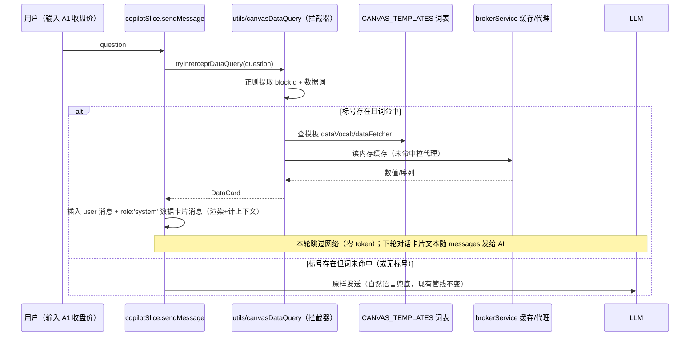

# 自由画布 · 模板注册表与受限取数语法设计（CanvasTemplate Registry）

> 关联文档：`docs/free-canvas-spec.md`（画布一期规格）、`docs/free-canvas-backend-integration.md`（后端对接契约，v3 代理定案）。
> 本文档为画布模板注册表的**架构设计**（status: active，§五 六步迁移已实施；§六 DSL 动态模板已落地）。

## 一、背景与决策记录（2026-09-25 用户拍板）

画布一期沉淀的七类模板（kline/table/chart/metric/text/image/file）目前是「隐式模板」：默认数据散在 `canvasSlice.addCanvasBlock` 的 switch、取数逻辑散在各渲染组件、后处理操作散在 `copilotActionSlice.dispatchCanvasAction` 的 switch。新增一类模板需要改 4+ 处。

本设计将其**显式注册表化**：模板内容、初始化、取数、操作、受限取数词表收编为单一注册对象。三点已拍板决策：

1. **数据进对话窗坚决采用「数据卡片消息」**（可见 + 计入上下文）——投资工具用户必须对「输入给 AI 的数据源」有绝对把控感；隐式上下文一旦 AI 算错无法区分是推理错还是取数错。
2. **后处理语法沿用现有 `canvas_*` 动作名**——保证 Prompt 稳定，一期不同时挑战前端重构与 Prompt 重构；注册表仅做底层分发替代 switch。
3. **接口上预留、一期落地仅限现有七类**——防范过度工程；`CanvasTemplate` 类型设计兼容未来动态模板（如 run_custom_stat），但一期不新增模板类型。

## 二、CanvasTemplate 类型定义

落点：`src/utils/canvasTemplates.ts`（纯数据 + 纯函数层，slice/组件/hook 均可安全引用，无循环依赖）。

```ts
import type { LucideIcon } from 'lucide-react';
import type { CanvasBlock, CanvasBlockData, CanvasBlockType } from '../types/domain';

/**
 * 模板后处理操作定义（一期 = 现有 canvas_* 动作的注册表映射；二期扩充新操作只加条目）。
 * guard/exec/summarize 与 copilotActions.ts 现有守卫族、copilotActionSlice 执行器一一对应收编。
 */
export interface CanvasTemplateOperation {
  /** 操作名 = canvas_* 动作白名单键（如 'set_stock'），对应完整动作名 `canvas_${op}` */
  op: string;
  /** 分级（沿用 copilotActions 纪律：auto 直行 / confirm 确认卡） */
  tier: 'auto' | 'confirm';
  /** 载荷守卫：引用 copilotActions.ts 集中守卫（一期守卫逻辑不散，仅在此登记） */
  guard: (p: unknown) => Record<string, unknown> | null;
  /** 执行器：runBlockTask 内落地；blockId 串行队列 + 最后一刻存活校验由 canvasSlice 兜底 */
  exec: (blockId: string, payload: Record<string, unknown>) => void;
  /** 确认卡/人话摘要（可选，缺省用通用模板「AI 建议执行：canvas_x」） */
  summarize?: (p: Record<string, unknown>) => string;
}

/** 数据卡片内容（受限取数产出，渲染进对话流 + 拼入 LLM messages） */
export interface CanvasDataCard {
  /** 卡片标题（如「A1 腾讯控股 · 收盘价」） */
  title: string;
  /** 键值行（只读展示；键为指标/字段名，值为格式化串 + 原始值双份） */
  rows: { label: string; text: string; raw: number | string }[];
  /** 取数时间（ISO，卡片注明时效） */
  asOf: string;
  /** 拼入 LLM 的纯文本形态：`[系统获取] A1 (腾讯控股) 收盘价: 310.40` 逐行拼接 */
  toPromptText: () => string;
}

/**
 * 画布模板注册表条目：七类模板各一个对象，新增模板 = 注册一个对象（一期不新增）。
 * 可选成员允许缺省：text/image/file 等静态模板无 initData/fetchData/dataVocab。
 */
export interface CanvasTemplate {
  type: CanvasBlockType;
  label: string;
  icon: LucideIcon;
  /** RGL 默认尺寸（现 canvasLayout DEFAULT_SIZES 字典收编于此，单一事实源） */
  defaultSize: { w: number; h: number };
  /** 建块默认 data（现 canvasSlice.addCanvasBlock 的 switch 收编；缺省 = 空对象兜底） */
  initData?: (params?: { stockCode?: string; content?: string }) => CanvasBlockData[CanvasBlockType];
  /**
   * 统一取数接口：组件挂载/刷新行情共用入口；返回 data 增量（调用方 updateCanvasBlockData 合并）。
   * 返回 null = 该模板不取数；抛错 = 取数失败（调用方转占位/toast，错误分类沿用 BrokerUnavailableError/SessionExpiredError）。
   * 二期动态模板（run_custom_stat）可在此接收 AI 传回的动态参数——签名宽度已预留。
   */
  fetchData?: (block: CanvasBlock, params?: Record<string, unknown>) => Promise<Partial<CanvasBlockData[CanvasBlockType]>> | null;
  /** 本模板可接受的后处理操作（copilotActions 白名单分型 + copilotActionSlice 分发由此派生） */
  operations: readonly CanvasTemplateOperation[];
  /** 受限取数词表（「<标号> <数据词>」匹配用；空数组 = 不支持取数，如 text/image/file） */
  dataVocab: readonly string[];
  /** 词表项取数执行：返回数据卡片内容（读内存缓存优先，未命中拉 fetchData 通道） */
  dataFetcher?: (block: CanvasBlock, term: string) => Promise<CanvasDataCard> | CanvasDataCard;
  /** 二期预留：动态模板自定义渲染钩子（run_custom_stat 类）；一期不实现，类型位占位 */
  renderCustom?: (block: CanvasBlock) => React.ReactNode;
}

/** 注册表（模块级常量）：按 type 查找的唯一事实源 */
export const CANVAS_TEMPLATES: Readonly<Record<CanvasBlockType, CanvasTemplate>>;
/** 便捷取用（未知 type 返回 undefined，调用方兜底） */
export function getCanvasTemplate(type: CanvasBlockType): CanvasTemplate | undefined;
/** 全模板 operations 展开（copilotActions 白名单/分级/执行器分发的派生源） */
export function allCanvasOperations(): ReadonlyMap<string, CanvasTemplateOperation>;
```

**类型设计要点**：
- `fetchData` 的 `params?` 与 `renderCustom` 是二期动态模板的预留位（决策 3），一期不实现任何调用点。
- guard 一期引用集中守卫（`asCanvasSetStockPayload` 等），不复制逻辑——白名单安全纪律仍是单点。
- `CanvasDataCard.toPromptText` 保证「用户看到的卡片」与「AI 收到的文本」同源，杜绝双源漂移。

## 三、受限取数语法：拦截与数据卡片流程

**语法（受限，非 NLP）**：`<标号> <数据词>`，如 `A1 收盘价`、`A3 MACD`、`A1 最近60天`。词表来自各模板 `dataVocab`（kline: 收盘价/开盘价/成交量/最近N天；metric: 当前值；table: 全表…）。

- 拦截点：`copilotSlice.sendMessage` 入口（发网络前）。
- 三分支：标号存在且数据词命中词表 → **本地拦截**，零 token 直出数据卡片；标号存在但词未命中 → **不拦截**原样发 AI（自然语言兜底）；无标号 → 不拦截。
- 数据卡片同时做两件事：对话流渲染（用户可见）+ 拼入本轮 messages（AI 可用原料）。



**核心伪代码**：

```ts
// utils/canvasDataQuery.ts
const BLOCK_RE = /^([A-Z]\d{1,2})\s+(.+)$/; // 标号形态：字母列+序号（canvasLayout 分配器同源）

export function tryInterceptDataQuery(question: string): CanvasDataCard | null {
  const m = BLOCK_RE.exec(question.trim());
  if (!m) return null;
  const [, blockId, term] = m;
  const block = useAppStore.getState().canvasBlocks.find((b) => b.blockId === blockId);
  if (!block) return null;                       // 标号不存在 → 原样发 AI
  const tpl = getCanvasTemplate(block.type);
  if (!tpl?.dataVocab.includes(term) || !tpl.dataFetcher) return null; // 词未命中 → 原样发 AI
  return tpl.dataFetcher(block, term);           // 命中 → 数据卡片（同步读缓存或异步拉数）
}

// copilotSlice.sendMessage 入口：
// const card = tryInterceptDataQuery(question);
// if (card) { 插入 user 消息 + system 卡片消息; return; }  // 零 token，不进网络
```

**消息形状**：线程消息新增 `role: 'system'` 变体（仅画布拦截产线使用），UI 渲染为只读灰底卡片（「[系统获取]」前缀 + asOf 时效），拼装 LLM messages 时以 `toPromptText()` 文本注入。存量消息解析对未知 role 容错跳过（向前兼容）。

## 四、后处理：canvas_* 动作的注册表分发

**对外行为零变化**：LLM 仍输出 `canvas_*` 动作 JSON（决策 2），copilotActions.ts 白名单/守卫/分级不动；仅 `copilotActionSlice.dispatchCanvasAction` 的 switch 收编为注册表分发：

```ts
// 现状：switch (type) { case 'canvas_set_stock': ...×9 }
// 之后：
const opName = type.replace(/^canvas_/, '');
const op = allCanvasOperations().get(opName);
if (!op) return false;                     // 未注册操作照旧静默丢弃（安全口径不变）
op.exec(payload.blockId, payload);         // runBlockTask 串行 + 存活校验兜底不变
```

- `annotate_block` 不收编（非模板操作，维持独立分支逐条确认）。
- 思维流放行（`copilotApprovedCanvasTypes`）机制不变。

## 五、一期迁移路径（6 步，每步 tsc+测试可独立验收）

| 步 | 内容 | 兼容性保障 |
|---|---|---|
| 1 | 新建 `utils/canvasTemplates.ts`：CanvasTemplate 类型 + 七类注册对象（纯搬运 label/icon/默认尺寸/默认 data）；`StockCanvas.TEMPLATES` 改为由 CANVAS_TEMPLATES 派生 | 纯新增，UI 零变化 |
| 2 | `canvasSlice.addCanvasBlock` 的默认 data switch → `template.initData(params)` 收编 | 存量画布不回读 initData，无影响 |
| 3 | 取数收口：KlineContent/ChartContent 内散的拉数逻辑挪到 kline/chart 模板 `fetchData`；`canvasService.refreshAllKlines` 改为遍历各模板 fetchData（保留 getCachedBrokerKlines 缓存语义与 force 刷新） | 组件 useEffect 改调统一接口，缓存/降级行为不变 |
| 4 | 受限取数：新建 `utils/canvasDataQuery.ts` + copilotSlice.sendMessage 入口拦截 + system 卡片消息渲染（GlobalCopilot 消息分支） | 拦截不命中=现状行为，风险面仅新增分支 |
| 5 | 动作分发：`dispatchCanvasAction` switch → 注册表遍历（§四）；copilotActions 白名单守卫保持集中 | LLM 侧语法零变化；补注册表分发等价性单测（9 动作逐一对拍） |
| 6 | 索引登记（stock-calculator-index canvas 行补 canvasTemplates/canvasDataQuery）+ devlog + 本文档 status: draft → active | — |

**七类模板 dataVocab/operations 一期基线**：

| 模板 | dataVocab | operations（=现有动作映射） |
|---|---|---|
| kline | 收盘价/开盘价/成交量/最近N天 | set_stock / add_hline / add_trendline / add_block(带码) |
| metric | 当前值 | set_metric |
| table | 全表 | update_table |
| chart | 数据点 | update_block(绑定/录入) |
| text | —（不支持取数） | update_text / add_block(带内容) |
| image / file（对外文案「文档」，见 free-canvas-spec §4.3） | — | —（仅 add_block） |
| 通用 | — | remove_block / refresh_klines（挂于 allCanvasOperations，不属单模板） |

## 六、DSL 动态模板（widget：第八区块类型，AI 自定义增量面板）

2026-09-25 拍板并落地：让 LLM 自主产出「自定义模板」动态面板——不开任何代码通道（含沙箱，禁 eval），LLM 只输出受 schema 约束的 JSON「图纸」，前端单一入口校验通过后才落画布。增量语义：**只新增不覆盖，改 = 删旧 `canvas_remove_block` + 加新 `canvas_add_widget`**（无 update 动作）。

**图纸 schema（`WidgetDsl`，类型在 types/domain）**：

- 顶层：`kind`（`stack` 纵排 | `grid` 两列）+ `title`（≤40 字）+ `nodes`（≤8 个叶子节点）；doc 总量 ≤8KB（UTF-8）。
- 叶子组件白名单 8 种（封闭）：`text` / `metric` / `kv` / `list` / `table` / `progress` / `tag` / `divider`；扁平单层，不允许可疑嵌套容器。
- 语义色调 `tone` 三值枚举：`info` / `warn` / `danger`。
- 校验纪律（`utils/widgetDsl.validateWidgetDsl` 单一入口）：结构违规（白名单外种类/未知字段/嵌套/条数超限/超尺寸）→ 整条拒绝返回 null；字符串超长 → 裁剪（对齐守卫族口径）；空串一律拒绝。

**链路与分级**：

| 环节 | 落点 | 口径 |
|---|---|---|
| 分级 | copilotActions `canvas_add_widget: 'auto'` | 只读可视化只新增，无破坏性，直执行不出确认卡 |
| 守卫 | `asCanvasAddWidgetPayload`（集中守卫族） | 内部调 validateWidgetDsl，返回规范化 DSL 随载荷下发 |
| 注册表 | `COMMON_OPERATION_META` 增 `add_widget` 条目 | 元数据 tier/guard 登记，exec 仍留 slice 层（R2） |
| 执行器 | `CANVAS_EXECUTORS.add_widget` | `addCanvasBlock('widget', { dsl })` + app-toast 反馈 |
| 渲染 | `CanvasBlockContent` case `widget` | WidgetContent 只读渲染（8 种叶子分派；grid 两列布局） |
| 手动入口 | 注册表 `aiOnly: true` | 不进「+ 添加」下拉与空态模板网格，仅对话动作可创建 |
| 持久化 | data = `{ dsl }` 随 canvasBlocks 防抖落库 | `canvasLayout.DATA_GUARDS.widget` 复用 validateWidgetDsl 兜底防手改脏数据 |
| 摘要 | `canvasSummary` widget 行 | `动态面板「title」kind/N项，节点[种类…]`，AI 标号摘要可见 |

**AI 侧接线（copilot-spec D33 条件携带，注册表承载）**：每个模板可在注册表登记 `aiPrompt`（本模板 canvas_* 写操作深规格，与 operationsMeta 守卫同仓同 PR 演进）+ `aiTriggers`（触发词，includes 宽匹配）；`buildCanvasPromptHints(question)` 组装 = 公共段（通用动作/标号约定/数据纪律）+ 命中触发词的模板专属段，copilotSlice 仅 canvas scope 随 ask 请求 `promptHints` 字段携带（ephemeral 不落库；后端按不可信输入 ≤8KB 截断原样拼接进系统提示固定区段，分层见 copilot-spec §6.2）。已登记：widget（canvas_add_widget 图纸 schema，触发词「自定义面板」，快捷按钮 draft 预填）/ kline（换股/划线格式）/ metric（值与表达式）/ table（行列覆写）/ text（覆写）；chart/image/file 无写操作不设。常规画布对话零额外 token；重发按原消息内容重判零状态。**权责边界（2026-09-25 联调定案）：动作外壳协议（`<copilot-actions>`，后端 CopilotStatActionExtractor 私有解析）由后端编排系统提示宣讲——谁解析谁宣讲、全局兜底；promptHints 仅教载荷、永不包含外壳标签（测试钉死）；前端 GlobalCopilot 渲染层经 `stripCopilotActionBlock` 剥离外壳块作双保险（防流式/历史重放泄漏 JSON）。**

**测试基线**：校验器专项（白名单/未知字段/嵌套/上限/裁剪/tone/空值）+ 守卫与 sanitize 路由 + 分发等价性对拍（add_widget 入表）+ auto 直执行落块/非法 DSL 静默丢弃；tsc 零错误，npm test 55 文件 854 用例全绿。

## 七、二期预留与不做的事

**预留**：`fetchData(block, params?)` 承接 AI 动态参数；`renderCustom` 承接 run_custom_stat 动态图表模板；`allCanvasOperations()` 天然支持二期扩充新操作/新文法（届时再评估统一「标号-操作-数据」文法）。

**不做（一期红线）**：不做自由中文 NLP 解析；不新增动作文法；不改 LLM 侧 prompt 输出格式；守卫逻辑不散出 copilotActions.ts。（「不新增模板类型」红线已于 2026-09-25 拍板对 widget DSL 动态模板开例外，见 §六。）

**风险与对冲**：
- 词表歧义（如「最近60天」是词还是数字）→ 词表精确串匹配，无模糊匹配；未命中一律兜底发 AI。
- 拦截误伤（用户想聊 A1 而非取数）→ 拦截仅限「标号+词表词」完整命中形态；卡片消息可被下一轮对话自然纠正（AI 看得到卡片内容）。
- system role 对存量会话解析的兼容 → 消息渲染按未知 role 容错跳过，持久化 schema 不变（copilot 线程为内存态）。
