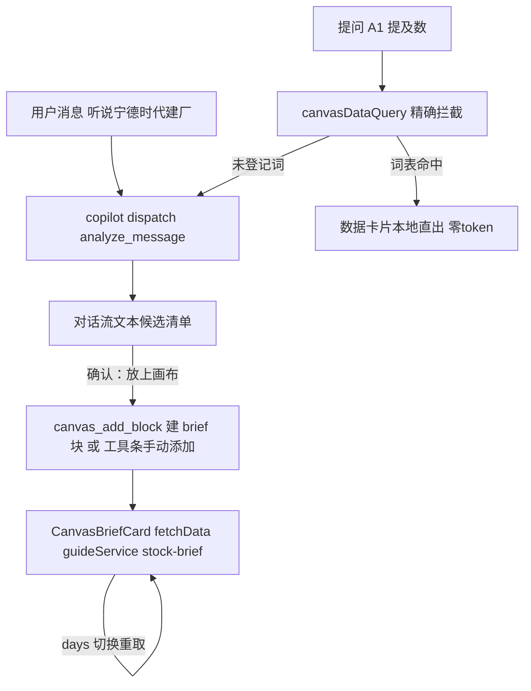

# 选股引导（Guide）· 前端设计文档

> 版本：v1.1（2026-09-26；v1.1 = 档案卡归宿改画布 brief 块 + dataVocab 登记方案 + 一期重排（向导页降可选）；v1.0 = 初稿（独立向导页两步 + prefillDraft handoff））
> 范围：选股引导的前端承接——对话流候选确认后，个股档案卡以**画布 brief 块**承载（持久/并排/AI 寻址）；聊天入口零改动。独立向导页降为可选二期。
> 关联：后端仓 `docs/guide/api.md`（REST 契约唯一事实源，含 nextAction 分支语义）、后端仓 `docs/guide/design.md`（流程与 D10/D13 决策）、本仓 `docs/free-canvas-spec.md` 与 `docs/free-canvas-template-registry.md`（画布区块注册表）、`docs/copilot-spec.md`（Copilot 上下文机制）
> 状态：一期已实现（tsc 零错误 + 866 用例全绿含架构护栏 + map:features 归组 ✓），待后端联调人工冒烟（§5）

## 0. 已确认决策记录

| # | 决策点 | 结论 |
|---|---|---|
| G1 | 一期形态 | **canvas brief 块 + 候选确认落块**；Step1（消息→候选）由对话流文本承载，独立向导页降为可选二期 |
| G2 | 档案卡归宿 | **画布块**：持久（RGL 布局落库）、多股并排、dataVocab 标号取数可 AI 寻址；**候选清单不上画布**（会话态瞬态数据，留对话流） |
| G3 | 取数登记 | brief 块**登记 dataVocab + dataFetcher**（模板条目内聚，无独立白名单）：一期只上数字词「提及数」精确直出（零 token、轻量直取保新鲜、防幻觉）；列表词（题材/公告）二期看 CanvasDataCard 形状再登记 |
| G4 | 块契约纪律 | fetchData 仅依赖 services（guideService）；brief 块只读，`operationsMeta: []` 不设 aiPrompt/aiTriggers；多实例 stockId 复用 initData 通用参数 `{ stockCode }`（与 guide stockId 同为 `sh600519` 字典键形态，零签名改动，kline :259-260 先例） |
| G5 | 同步扩容点 | `canvas_add_block` 的 aiPrompt type 枚举**硬编码于 canvasTemplates.ts:459**（非注册表派生）——加 brief 类型须同轮把「七类」扩「八类」并同步动作守卫，否则 AI 落块被静默丢弃（手动工具条不受影响） |
| G6 | CORS/部署 | 对齐 search/broker 多数派不挂跨域注解，前端同源/反代访问（后端 api.md §0），本仓无需额外配置 |
| G7 | 向导页纪律（可选二期适用） | 若做向导页：分支只判 `nextAction`（present_candidates/clarify）；prefillDraft 通道（copilotSlice 增字段 + GlobalCopilot effect 消费即清）承载卡片按钮预填；quickActions 只放静态项 |

## 1. 落点清单（一期已实现：新文件 2 + 改动 8 + 登记 2）

| 文件 | 职责 |
|---|---|
| `src/services/guideService.ts`（新） | fetchStockBrief(stockId, days) 薄封装（镜像 searchService 取数范式：信封 code 分支/401 兜底/15s 超时）；向导页二期再加 analyzeMessage |
| `src/components/canvas/CanvasBriefCard.tsx`（新） | brief 块组件：三段聚合 + days 预设切换（7/14/30）+ 手动刷新；ctime ×1000；取数→写库依赖收缩为原语防死循环 |
| `src/types/domain.ts`（改动） | Guide* 三接口下沉 + `CanvasBlockType` 增 `'brief'` 与 `CanvasBlockData.brief` 变体 |
| `src/utils/canvasTemplates.ts`（改动） | brief 模板条目（initData/fetchData/dataVocab:['提及数']/dataFetcher/operationsMeta:[]）+ canvas_add_block aiPrompt 枚举加 brief（G5） |
| `src/utils/copilotActions.ts`（改动） | CANVAS_BLOCK_TYPES 白名单加 brief（G5） |
| `src/store/slices/copilotActionSlice.ts`（改动） | add_block exec 增 brief 分支（initData({ stockCode }) 复用，形状单一事实源） |
| `src/components/canvas/CanvasBlockContent.tsx`（改动） | type 分发加 brief case |
| `src/utils/canvasSummary.ts`（改动） | 标号摘要增 brief case（AI 区块快照可读档案） |
| `src/utils/canvasLayout.ts`（改动） | DATA_GUARDS 增 brief 形状守卫（实现时发现的穷举 Record 同步点，与 G5 同类） |
| `src/components/canvas/CanvasBlockFrame.tsx`（改动） | TYPE_LABEL 徽标增「个股档案」（同类穷举 Record 同步点） |
| 登记 | `scripts/feature-map.mjs` GROUPS 增 guide（置于 canvas 前，briefcard 归 guide）；`stock-calculator-index` 归属表加 guide 行 |

可选二期（向导页三件套）：`src/views/Guide.tsx` + `src/components/guide/CandidateCard.tsx` + `src/hooks/useGuideContext.ts` + prefillDraft 通道（copilotSlice.ts:453 一带 + GlobalCopilot.tsx:213 effect）——触发条件：对话流文本候选不够用。

## 2. 数据流

- 确认落块两通道：对话里说「把贵州茅台放上画布」（AI 经 canvas_add_block，依赖 G5 扩容）或工具条「+ 添加」手动建块（非 aiOnly 模板自动获得入口）。
- 空候选/空档案/未收录股票均为 200 业务态（count=0、空名不进错误分支），UI 按「近窗口无数据」呈现；`llmDegraded` 语义见后端 api.md（对话流由 copilot 自行转述）。

## 3. dataVocab 登记方案（G3）

- 词表一期：`['提及数']` —— dataFetcher 复用 fetchStockBrief 的 `clsMention.count`，形态照抄 kline 数字词先例（canvasTemplates.ts:276-281）。
- 拦截器契约（canvasDataQuery.ts）：「`<标号> <数据词>`」精确串匹配 → 命中本地直出（零 token、缓存优先）；未命中 → null 原样发 AI 自然语言兜底（fail-open 两条腿并存）。数字字段精确直出即防幻觉护栏。
- 列表词（「题材」「公告」）二期：先确认 `CanvasDataCard` 对列表型数据的形状支持，不硬塞。

## 4. 联调前提

1. 代理路由：`proxy.config.js` UPSTREAMS 显式列了 auth/import——确认 vite dev proxy 与 `middleware.js`（Vercel）把 `/api/guide` 前缀送到同一 Spring Boot upstream（按前缀白名单转发则补登记一行）。
2. 部署同源/反代（G6）；后端暴露面口径见后端 design.md D13。

## 5. 验证

- 静态：`npx tsc --noEmit` 零错误；`npm test`（pretest 自动跑 check:arch）全绿；
- 归组：`npm run map:features -- guide canvas` 确认新文件入组（`scripts/feature-map.mjs` GROUPS 补 guide 关键词）；
- 人工冒烟：① 对话确认落块（AI 动作 + 手动两路）；② 块数据刷新与 days 切换重取；③ 提问「A1 提及数」零 token 直出数据卡片；④ 多股多块并排与布局持久化（重开还在）。

## 6. 边界与二期

- 独立向导页两步流（Step1 消息→候选卡片 + prefillDraft handoff）：对话流文本候选不够用时启动，纪律按 G7；
- dataVocab 列表词登记（题材/公告）：等 CanvasDataCard 形状评估；
- 聊天内候选卡片渲染：copilot 消息流识别 guide 工具结构化结果，机制另评；
- 电报正文回源：等后端 P2 端点落地后块内加「看原文」。
