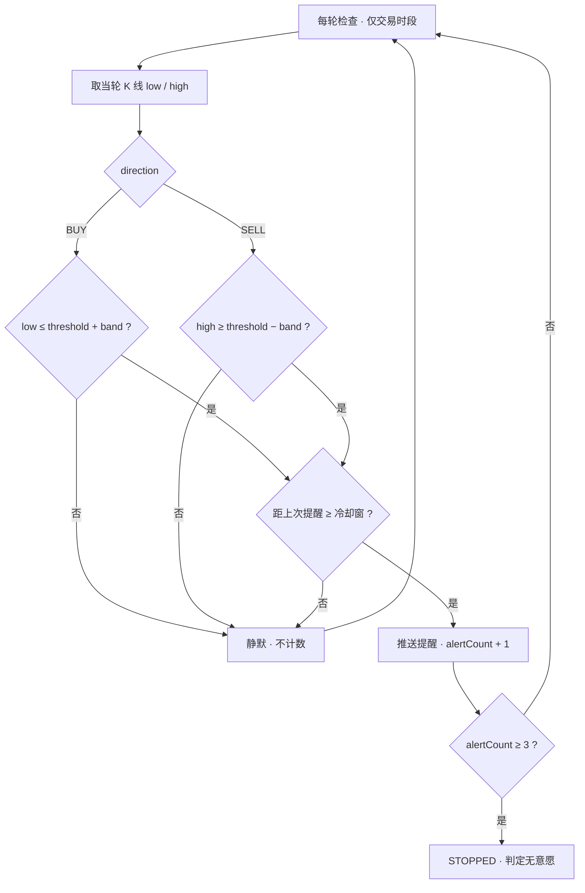
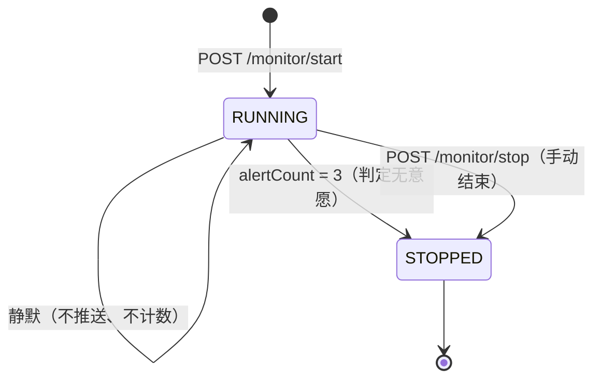

# 价格预告单监控（Alert）· 判定语义设计

> 定位：**判定语义的唯一事实源**。定义「什么时候算命中、什么时候静默、什么时候结束」，供后端实现与前端文案对齐。
> 关联：[api.md](api.md)（字段契约）、`src/services/pushService.ts`（推送订阅与拉取兜底，前端侧已实现）。
> 状态：语义已定稿，后端已实现（编译通过，待冒烟）；2026-09-26 与后端契约 v1.1 对账后同步。

---

## 1. 结论摘要

| 议题 | 定案 |
|---|---|
| 触发形态 | **单边半开区间**，不是「进入区间」的对称判定 |
| 方向 | 由 `direction`（BUY/SELL）决定用区间的哪条边作为触发线 |
| `band` 语义 | **区间容差**：BUY 用上沿 `threshold + band` 触发、SELL 用下沿 `threshold − band` 触发（作用是单方向的提前提醒量，非双向容差） |
| 计数 | 命中一次 +1；同一单两次提醒受冷却窗约束（默认 1800s），不连续轰炸 |
| 终止 | 累计 3 次 → 自动 STOPPED，**判定为用户无成交意愿** |
| 冷却窗 | `alert-cooldown-seconds` 默认 1800s；命中但处于冷却中则不推送、不计数 |
| 静默区 | 退回静默区不提醒、不计数，**已用次数保留不清零** |
| 建单即命中 | **立即开始提醒**（方案 A），但表单需实时提示 |
| 采样 | 对外口径每 30 分钟一轮（实现为每分钟调度，见 §6），仅交易时段；当轮 K 线 `low`/`high` 取数（已定案） |

---

## 2. 术语

| 术语 | 定义 |
|---|---|
| 目标价 `threshold` | 用户想成交的价格 |
| 区间容差 `band` | 提前多少元开始提醒：BUY 向上提前（上沿）、SELL 向下提前（下沿），**非双向容差** |
| 区间 | `[threshold − band, threshold + band]` |
| 上沿 `U` | `threshold + band` |
| 下沿 `L` | `threshold − band` |
| 提醒区 | 命中即推送的区间（BUY：`(−∞, U]`；SELL：`[L, +∞)`） |
| 静默区 | 不推送、不计数的区间（BUY：`(U, +∞)`；SELL：`(−∞, L)`） |

`band = 0` 时区间退化为单点：BUY 等价 `PRICE_BELOW(threshold)`，SELL 等价「涨破 threshold」。

---

## 3. 判定规则（核心）

| direction | 提醒区（提醒 + 计数） | 静默区（不提醒、不计数） | 触发线 |
|---|---|---|---|
| `BUY` | `price ≤ 上沿`（区间内、跌穿下沿都提醒） | `price > 上沿` | `U = threshold + band` |
| `SELL` | `price ≥ 下沿`（区间内、涨穿上沿都提醒） | `price < 下沿` | `L = threshold − band` |

语义动机：

- **BUY（等回落低吸）**：跌到上沿就开始提醒；继续跌穿下沿说明**更便宜、更该买**，继续提醒；反弹回上沿之上说明已偏离买点，静默。
- **SELL（等上涨止盈）**：涨到下沿就开始提醒；继续涨穿上沿说明**卖点更好**，继续提醒；回落至下沿之下说明反弹结束，静默。

**方向只决定触发边，不改变「穿过提醒区后继续同向仍提醒」这一条。**

### 3.1 判定流程

---

## 4. 生命周期状态机

`STOPPED` 不可逆，不提供续期/重置接口；仍需关注时由前端复用参数**重建一条**。

---

## 5. 计数与终止

1. 命中一次 `alertCount + 1`，同时刷新 `lastAlertAt`。
2. 价格停留在提醒区内 → 命中，但受**冷却窗**（`alert-cooldown-seconds`，默认 1800s）约束：同一单两次提醒至少间隔 30 分钟，不会连续轰炸。
3. `alertCount = 3` → 自动 `STOPPED`。产品定案：**3 次是 3 次意愿，3 次未成交即判定无意愿**。
4. 退回静默区 → 停止提醒，**已用次数保留不清零**；再次进入提醒区继续提醒，直至 3 次。
5. 除冷却窗外不做按自然日去重——「3 次」是意愿判定，不该被时间维度重置。

由此推导的寿命：价格一旦进入并停留，3 次最快约 1 小时、极端约 1.5 小时耗尽；反复进出则可延续数日。

---

## 6. 采样、时段与漏报

- **节奏**：对外口径每 30 分钟一轮。实现侧调度为每分钟一次（cron `0 * * * * *`），节流由冷却窗承担，真实送达只会更快；文案按 30 分钟保守表述（见 api.md §6.5）。
- **时段**：仅 A 股交易时段 9:30–11:30 / 13:00–15:00，周末及休市不跑。
- **延迟**：命中到推送最长约 30 分钟，必须在 UI 明示。
- **漏报**：单边判定是覆盖式判定，不存在「从区间穿过而两端采样都没抓到」的漏报。残余风险只有「盘中触及触发线又回落、采样点未捕捉」。
- **取数**（已定案，后端已实现）：用**当轮 30 分钟 K 线的 `low`（BUY）/ `high`（SELL）** 与触发线比对，彻底消除上述残余风险。

---

## 7. 边界情形清单

| # | 情形 | 定案 |
|---|---|---|
| 1 | 建单时价格已在提醒区内 | **立即开始提醒**（方案 A）。前端表单须实时提示「当前价已在提醒范围内，提交后将立即开始提醒」 |
| 2 | 命中后退回静默区 | 停止提醒、不计数，已用次数保留；再进入继续提醒 |
| 3 | 振荡反复进出 | 每次进入提醒区都提醒，但受冷却窗（≥30 分钟）约束，靠 3 次封顶收敛 |
| 4 | 同股同价一买一卖两条 | 合法且独立；**幂等键必须包含 `direction`**，否则第二条会被误判重复 |
| 5 | 重复提交 | 同用户 + 同股 + 同类型 + 同阈值 + 同 band + **同 direction** 已 RUNNING 时返回既有 `taskId` |
| 6 | 用户 RUNNING 数达上限（默认 5） | 拒绝新建，返回 429 |
| 7 | 手动 `stop` | 立即 STOPPED；与「3 次自动停」在列表页需区分展示 |
| 8 | `direction=SELL` 且 `type=PRICE_BELOW` | 语义冲突，400 |

---

## 8. 对接口的硬性要求

1. `direction`（`BUY` / `SELL`）为**顶层必填字段**（与 `fullCode` / `interval` 同级，不在 `alertRule` 内），决定触发边；`SELL` 仅允许 `PRICE_NEAR`，`PRICE_BELOW` 仅允许 `BUY`。
2. `list` 返回的 Task 必须带 `direction`，否则前端无法渲染「跌到 X 提醒买 / 涨到 X 提醒卖」及重建表单。
3. 幂等判重键加入 `direction`。
4. 推送文案需携带方向与次数（见 [api.md §4](api.md)）。

---

## 9. 未决事项

- `PRICE_BELOW` 是否在 `direction` 落地后收敛移除（现为 `PRICE_NEAR + BUY + band=0` 的等价冗余路径）。
