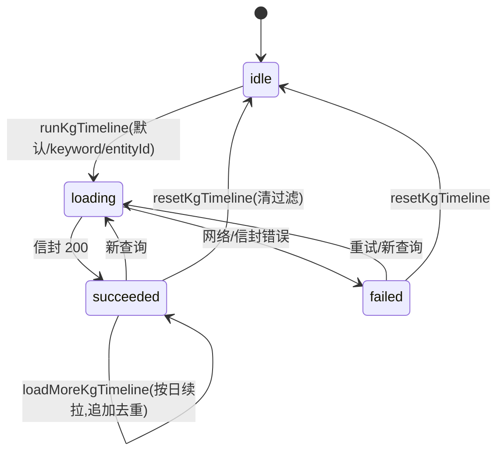

# news-kg-spec · 新闻联播图谱（前端）

> 资讯页「新闻联播图谱」模式的功能规格与前端实现说明。后端契约设计稿见
> stock-calculator-service 仓库 `docs/ai-pipeline/cls-news-kg.md` §13；
> 前端对接契约以《kg 时间轴查询 API · 前端对接文档（draft）》为准，本文档记录定案与落点。

## 一、功能定位

新闻联播《要闻汇编》经 LLM 抽取后的**事件时间轴 + 实体图谱**浏览：按日分组的卡片流、
实体检索（建议/热榜/共现漫游）、事件详情溯源。挂在资讯页（`/news`，`NewsSearch`）的
页级模式 Tab 之下，与「资讯检索」并列；非独立路由。

- 入口：资讯页顶部模式切换（`useState` 纯 UI 态，切走再切回不丢结果）。
- 数据：`GET /api/kg/*`（与主服务同源 `:18080`，鉴权同 `/api/search`——`Bearer token`，
  401 静默降级不弹窗）。开发代理 `vite.config.ts` `/api/kg`、线上 `middleware.js`
  （UPSTREAMS + matcher）均已登记。
- 数据现状：历史回填推进期间，默认态展示的是**已抽取数据的最新几天**（按事件时间倒序
  的正确行为），非「自然今天」；前端不展示补录进度（已拍板）。

## 二、状态机与取数分界

时间轴主流转落 `kgSlice`（D5/R2：Copilot 快照可经 `getState()` 同源读取）；
suggest / 热榜 / 实体详情卡为一次性读，由组件直调 `kgService`（I3）。

- **seq 竞态守卫**（N5，镜像 searchSlice）：模块级 `requestSeq`，新查询自增，
  旧响应/续拉按序号作废；续拉不推进序号（仅新查询作废续拉）。
- **keyword / entityId 互斥**：同时传入时 entityId 优先（比 keyword 准），keyword 置 null。
- **续拉去重**：日组以 `articleId@date` 为键追加去重（页间数据漂移防御）。
- 内存态不持久化，刷新即回初始态（与资讯搜索一致）。

## 三、交互落点（接口文档 §六 实现）

| 区块 | 实现 | 取数 |
|---|---|---|
| 页级模式切换 | NewsSearch 顶部 Tab（`资讯检索` / `新闻联播图谱`） | — |
| 搜索框 | 输入防抖 300ms 且 ≥1 字符发 suggest；**onMouseDown 选中**（抢在 blur 前）；选中 = entityId 检索，回车 = keyword 检索 | `entities/suggest`（limit 10） |
| 空态（默认） | 时间轴（无参）+ 实体热榜 chips（拉取失败整块静默隐藏）；热榜 chip 点击 = entityId 检索 | `timeline` + `entities/hot`（limit 20） |
| 搜索态置顶 | matchedEntities chips（timeline 自带 top3），点开展开实体详情摘要卡 | `entities/{id}`（404 → 卡内错误文案） |
| 漫游 | 详情卡内共现 chips 点击 = 以该实体 id 重新搜索并打开其详情卡；别名 chip 点击 = 别名作 keyword 检索；事件卡/抽屉内实体 chips 点击 = entityId 检索 | `timeline` |
| 时间轴卡片流 | 日组（日头日期 + 汇编稿标题 + 事件数）+ 事件卡（时间 + 类型徽章 + 标题 + detail 摘要）；IntersectionObserver 无限滑动 + 手动「加载更多」 | `timeline`（page 递增） |
| 事件详情抽屉 | detail 全文 + 实体 chips + 溯源脚注（汇编稿标题 + articleId）；背景/按钮/Escape 关闭 | 无新端点 |
| 高亮 | 前端本地：keyword 分词（≥2 字符）+ 实体名 + matched 实体名，≤8 词；分段渲染防 XSS | — |

## 四、待确认清单定案（接口文档 §七）

1. **pageSize**：前端定 **3 天/页**（每篇汇编稿 20~30 条事件，5 天一屏约百卡过重；
   仅改请求参数，不动后端）。
2. **热榜条数**：沿用后端默认 **20**。
3. **eventType 筛选器**：一期**不做**（LLM 自由值不受控，无法可靠枚举）；类型仅作徽章展示。
4. **溯源跳转**：一期抽屉仅展示「汇编稿标题 + 源稿 ID」文本——资讯页无按 articleId
   打开详情的路由；后续如后端提供汇编稿详情能力再接。
5. **高亮实现**：前端本地高亮（当前方案），不依赖后端命中偏移。
6. **锚点跳转**：一期不做自选股/题材联动；详情卡仅展示锚点徽章（锚定股票/题材 + anchorId）。

## 五、代码落点

| 层 | 文件 | 职责 |
|---|---|---|
| Types | `types/kg.ts` | 契约类型（时间轴/建议/详情卡）+ `KgStatus` + `KgTimelineInput` |
| Service | `services/kgService.ts` | 四端点 GET 封装；请求底座镜像 searchService（15s 超时/信封分支/401）；防御性归一（脏行丢弃、类型窄化、date 空串保留、anchorId 转字符串） |
| Store | `store/slices/kgSlice.ts` | 时间轴状态机（runKgTimeline / loadMoreKgTimeline / resetKgTimeline）；`KG_PAGE_SIZE=3` |
| Utils | `utils/kgText.ts` | 实体类型中文标签、时间/日头兜底、高亮词集与分段（R2 纯函数） |
| UI | `components/kg/KgPanel.tsx` | 主面板编排（搜索/suggest/热榜/命中 chips/详情卡/续拉/抽屉） |
| UI | `components/kg/KgTimeline.tsx` | 日组卡片流 |
| UI | `components/kg/KgEntityCard.tsx` | 实体详情摘要卡 |
| UI | `components/kg/KgEventDrawer.tsx` | 事件详情抽屉 |
| UI | `components/kg/KgShared.tsx` | 高亮文本 / 实体 chip / 类型徽章原子 |
| 视图 | `views/NewsSearch.tsx` | 页级模式 Tab 装配（`NewsPageMode`） |
| 代理 | `vite.config.ts` · `middleware.js` | `/api/kg` 前缀登记（dev 上游跟随 `DEV_UPSTREAM_ENV`） |

测试：`src/__tests__/kgText.test.ts`（纯函数）、`kgService.test.ts`（底座/归一）、
`kgSlice.test.ts`（编排/竞态/续拉）。索引登记：`scripts/feature-map.mjs` GROUPS `kg` 域 +
`.agents/skills/stock-calculator-index` 归属表。

## 六、边界与已知限制

- 事件 `eventType` 为 LLM 自由文本，徽章直出不做枚举映射；实体 `entityType` 为八类枚举，
  契约外值归一为 OTHER（行保留不丢弃）。
- `date` 空串（源站撤稿弱一致）保留下发，日头展示兜底：正常日期附推算星期 →
  原标题提取「x月x日」→「日期缺失」；`eventDate` 缺失用 `eventTimeText`（→「时间待定」）。
- `from/to`/`eventType` 过滤参数一期前端不暴露（后端已支持日期闭开区间，UI 待需求）。
- 未注册 Copilot 页面上下文（scopeId 沿用 news_search 的检索语境），图谱区块快照待后续需求。
