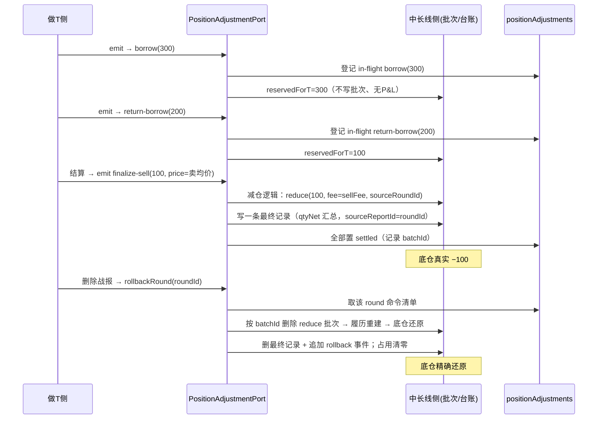
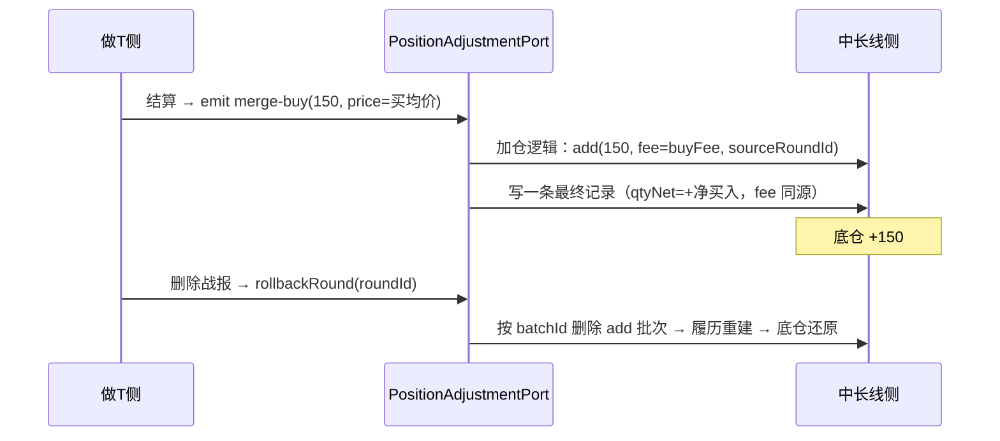
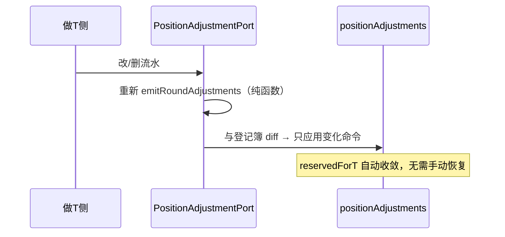

# 做T × 中长期底仓：目标态行为说明（参数桥 / positionLedger）

> 版本：目标态 v1
> 定位：本文档描述**重构后**的预期行为（新契约），**不引用**现有实现细节
> （`borrowBatchId` / `mergeBatchId` / `settledAdjustmentIds` / `adjustmentBatchIds` / `transferAmount` /
> `baseDeductedAmount` / `baseMergedAmount` / `rollbackTransferPosition` 等旧机制全部退出）。
> 配套：`docs/behavior-spec.md` 是**重构前**行为基线；重构完成后的行为以本文档为准。

---

## 0. 设计总纲

### 0.1 核心原则（六条，不可妥协）

1. **持仓变更是中长线侧的独占能力**：`positions` / `positionBatches` 只允许中长线侧（positionLedger）写入；做T侧永不直接触碰批次。
2. **做T只发"意图"，不发"结果"**：做T侧通过命令接口发 `qty` + 参考 `price`；成本、手续费、批次形态全部由中长线侧从自己快照计算。
3. **事实源是 T 流水池，中间表是它的物化视图**：命令是"流水 → 命令组"的**纯函数投影**；
   中间表 `positionAdjustments` 持久化"已应用命令 + 占用视图 + 聚合快照"，**写时物化、读时直取**；
   但命令永远可从流水重推导（保留重放能力），因此流水增/删/改天然幂等收敛，不需要反推撤销。
4. **解耦的是接口，不是事务**：命令的发送方与接收方的应用必须在**同一个事务**内完成
   （round 翻转 + 批次 + 台账 + 中间表登记簿与物化快照原子提交），杜绝孤儿数据。
5. **"完全解耦"不可达，接受接口隔离**：做T必须实时读底仓（可借上限、成本），中长线必须实时读做T状态（结仓拦截）；两方向都用显式 Provider 接口，而不是互相读对方的数据结构。
6. **凡动底仓必留痕，归档收敛为一条最终记录**：任何底仓变动（出借、归还、真实落定、回滚、手工）
   都追加一条**不可变事件**（append-only 痕迹层）；
   每轮做T归档时，台账（longTermRecords）只保留**一条最终记录**（sourceReportId=roundId）；
   删除战报 = 还原底仓 + 删最终记录 + 追加 rollback 事件（历史痕迹保留）。

### 0.2 数据所有权（目标态）

| 数据 | 拥有者 | 写入口 | 备注 |
|---|---|---|---|
| `tRounds` / `tTransactions` | 做T侧 | 做T侧专用 action | 流水是事实源 |
| `positions` / `positionBatches` | **中长线侧（positionLedger）** | `applyRoundAdjustments` / `rollbackRound` / 手工加减仓 | 做T侧经端口访问 |
| `positionAdjustments`（新·**中间表**） | **中长线侧独占** | `applyRoundAdjustments` / `rollbackRound` | 命令登记簿 + 占用视图 + 物化快照（写时物化、读时直取；带 roundId 可重放） |
| `longTermRecords` | 中长线侧 | `applyRoundAdjustments` / `rollbackRound` | 手工买卖记录 + **每轮做T一条最终记录**（sourceReportId=roundId）；删除战报级联删除 |
| `positionEvents`（新·**变动痕迹**） | 中长线侧 | `applyRoundAdjustments` / `rollbackRound` / 手工加减仓 | append-only 事件流：凡动底仓必记（出借/归还/落定/回滚/手工）；删除战报追加 rollback、历史保留 |
| `feeConfig` | 全局共享 | 只读 | 手续费唯一计算方 = 中长线侧 |

### 0.3 依赖方向

```
┌─ 做T侧（TCalculator）────────────────────────────┐      ┌─ 中长线侧（CostAveraging / positionLedger）────┐
│  emitRoundAdjustments(roundState, base, fee)     │      │  applyRoundAdjustments(cmds)                     │
│  → TPositionAdjustmentCommand[]（纯函数投影）      │ ───► │  rollbackRound(roundId)                           │
│  validateSell(amount)：借仓/超卖校验              │      │  getTRoundStatus(fullCode) → {open, borrowNet}    │
│                                                  │ ◄─── │                                                   │
│  读 getBasePosition(fullCode) →                  │      │  读命令：borrow/return/finalize-sell/merge-buy    │
│  { currentCost, currentAmount, reservedForT,     │      │  写批次：reduce/add（带 sourceRoundId）           │
│    availableForT }                               │      │  写事件流：borrow/return/落定/回滚                  │
└──────────────────────────────────────────────────┘      └───────────────────────────────────────────────────┘
                      ▲                                          ▲
                      │                                          │
             只经 Port 接口通信（同一 Zustand store 是数据层，不是耦合）
```

---

## 1. 接口契约

### 1.1 命令类型 `TPositionAdjustmentCommand`（4 种）

```ts
interface TPositionAdjustmentCommand {
  /** 命令唯一 ID = `${roundId}-${seq}`：幂等去重与回滚定位 */
  id: string;
  /** 关联做T轮次：归档、删除、回滚的唯一关联键 */
  roundId: string;
  /** 序号（0 起）：同一 round 内命令全序，保证应用与逆向的顺序稳定 */
  seq: number;
  fullCode: string;
  kind:
    | 'borrow'        // 倒T借出：在途占用底仓 qty（临时，不落真实批次、不产生 P&L）
    | 'return-borrow' // 倒T买回归还：在途释放占用 qty
    | 'finalize-sell' // 归档落定：真实卖出 qty（倒T未回补部分 / 净卖出）
    | 'merge-buy';    // 归档落定：真实买入 qty（正T净买入 / 倒T超额买入）
  qty: number;
  /** 参考成交价：做T侧实际成交价或加权均价。仅用于展示与 fee 计算参考；
   *  真实成本永远由中长线侧从自己快照重算。 */
  price?: number;
  createdAt: number;
}
```

> 撤销不是第 5 种命令，而是端口操作 `rollbackRound(roundId)`（见 1.2），
> 因为撤销不需要 qty/price，只需要 roundId 定位登记簿。

### 1.2 端口 `PositionAdjustmentPort`（做T侧唯一的对外触点）

```ts
interface PositionAdjustmentPort {
  /** 应用一组命令（同一事务；幂等：仅应用尚未应用的 id） */
  applyRoundAdjustments(cmds: TPositionAdjustmentCommand[]): ApplyResult;

  /** 撤销一个 round 的全部已应用命令（删除战报 / 回滚已归档流水） */
  rollbackRound(roundId: string, options?: RollbackOptions): ApplyResult;

  /** 读契约（中长线侧实现，做T侧借仓/超卖校验用） */
  getBasePosition(fullCode: string): {
    currentCost: number;      // 底仓当前成本（中长线侧权威值）
    currentAmount: number;    // 真实持有数量（不含占用）
    reservedForT: number;     // 出借占用（Σborrow − Σreturn-borrow）
    availableForT: number;    // 可借上限 = currentAmount − reservedForT
  };

  /** 读契约（做T侧实现，中长线侧结仓拦截用） */
  getTRoundStatus(fullCode: string): {
    open: boolean;            // 是否存在 OPENED 轮次
    borrowNet: number;        // 该标的在途净借出
  };
}

/** 回滚选项（v1 仅支持 reject，预留接口扩展） */
interface RollbackOptions {
  /** 容量冲突策略：'reject'（默认）拒绝删除并提示先补仓；'truncate'（v2+）允许删除，负数量截断为 0 */
  capacityConflict?: 'reject' | 'truncate';
}
```

### 1.3 幂等与事务

- **幂等**：中长线侧维护登记簿 `positionAdjustments`（按 `id` 去重）。
  `applyRoundAdjustments` 先比对"命令 id − 已应用 id"，只应用差量；
  命令内容永远可从流水重推导，因此任意时刻重复 emit / apply 结果一致。
- **事务**：每次应用/回滚都在**一个 Dexie 事务**内完成：
  `tRounds（翻转状态）+ positionBatches（写批次）+ longTermRecords（写每轮一条最终记录）
   + positionEvents（追加变动事件）+ positionAdjustments（写登记簿 + 增量更新物化快照）`。
  任一步失败 → 整体回滚，不留孤儿数据、不产生脏缓存。
- **流水在途收敛**：流水增/删/改 → 重新 emit → 与登记簿 diff → 只应用变化部分；
  与流水池始终一致，无需手动恢复。
- **写时物化、读时直取**：每次应用/回滚在**同一事务**内增量更新中间表聚合快照
  （currentCost / currentAmount / totalInvested / realizedPnL / reservedForT）；
  读底仓时 O(1) 直接取值，不再从批次履历全量重建。
  批次履历是真相、聚合值只是缓存：任一时刻都可用"重放对账"校验修正。

### 1.4 中间表 `positionAdjustments`（命令登记簿 + 占用视图 + 物化快照）

**三职责合一**，全部由中长线侧独占维护（做T侧只经端口读，不直接读写）：

```ts
/** 命令登记簿（每行 = 一条已应用命令，含回滚定位） */
interface PositionAdjustment {
  id: string;            // 命令 id（roundId-seq）
  roundId: string;       // 关联做T轮次（重放 / 级联删除定位键）
  seq: number;
  kind: 'borrow' | 'return-borrow' | 'finalize-sell' | 'merge-buy';
  fullCode: string;
  qty: number;
  price?: number;
  /** 归档落定命令产生的真实批次 id（回滚时按此精确定位删除批次） */
  batchId?: string;
  /** 在途占用 / 已归档落定 */
  status: 'in-flight' | 'settled';
  appliedAt: string;
}

/** 聚合快照（物化于中间表；与命令登记簿同事务写，读时 O(1) 直取） */
interface MaterializedSnapshot {
  fullCode: string;
  currentCost: number;     // 底仓当前成本（批次履历的投影值）
  currentAmount: number;   // 真实持有数量（不含占用）
  reservedForT: number;    // 出借占用（Σborrow − Σreturn-borrow，仅 in-flight）
  totalInvested: number;
  realizedPnL: number;
  isClosed: 0 | 1;
  updatedAt: number;       // 最近一次物化时间戳
}
```

要点：

- **命令登记簿**：应用了什么命令、落在哪个批次（batchId）、是否已归档——删除战报的恢复依据；
- **占用视图**：在途借出只物化 `reservedForT` 聚合值，不写批次、不产生 P&L；
- **物化快照**：把"批次履历 → 成本/数量/盈亏"的推导从**读路径挪到写路径**，
  应用/回滚时在同一事务内增量更新，读底仓时零推导；
- **只缓存不替代**：任一时刻都可用"流水重放 + 批次履历"重建整张中间表
  （流水是事实源、中间表是物化视图，见 ADR-1 / ADR-7）；
  若物化值与履历重放结果不一致 → 以履历为准重放修正（对账）。

### 1.5 底仓变动双层记录（事件流留痕 + 归档收敛）

> 需求定稿：
> ① **凡动底仓必留痕**（append-only 事件流）：出借、归还、真实落定、回滚、手工——每次变动都记；
> ② **归档收敛**：每轮做T归档时，台账（longTermRecords）只保留**一条最终记录**；
> ③ **明细入口**：做T轮次保留，点开看全部流水；
> ④ **删除战报**：还原底仓 → 删最终记录 → 追加 rollback 事件（历史痕迹保留）。

**A. 痕迹层（`positionEvents`，append-only）**：

```ts
interface PositionEvent {
  id: string;
  fullCode: string;
  roundId?: string;             // 做T驱动时关联轮次
  eventType:
    | 'borrow'          // 出借：reservedForT +qty
    | 'return'          // 归还：reservedForT −qty
    | 'finalize-sell'   // 归档真实卖出 −qty（reduce 批次）
    | 'merge-buy'       // 归档真实买入 +qty（add 批次）
    | 'manual-add'      // 手工加仓 +qty
    | 'manual-reduce'   // 手工减仓 −qty
    | 'rollback';       // 删除战报回滚：净还原 ±qty（历史保留）
  qty: number;
  price?: number;
  fee?: number;
  batchId?: string;     // 真实批次 id（若有）
  timestamp: number;
  note?: string;
}
```

> 事件按来源分两类：
> - **可推导事件**（borrow / return / finalize-sell / merge-buy）：`emitRoundAdjustments` 的投影产物，同一流水输入产生同一事件序列，**可从流水重推导**。事件流保留它们是为"在途变动历史"提供审计视图，**不参与重放重建**（重放对账只修登记簿与物化快照，不修事件流）。
> - **不可推导事件**（rollback / manual-add / manual-reduce）：流水无法表达的事实（"删除曾发生"、"手工加减仓"），是事件流的**独立事实记录**。
>
> 事件流保证：id 全局唯一，只追加不修改，与登记簿同事务写（不会出现事件已写但登记簿未写，或反之的不一致）。

**B. 收敛层（`longTermRecords`，每轮一条最终记录）**：

```ts
interface LongTermTRecord {
  id: string;
  fullCode: string;
  stockName: string;
  /** = roundId：做T轮次关联键（明细入口） */
  sourceReportId: string;
  type: 't-round';              // 做T归档最终记录（与手工 buy/sell/merge 区分）
  /** 该轮对底仓的净变动：+加仓 / −减仓 / 0 无变化 */
  qtyNet: number;
  /** 加权均价 */
  price: number;
  /** 该轮总手续费（中长线侧唯一计算） */
  fee: number;
  /** 倒T：总借出量（汇总字段，展示用） */
  totalBorrow: number;
  /** 倒T：回补量 */
  buyBack: number;
  /** 做T落袋利润（并入底仓 realizedPnL 的部分） */
  profit: number;
  timestamp: number;
  note?: string;
}
```

**两层分工**：

| 层 | 表 | 性质 | 归档时 | 删除战报时 |
|---|---|---|---|---|
| 痕迹层 | `positionEvents` | append-only 事件流（**不可重建**） | 保留在途全部事件 | 追加 `rollback`，历史**保留** |
| 收敛层 | `longTermRecords` | 每轮一条最终记录（可重建） | 写入一条 | **删除**（历史记录删除） |

**写入时机（痕迹层）**：

| 场景 | 事件 | 底仓实际变化 |
|---|---|---|
| 出借（倒T卖出） | `borrow(300)` | reservedForT +300（可借上限减少） |
| 归还（倒T买回） | `return(200)` | reservedForT −200 |
| 在途流水变更（diff 净变化） | 按占用净增减追加对应方向事件 | reservedForT ±净增量 |
| 归档未回补落定 | `finalize-sell(100)` | currentAmount −100（reduce 批次） |
| 归档归并/划转落定 | `merge-buy(150)` | currentAmount +150（add 批次） |
| 手工加/减仓 | `manual-add / manual-reduce` | currentAmount ±qty |
| 删除战报回滚 | `rollback(还原量)` | 底仓还原（占用清零 / 批次删除） |

**归档收敛规则（每轮 → 恰好一条）**：

| 轮次结果 | 一条最终记录 |
|---|---|
| 倒T净卖出（未回补 > 0） | `qtyNet = −未回补量`；totalBorrow / buyBack 记汇总；profit = 做T利润 |
| 倒T完全回补 | `qtyNet = 0`（底仓无变化，仅记借出/回补汇总） |
| 正T净买入 / 倒T超额 | `qtyNet = +净买入量`；profit = 波段利润 |

**删除行为**：

```
rollbackRound(roundId)
  ├─ 还原中长期仓位（删批次 + 履历重建 + 回写物化快照）
  ├─ 删除该 round 的最终记录（longTermRecords，sourceReportId=roundId）
  ├─ 追加 rollback 事件（痕迹层保留历史）
  └─ 删除做T轮次本身
```

> 中间过程明细可查于**做T轮次流水**（事实源）+ **痕迹层事件流**；
> 收敛层每轮一条，是中长期仓位历史的"汇总视图"。

---

## 2. 生命周期与出借占用视图

### 2.1 三态生命周期

```
做T轮次状态                  中长线侧状态
──────────────────────────────────────────────────────────────
OPENED（在途）  ──────────►  出借占用视图（reservedForT 增减，
                             只动登记簿 + 占用数量，不动真实批次）
        │
        ├─ 倒T结算（净卖出）──►  release 已回补 + 落定 finalize-sell 真实卖出批次
        ├─ 正T结算（净买入）──►  落定 merge-buy 真实买入批次
        │
COMPLETED（归档）────────►  真实批次固化（批次带 sourceRoundId），登记簿置 settled
        │
        └─ 删除战报 ──────►  rollbackRound：删批次 + 还原占用 + 删台账（履历重建）
```

### 2.2 出借占用视图（在途）

- 中长线侧内部维护 `reservedForT`（**独立于真实持仓的占用数量**，而非写入批次）：
  ```
  reservedForT = Σ borrow − Σ return-borrow（仅统计 in-flight）
  ```
- `currentAmount`（真实持有）**保持不变**；
- `reservedForT` 物化在中间表（同事务增量更新），读时 O(1) 直取，不扫流水、不扫批次；
- `availableForT = currentAmount − reservedForT` 就是做T可借上限；
- CostAveraging 展示"出借中 X 股"标签，来自登记簿视图，不产生真实批次、
  不产生 P&L、不进入 Statistics 的建仓履历。

### 2.3 结仓拦截（中长线侧）

`getCloseBlockReason` 改为读做T侧 Provider：
```
block if：currentAmount > 0
       或 getTRoundStatus(fullCode).open === true      // 存在 OPENED 轮次
       或 getTRoundStatus(fullCode).borrowNet > 0      // 在途净借出
```
不再依赖撮合结果的 status 与 tRounds 结构的内部字段。

### 2.4 做T卖出上限与"卖完底仓"

做T卖出（倒T借仓）总量受中长期侧**占用视图**约束：

```
可借上限 availableForT = currentAmount − reservedForT（物化值，读时 O(1)）
卖出校验 validateSell(sellAmount)：
  valid = sellAmount ≤ 做T池待处理(pendingBuy) + availableForT
```

- 校验失败 → 拦截并提示（现状 `validateSellOrder` 两级阶梯升级为"占用视图口径"：
  `basePositionAmount` 由 `currentAmount` 改为 `availableForT`）。

**多次卖出把底仓"卖完"的三种情形**：

| 情形 | 状态 | 处理 |
|---|---|---|
| ① 累计借出 = 底仓（100% 占用） | `reservedForT = currentAmount`，`availableForT = 0` | **允许**：CostAveraging 显示"出借中 N（100%）"；再做卖出被拦截（提示先回补或结算） |
| ② 真正清仓（不再持有） | 未回补 = 底仓全部 | 走**归档结算**：`finalize-sell(全部)` → currentAmount 清零 → `isClosed=true`。这是"做T卖完底仓"的唯一合法路径 |
| ③ 反悔不卖 | 占用 100% 未结算 | 删除战报/清空流水 → `rollbackRound` 占用归零、底仓还原 |

- **中长期侧清仓被拦**（结仓拦截见 §2.3）：`reservedForT > 0` 时不能直接手工清仓，
  必须先做T结算（占用转真实卖出）或删除做T流水（占用释放）；
- **删除战报后 isClosed 还原**：finalize-sell 批次被删 → 履历重建 → 底仓重开（isClosed=0）。

### 2.5 真实批次全部携带 `sourceRoundId`

中长线侧写入的所有做T批次（finalize-sell 的 reduce / merge-buy 的 add）都带
`sourceRoundId = roundId`。这是回滚定位的**唯一**依据，取代旧的全部 ID 胶水字段。

---

## 3. 数据流转：在途（OPENED）

### 3.1 通用流程

```
做T侧录入/修改/删除流水
  → 流水池变化
  → emitRoundAdjustments(roundState, basePosition, feeConfig)   ← 纯函数投影
       规则（倒T）：
         净借出 = max(0, Σ卖出 − Σ买入)
         ─ 每笔卖出流 → borrow(该笔未回补占用量)
         ─ 每笔买入流 → return-borrow(回补量)
  → applyRoundAdjustments(cmds)
       ① 与 positionAdjustments 登记簿 diff，只应用新增/变化的命令 id
       ② borrow/return-borrow：
           更新 reservedForT（登记簿 in-flight）
           不写批次、不产生 P&L、不动 currentCost
       ③ 同一事务写登记簿 + 增量更新物化快照（reservedForT）
          + 追加事件（borrow/return）+ tRounds
     （在途不写收敛层最终记录；痕迹层事件流 + 做T轮次流水记录中间过程）
```

### 3.2 场景表（倒T：卖出300 → 买回200 → 改/删流水）

| 动作 | emit 出的命令 | 中长线侧效果 |
|---|---|---|
| 卖出 300 | `borrow(300)` | reservedForT = 300；可借上限 = 底仓 − 300；结仓被拦 |
| 买回 200 | `return-borrow(200)` | reservedForT = 100 |
| 修改卖出 300→500 | diff：`borrow(500)` 替换 | reservedForT = 400 |
| 删除买回 200 | diff：`return-borrow(200)` 撤销 | reservedForT = 300 |
| 删除全部流水 | 命令组为空 | reservedForT = 0，占用完全释放 |

> 在途删除/修改流水 = 重新投影 = 差量应用，底仓自动收敛，**无需手动恢复**。

---

## 4. 数据流转：归档（COMPLETED）

### 4.1 倒T结算（净卖出 → finalize-sell）

前置：该标的流水已撮合（做T侧算好净结果）。

```
做T侧结算
  → emit：
      [ return-borrow(已回补量) ,
        finalize-sell(未回补量, price=卖出加权均价) ]
  → applyRoundAdjustments（一个事务）：
       ① return-borrow(已回补)   → reservedForT 减
       ② finalize-sell(未回补)   → 中长线侧执行自己的「减仓」逻辑：
             sellFee = calcTradeFees(price, qty, 'sell', feeConfig, kind).total
             reduce 批次：amount=-qty, fee=sellFee, sourceRoundId=roundId
             成本与 P&L 从中长线侧快照计算（不做任何"补差"）
             批次的 batchId 写入登记簿（status=settled）
       ③ 追加事件：return(已回补) + finalize-sell(未回补)
       ④ 台账：写**一条**最终记录（sourceReportId=roundId）
             qtyNet=净卖出或回补汇总；totalBorrow=总借出、buyBack=已回补；
             fee=该轮总手续费（中长线侧唯一计算）；profit=做T利润
       ⑤ tRounds → COMPLETED；登记簿全部置 settled
       ⑥ 若期间有额外净买入（倒T超额）→ 追加 merge-buy 命令（见 4.3）
```

### 4.2 正T结算（净买入 → merge-buy）

前置：正T撮合后 `netPendingAmount > 0`（仍有未平仓买入量）。

```
做T侧结算
  → emit：
      [ merge-buy(净买入量, price=买入加权均价) ]
  → applyRoundAdjustments（一个事务）：
       ① merge-buy → 中长线侧执行自己的「加仓」逻辑：
             buyFee = calcTradeFees(price, qty, 'buy', feeConfig, kind).total
             add 批次：amount=+qty, fee=buyFee, sourceRoundId=roundId
             加权成本从中长线侧当前快照计算
             批次的 batchId 写入登记簿（status=settled）
       ② 追加事件：merge-buy(净买入量)
       ③ 台账：写**一条**最终记录
             qtyNet=+净买入量，fee=buyFee（同批次同源），profit=波段利润，sourceReportId=roundId
       ④ tRounds → COMPLETED
```

### 4.3 倒T超额买回归并（与 4.2 同一路径）

倒T CLEARED 且 `超额 = Σ买入 − Σ回补 > 0` 时，超额部分**不特殊处理**，
直接作为 `merge-buy(超额, price=买入加权均价)` 发出 → 走 4.2 的同一加仓逻辑。

> 目标态下不再存在"自动归并无手续费"的旁路：所有真实买入/卖出
> 只有 `merge-buy` / `finalize-sell` 两个入口，手续费口径唯一。

### 4.4 归档后事实源冻结

- COMPLETED 轮次的流水不可再修改/删除（与现状一致）；
- 若要改动，必须先 `rollbackRound(roundId)` 回到在途，再改流水、重新 emit。

---

## 5. 数据流转：删除战报 → 中长期仓位如何恢复

### 5.1 统一入口 `rollbackRound(roundId)`

删除战报（无论倒T结算、正T划转、在途未结算）**只有一条恢复路径**：

```
rollbackRound(roundId)
├─ ① 从 positionAdjustments 取该 round 全部已应用命令（按 seq 升序）
├─ ② 逆序处理每条命令：
│      borrow / return-borrow  → 反向调整 reservedForT（in-flight 占用归零）
│      finalize-sell           → 按 batchId 删除对应 reduce 批次
│      merge-buy               → 按 batchId 删除对应 add 批次
├─ ③ 用剩余批次履历重建权威快照
│   ├─ ③a 重建后容量检查：若 currentAmount < 0（占用量 > 剩余承载）→ 按 options.capacityConflict 策略处理
│   │   reject（默认）：整体事务回滚，报错提示"先补仓再删除"
│   │   truncate（v2+）：截断为 0 并标记 isClosed，继续
│   └─ ③b 回写中间表物化快照（currentCost/currentAmount/realizedPnL/totalInvested/isClosed）
├─ ④ 删除该 round 的最终记录（longTermRecords，sourceReportId=roundId）
├─ ⑤ 追加 rollback 事件（净还原量；痕迹层历史保留）
├─ ⑥ 删除 positionAdjustments（roundId）
├─ ⑦ 删除 tRounds 中的该 round
└─ ⑧ 以上全部在同一 Dexie 事务内提交（任一步失败整体回滚）
```

### 5.2 精确性论证（为什么不会"补差回滚"）

- 回滚依据是登记簿里**精确的 batchId**（归档落定时就已记录），按 ID 删批次 → 履历重建；
- 不做"按 avgPrice 倒扣成本"、不追加"剥离批次"、不残留手续费；
- 即使删除前用户又在中长线侧手动加/减过仓，做T批次依然是履历中**可单独识别**的条目
  （`sourceRoundId`），删除后剩余履历重建即精确还原，加减仓批次不受影响。
- 手续费随批次删除而消失，`totalInvested` / `realizedPnL` 由履历重建 → 干净彻底。

### 5.3 恢复结果核对表

倒T：卖出300 → 买回200 → 结算 → 删除：

| 阶段 | 真实持仓 | 占用 | 批次 |
|---|---|---|---|
| 在途（卖出300后） | 底仓（不变） | reservedForT=300 | 无做T批次 |
| 在途（买回200后） | 底仓（不变） | reservedForT=100 | 无做T批次 |
| 结算后 | 底仓 −100 | 0 | + reduce(100, fee=sellFee, sourceRoundId) |
| **删除战报后** | **底仓（还原）** | 0 | **该 reduce 批次被删除，履历重建 → 精确还原** |

正T：低吸200 → 高抛200 → 剩余净买入150 → 划转归档 → 删除：

| 阶段 | 真实持仓 | 批次 |
|---|---|---|
| 结算后 | 底仓 +150 | + add(150, fee=buyFee, sourceRoundId) |
| **删除战报后** | **底仓（还原）** | **该 add 批次被删除，履历重建 → 精确还原** |

> 每轮归档后，中长期仓位侧只有一条最终记录（sourceReportId=roundId），
> 明细以做T轮次 + 痕迹层事件流为入口；删除战报后该记录删除，
> 但痕迹层保留历史并追加 rollback 事件（底仓变动全程可查）。

### 5.4 边界条件

- **完全回补倒T**（净借出=0）：无 finalize-sell / merge-buy，登记簿只有 in-flight
  命令 → 回滚只清占用，底仓批次零变化。
- **期间被手动减仓**：若用户手动减仓导致底仓数量不足以承载做T占用量，
  回滚后履历重建可能出现负数量或触发 isClosed —— v1 决策：
  **拒绝删除**（`capacityConflict: 'reject'`，默认策略），提示"先补仓再删除"；
   `rollbackRound` 签名已预留 `capacityConflict: 'truncate'` 策略位（见 §1.2），
   未来需要"允许删除、负数量截断为 0"时，只需在调用处传入策略，不改回滚事务骨架。
- **在途（OPENED）删除**：同样走 rollbackRound，占用清零、无批次 → 等价于旧"清空流水"。
- **失败原子性**：事务失败（如数量校验）→ 不删除 round、不写任何中间状态，UI 报错。

---

## 6. 手续费（目标态）

### 6.1 做T侧（只记真实成交规费）

- 每笔流水保留 `fee`（做T侧自己成交的规费，`calcTradeFees`），计入做T净收益与 `realizedFee`；
- **做T侧不再计算任何"桥接手续费"**（划转费、结算费、归并费全部取消）。

### 6.2 中长线侧（唯一计算方）

| 动作 | fee 来源 | 去向 |
|---|---|---|
| 手工建仓/加仓 | `calcTradeFees(price, qty, 'buy')` | open/add 批次 fee → 成本 |
| 手工减仓 | `calcTradeFees(price, qty, 'sell')` | reduce 批次 fee → P&L |
| 应用 `finalize-sell` | `calcTradeFees(price, qty, 'sell')` | reduce 批次 fee → P&L（同手工减仓同函数） |
| 应用 `merge-buy` | `calcTradeFees(price, qty, 'buy')` | add 批次 fee → 成本（同手工加仓同函数） |
| 台账记录 | 与对应批次**同一次** calcTradeFees 结果 | longTermRecords.fee（消除"台账≠批次"分裂） |

- `price` 参考做T侧命令里的参考价（做T实际成交均价），`feeConfig` 与标的 `kind` 由中长线侧解析；
- 每轮归档只产生**一条最终记录**（qtyNet + totalBorrow/buyBack + fee），
  fee 与真实批次**同一次** calcTradeFees 结果，不再按"解除出借 / 回补"两条拆分。

### 6.3 删除战报时手续费怎么走

| 恢复路径 | 手续费去向 |
|---|---|
| `rollbackRound` | 按 batchId 删除批次 → 该批次 fee 随批次消失；`totalInvested`/`realizedPnL` 按剩余履历重建 → **完全干净，无残留** |
| 台账 | `longTermRecords`（sourceReportId）级联删除，展示性 fee 一并消失 |

### 6.4 相对现状修复的缺口（目标态承诺）

1. ~~超额归并无手续费~~ → 统一走 `merge-buy`，手续费由中长线侧计算（缺口消除）；
2. ~~划转按"买入"加收 txnFee 的旁路算法~~ → 划转即 `merge-buy`，同一加仓函数（算法唯一）；
3. ~~回滚 fee=0 残留~~ → 删批次即删 fee（无残留）；
4. ~~台账 fee ≠ 批次 fee~~ → 台账与批次同一次计算（同源）。

---

## 7. 时序图

### 7.1 倒T全链路（卖出300 → 买回200 → 结算 → 删除）



### 7.2 正T净买入划转 → 删除



### 7.3 在途流水变更 → 差量收敛



---

## 8. 关键决策记录（ADR）

| # | 决策 | 结论 | 理由 |
|---|---|---|---|
| ADR-1 | 事实源 | **T 流水池**（命令=投影） | 删改流水天然幂等收敛，避免"反推撤销"导致的数量不足死锁 |
| ADR-2 | 出借占用形态 | **独立 `reservedForT` 占用数量**（不写批次） | currentAmount 保持真实口径；Statistics/履历不被临时占用污染 |
| ADR-3 | 回滚方式 | **按 batchId 删批次 + 履历重建**（唯一路径） | 精确、fee 干净、无补差 |
| ADR-4 | 批次关联 | 批次带 `sourceRoundId`（登记簿记 batchId） | 取代全部旧 ID 胶水字段 |
| ADR-5 | 手续费 | **中长线侧唯一计算**（4 类动作同一组函数） | 消除超额归并/划转/回滚三处口径分裂 |
| ADR-6 | 事务 | apply / rollback 均为**单事务**（round+批次+台账+登记簿+物化快照） | 防止孤儿数据（Round 归档了底仓没减，或反之）；物化值不产生脏缓存 |
| ADR-7 | 中间表 | `positionAdjustments` = 命令登记簿 + 占用视图 + **物化快照**，**只缓存不替代**（保留流水重放能力） | 读时零推导（写时物化）；流水仍是唯一事实源，删除恢复仍走重放对账 |
| ADR-8 | 双层记录 | **痕迹层** `positionEvents`（append-only：凡动底仓必记，回滚追加 rollback 保留历史）+ **收敛层** `longTermRecords`（每轮一条最终记录，删除战报时删除） | 变动全程可追溯（出借/归还/落定/回滚/手工），台账保持每轮一条的收敛形态；事件流是审计视图，不参与重放重建 |

---

## 9. 迁移与落地步骤

1. **抽端口与中间表**：新增 `src/services/positionAdjustmentPort.ts` + `positionAdjustments` 中间表
   （命令登记簿 + 占用视图 + 物化快照）+ `positionEvents` 变动痕迹表；
   `emitRoundAdjustments` 先写成与现状行为等价的纯函数，现有测试护航；
2. **接管写入**：在途出借 → reservedForT（替代 borrow 批次）；
   结算/划转 → finalize-sell / merge-buy（替代 settleShortRound / transferToPosition 内联算法）；
3. **统一回滚**：`rollbackRound` 上线后，删除战报不再走旧双路径；
4. **数据迁移**：存量 borrow/merge 批次按 `sourceRoundId` 归并进登记簿（STORES_V6 迁移）；
5. **回归重点**：做T在途 → CostAveraging 结仓仍被拦；归档后底仓即时显示净变化；
   删除战报后底仓精确还原；手续费在三种场景（手工 / 做T / 删除）下无残留；
   物化快照与批次履历重放结果一致（重放对账通过）；
   **每轮归档恰好一条最终记录；凡动底仓（含删除回滚）均可在事件流查到（痕迹闭环）**。

---

## 10. 原来方案 vs 现在方案：方案对比

> "原来方案" = 重构前现状基线（`docs/behavior-spec.md`，旧机制）；
> "现在方案" = 本文档目标态（参数桥 + 中间表 + 物化快照）。

| 维度 | 原来方案（现状基线） | 现在方案（目标态） |
|---|---|---|
| 中间表 | **无独立中间表**：用 7 个 ID 胶水字段（borrowBatchId / mergeBatchId / settledAdjustmentIds / adjustmentBatchIds / transferAmount / baseDeductedAmount / baseMergedAmount）贴在两端数据结构上，让两边互相感知对方 | **独立中间表 `positionAdjustments`**：命令登记簿 + 占用视图 + 物化快照三职责合一，中长线侧独占，做T侧只经端口读 |
| 推导方式 | **读时全量推导**：每次读持仓扫全部批次履历重建（recomputePositionSnapshot）；每次流水变更对全部标的全量对账（reconcilePositionsWithStreams） | **写时物化、读时直取**：应用/回滚时同一事务增量更新聚合快照，读时 O(1)；流水变更按 round 增量 emit + diff |
| 在途借出 | 借出写成 `kind='borrow'` 批次（currentAmount 可见减少、进 Statistics 口径），再随流水池剥离/重建 | 独立 `reservedForT` 占用视图：不写批次、currentAmount 不变、不入履历，读时直取 |
| 删除恢复 | **双路径分裂**：路径A（adjustmentBatchIds 删批次重建）精确但只覆盖倒T结算；路径B（rollbackTransferPosition 补差回滚）近似、fee=0 残留、底仓被消耗时拒绝删除 | **唯一路径** `rollbackRound`：按登记簿 batchId 精确删批次 + 履历重建 + 回写物化快照；无补差、无拒绝死锁 |
| 手续费 | 三处口径分裂：超额归并无 fee / 划转旁路 txnFee / 回滚 fee=0 残留；台账 fee 与批次 fee 不同源 | 中长线侧唯一计算方，finalize-sell / merge-buy 与手工加减仓同一组函数；台账与批次同源；删除即删 fee |
| 事实源 | 流水池 + 幂等胶水字段的"混合事实源"（命令身份依赖回写标记） | 流水池唯一事实源；中间表是物化视图，**保留重放能力** |
| 持仓算法 | 4 套互相独立：recomputePositionSnapshot / transferToPosition 内联加权 / rollbackTransferPosition / recalculatePosition | 收敛为 1 套：中长线侧加/减仓逻辑（finalize-sell、merge-buy 同函数） |
| 结仓拦截 | 依赖撮合结果 status + 读 tRounds 内部结构 | 显式 Provider：getTRoundStatus(fullCode) → { open, borrowNet } |
| 数据关联 | 批次级 ID 互相感知（borrowBatchId 挂在流水上、adjustmentBatchIds 挂在 round 上），新增场景就要加新字段 | 单一关联键 roundId：批次 sourceRoundId + 登记簿 batchId 双向定位 |
| 读性能 | 每次读持仓 O(批次履历) 重建 | 读时 O(1) 直取物化快照 |
| 一致性代价 | 全量重算天然自洽，但每次写入 O(全部标的 × 全部批次) | 一致性责任上移：物化值必须与批次/台账同事务写，靠重放对账兜底 |
| 动底仓记录 | 台账仅归档时记录（sell/buy/merge），在途借出与回滚**无痕**，删除即级联删台账 | **双层**：痕迹层 `positionEvents`（append-only：出借/归还/落定/回滚/手工都记）+ 收敛层每轮一条最终记录；删除 = 还原 + 删收敛记录 + 追加 rollback 事件 |

### 10.1 一句话总结

原来的胶水字段是"没有中间表时的残缺替代品"——它在两端各自复制对方状态；
现在的中间表是"正规的衔接层"——它把推导物化到写路径、把关联收敛到 `roundId` 一个键，
同时保留"流水可重放"这条事实源底线，避免补差回滚的死锁；
底仓变动走**双层记录**：痕迹层 append-only 留痕（出借/归还/落定/回滚/手工），
收敛层每轮一条最终记录，删除战报时收敛层删除、痕迹层追加 rollback 事件。

### 10.2 迁移时的行为等价性

第 1 步落地时（抽端口 + 中间表），`emitRoundAdjustments` 的产出必须与
原来方案"对账后的底仓 + 批次"在**同一输入下**完全等价
（用现有 reconcilePositionsWithStreams / recomputePositionSnapshot / rollbackTransferPosition
的测试护航）；行为差异只允许出现在上表列出的"修复项"（手续费、删除精度），
不允许出现在数量 / 成本口径上。


