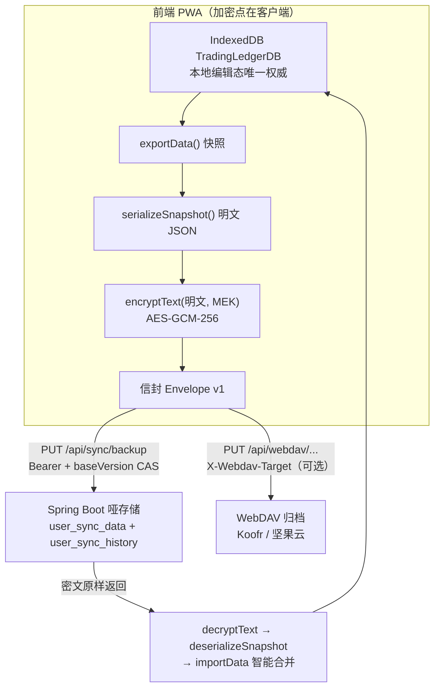
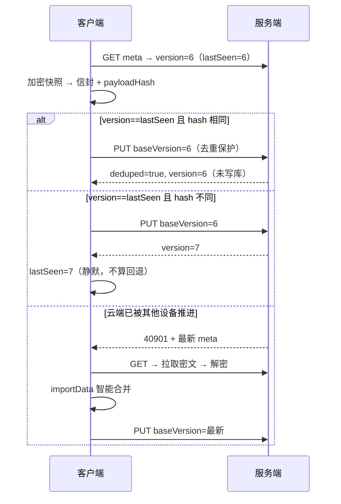
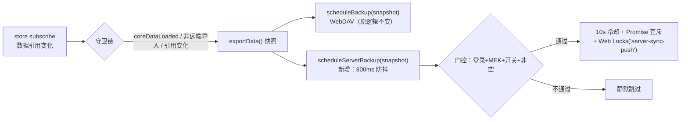

# 服务端密文同步（登录即备份）· 方案设计文档

> 版本：定稿 v1.2（2026-09-04；v1.1 = 后端事实核对修正 E1-E9 见 §0.2；v1.2 = §8.3 补 E9 等待不持锁的重调度约束）
> 范围：登录用户的零配置云端热同步通道——客户端加密快照 + 服务端哑存储 + 乐观版本号 CAS。含数据库表设计、API 契约、同步协议、触发管线、与 WebDAV 通道的关系划分。
> 关联：`docs/e2ee-auth-spec.md`（MEK 密钥体系；本方案落实其 §1.2 预留的二期「云端密文同步」）、`docs/copilot-spec.md` / `docs/copilot-implementation.md`（恒 200 信封、apiClient 底座、后端 Modulith 约定）、`README.md`（/api 同源代理架构）
> 状态：设计定稿，待开发启动（开发落点见 `docs/server-sync-implementation.md`）

---

## 0. 已确认决策记录

| # | 决策点 | 结论 |
|---|--------|------|
| D1 | 通道定位 | 服务端通道 = 登录用户的**默认热同步**（零配置：登录即备份）；WebDAV = 可选异地归档/镜像；两者独立开关、互不阻塞 |
| D2 | 后端定位 | 零知识哑存储：只校验信封**结构**（v/alg/iv/ct 齐全），永不解析、不检索、不解密业务内容 |
| D3 | 密钥 | 复用 E2EE 体系的 MEK（AES-GCM-256），登录会话内可得；**不新增**任何用户口令；跨设备可解（同一账号 MEK 相同） |
| D4 | 格式 | 密文信封 v1 = `{v, alg, iv, ct}`；明文 = 现有 `serializeSnapshot()` 输出，**不新造快照格式** |
| D5 | 版本号 | 服务端单调自增（每接受一次 PUT +1）；客户端只上送 `baseVersion` 做乐观 CAS；`baseVersion=0` 语义为「云端应为空」；时间戳仅展示不参与判定 |
| D6 | 冲突策略 | CAS 失败 → 拉取云端 → 本地智能合并（importData）→ 重推合并结果；**不提供**任何静默覆盖路径 |
| D7 | 幂等去重 | hash 相同即不写库：(a) `version==baseVersion` 且 hash 同；(b) `version==baseVersion+1` 且 hash 同（推送成功但响应丢失后的重试）。返回 deduped=true，重试零成本 |
| D8 | 历史保留 | 每次覆盖前把旧版本挪入 `user_sync_history`，保留最近 **5** 份；读取 API 二期 |
| D9 | 墓碑 | 空快照**禁止自动上传**（防 bug 清空云端）；仅显式「清空数据并同步云端」操作上传墓碑快照 |
| D10 | 频控 | 服务端单用户 PUT 间隔 ≥ 5s（42901，附 retryAfterSeconds）；前端 10s 冷却与之对齐 |
| D11 | 大小限制 | 信封 ≤ 2,000,000 字节（UTF-8）；默认值写死在代码 `@Value` defaultValue，**不进 yml**（避免触发 native 全量重建） |
| D12 | 触发管线 | 复用 `initAutoSync` 单管线双通道：`scheduleBackup` 之后并列服务端 `scheduleServerBackup`；守卫叠加「已登录 + MEK 可用 + 开关 + 非空快照」 |
| D13 | 实时性 | 无 WebSocket；启动 + `visibilitychange` + 15min 前台间隔做 meta 轻量对账 |
| D14 | 回退检测 | meta 对账发现云端 `version < lastSeenCloudVersion`（设备本地持久化）→ 判定服务端被回滚/恢复，本地告警不自动动作；本机自己推送成功导致的版本变化不算回退 |
| D15 | 未登录 | 服务端通道整体禁用（未登录全功能可用的体验不变，见 e2ee-auth-spec D6）；WebDAV 通道不受影响 |

### 0.2 后端事实核对修正（E1-E9，v1.1）

| # | 级别 | 问题 | 修正 | 前端影响 |
|---|---|---|---|---|
| E1 | 高 | user_id 误用 BIGINT；后端 UserEntity.id 是 UUID（copilot 先例 varchar(64) + String） | 两表 user_id 改 VARCHAR(64)，实体/Repository 用 String | 无（userId 不进前端契约） |
| E2 | 高 | newVersion=baseVersion+1 在「云端空但 base>0」路径错报（实际写入 v1），致客户端 lastSeen 错乱 → D14 假回退告警 | CAS 成功后回读数据库实际 version 返回；客户端 lastSeen 恒用返回值 | 无（前端规则本就是「lastSeen=返回值」，修正后假告警消失） |
| E3 | 高 | WebConfig 拦截白名单未登记 /api/sync/** → 端点无鉴权裸奔（拦截器只挂已注册路径） | 白名单登记 + 上线验收补 401 检查 | 无（前端本就恒带 Bearer） |
| E4 | 中 | 40901/40902/42901 需携带 data，但 BusinessException 无 data 字段 | Service 返回 PushOutcome，Controller 组装信封 | 无（恒 200 信封契约与 data 形状不变） |
| E5 | 中 | 示例误写 code:0；ApiResponse.success 恒 200、前端 apiClient 判 code===200 | 示例与映射统一为 200 | 文档级（serverSync.syncRequest 沿用 apiClient 判定） |
| E6 | 中 | Nginx 默认 client_max_body_size 1m < 2MB 信封上限 → 413 假故障 | 部署步骤补 client_max_body_size 2m；前端 413 归入 network 并提示反代配置 | 小（错误映射 + UI 文案） |
| E7 | 低 | 整库回滚后重推撞历史 (user_id, version) 唯一约束 | 历史插入 ON CONFLICT DO NOTHING 幂等吸收 | 无 |
| E8 | 低 | payloadHash / baseVersion 空值未定义 | 空 hash → 40003、空/非法 baseVersion → 40001 | 无（前端恒发送两字段，错误映射已覆盖） |
| E9 | 低 | 409 合并重推可能撞频控（冲突源于他设备刚写入，updated_at 新鲜） | 重推 42901 走 retryAfter 重试，不计入失败退避、不报 UI 错 | 小（ioSlice 冲突重推路径复用 42901 处理） |

## 1. 目标与非目标

### 1.1 目标

1. **零配置备份**：登录账号后数据自动端到端加密上传，无需填服务器/账号/路径/密码
2. **零知识**：数据库被完全泄露时攻击者只能拿到 AES-GCM 密文；服务器管理员同样不可读
3. **多端安全同步**：乐观版本号 CAS + 智能合并，多设备并发编辑不静默丢数据
4. **最小增量**：加密、防抖、互斥、合并全部复用既有设施，前端仅新增一个 service + 少量接线

### 1.2 非目标（本期不做）

- 端到端实时推送（WebSocket / SSE / 长轮询）
- 增量同步 / 分片上传（全量快照 + 恢复时智能合并；真增量需 manifest + 分片，独立迭代）
- 历史版本读取 API（表结构本期就位，API 二期）
- WebDAV 通道密文化改造（二期评估）
- 未登录用户的云端同步
- 后端业务检索能力（设计上不可能：后端无明文）

## 2. 总体架构



### 2.1 三存储定位

| 存储 | 角色 | 写入 | 读取 |
|---|---|---|---|
| IndexedDB（本地） | 编辑态唯一权威（source of truth） | 用户操作 | 全部功能 |
| 服务端 user_sync_data | 登录用户的密文热镜像（最新一份 + 5 份历史） | 防抖自动 + 手动 | 启动对账 / 手动恢复 |
| WebDAV（可选） | 异地归档 | 防抖自动（独立开关） | 手动恢复 |

### 2.2 关键架构原则

| 原则 | 说明 |
|---|---|
| 加密点在客户端 | 明文只在内存中短暂存在；出浏览器前必然已是信封密文 |
| 后端格式无关 | 后端只认信封结构，算法升级（v2）不需要后端发版 |
| 版本判定优先 | 冲突/新旧判断只认服务端版本号；时间戳仅 UI 展示（跨设备时钟不可信） |
| 失败不阻断 | 服务端通道任何失败不得阻塞本地功能；WebDAV 失败亦然 |
| 本地数据不动 | 同步通道不修改 TradingLedgerDB 结构；恢复走既有 importData 路径 |

## 3. 安全模型与威胁边界

### 3.1 密钥复用（零新增密钥材料）

| 项目 | 说明 |
|---|---|
| 数据密钥 | MEK（AES-GCM-256，随机生成终生不变），登录会话内由既有解封链路提供 |
| 解封路径 | 主密码派生 KEK 解封 / 助记词 Recovery Key 解封 / 本机 DeviceKey 免密——三选一，均不出客户端 |
| 跨设备 | 同一账号 MEK 相同 → 设备 A 加密的备份，设备 B 登录后可直接解密 |
| 改密码 | MEK 不变（仅重新封装）→ 历史密文仍可解 |

### 3.2 加密参数

| 项目 | 参数 |
|---|---|
| 算法 | AES-GCM-256（WebCrypto `AES-GCM`） |
| IV | 96-bit，每次加密随机新生成（`crypto.getRandomValues`） |
| 完整性 | GCM 认证标签；密文或 IV 被篡改 → 解密直接失败 |
| 编码 | iv / ct 均 base64 |

### 3.3 威胁边界

| 威胁 | 结论 |
|---|---|
| 数据库整库泄露 | ✅ 只有密文；离线爆破需先攻破 PBKDF2(100k) 保护的 MEK 封装 |
| 传输窃听 | ✅ TLS 之上再叠加一层应用层加密 |
| 服务器管理员 / 后端代码 | ✅ 无 MEK，技术上不可读 |
| 元数据分析（大小/时间/频率） | ❌ 不可防；信封大小与写入时间对服务端可见 |
| 服务端作恶：拒绝服务 / 回滚旧版本 | ❌ 不可防，但 D14 回退检测可发现回滚；历史表降低坏写入损失 |
| 本地设备明文 | ❌ 超出范围（与 E2EE 体系一致：防服务器不防本机） |
| 忘记密码 + 丢失助记词 | ❌ 数据永久不可解（账号级既有风险，非本方案新增） |

### 3.4 服务端安全清单（硬性）

1. `/api/sync/**` 全部要求 Bearer 认证（401 由既有拦截器统一处理）
2. `userId` 一律取自认证上下文（与 CopilotController 同法），**绝不**从请求体读取
3. 日志禁止输出 envelope 内容；只允许 `payloadHash` 前 8 位 + `payloadBytes`
4. 信封大小硬限（D11）；超限直接拒绝
5. 频控（D10）；仅对 PUT 生效

## 4. 数据格式规范（v1，冻结）

### 4.1 密文信封（`encrypted_payload` 列内容）

```json
{
  "v": 1,
  "alg": "A256GCM",
  "iv": "<base64, 解码后 12 字节>",
  "ct": "<base64, AES-GCM 密文+认证标签>"
}
```

| 字段 | 类型 | 约束 |
|---|---|---|
| v | number | 恒为 1（信封格式版本，非业务版本） |
| alg | string | 恒为 "A256GCM" |
| iv | string | base64，解码后 12 字节 |
| ct | string | base64 密文 |

- 服务端结构校验：JSON 对象 + 四字段存在 + v==1 + alg=="A256GCM" + iv/ct 非空字符串；**不**校验解码内容（D2）
- 明文（ct 解密后）= `serializeSnapshot()` 输出字符串原样：`{version, exportedAt, timestamp, feeConfig, tRounds, positions, stocks, longTermRecords}`；恢复侧经既有 `deserializeSnapshot()` 结构校验

### 4.2 校验和与体积

| 字段 | 定义 |
|---|---|
| payloadHash | `SHA-256(信封 JSON 字符串, UTF-8)` 的 64 位小写 hex；客户端计算、服务端原样存储比对（D7 去重） |
| payloadBytes | 信封 JSON 字符串的 UTF-8 字节数；服务端校验与请求声明一致 |

## 5. 数据库设计（PostgreSQL，两表）

### 5.1 user_sync_data（最新快照，每用户一行）

```sql
CREATE TABLE user_sync_data (
    user_id           VARCHAR(64) PRIMARY KEY,       -- E1：后端 UserEntity.id 为 UUID 字符串（copilot 先例 varchar(64)）；平铺不建物理外键
    encrypted_payload TEXT NOT NULL,                 -- 密文信封 JSON（§4.1）
    version           BIGINT NOT NULL,               -- 服务端单调自增，首传为 1
    payload_hash      VARCHAR(64),                   -- 信封 SHA-256（小写 hex），去重比对
    payload_bytes     INT  NOT NULL,
    created_at        TIMESTAMPTZ NOT NULL DEFAULT NOW(),
    updated_at        TIMESTAMPTZ NOT NULL DEFAULT NOW()
);
```

### 5.2 user_sync_history（被替换版本，保留最近 5 份）

```sql
CREATE TABLE user_sync_history (
    id                BIGSERIAL PRIMARY KEY,
    user_id           VARCHAR(64) NOT NULL,          -- E1：对齐 UserEntity.id UUID 字符串
    version           BIGINT NOT NULL,               -- 被替换时的云端版本号
    encrypted_payload TEXT NOT NULL,
    payload_bytes     INT  NOT NULL,
    created_at        TIMESTAMPTZ NOT NULL DEFAULT NOW(),
    CONSTRAINT uq_user_sync_history UNIQUE (user_id, version)
);
```

### 5.3 设计说明

| 点 | 理由 |
|---|---|
| version 服务端自增而非客户端上报 | 多设备并发时客户端版本号必撞号；服务端单点自增保证全序 |
| 单行主表 + 小历史表，而非全历史表 | meta/pull 恒为单行读，极简；历史仅作坏写入保险（D8） |
| 无物理外键 | 平铺 String（UUID，E1）；同步表生命周期与用户表解耦，便于清理 |
| 历史写入幂等 | ON CONFLICT (user_id, version) DO NOTHING：整库回滚后重推可能撞唯一约束（E7） |
| 历史裁剪 | 成功写入 newVersion 后：`DELETE ... WHERE user_id=? AND version <= newVersion - 5` |
| 体积评估 | 账本 JSON 通常 < 200KB，base64 后 < 300KB；TEXT 远未触及上限，2MB 硬限为滥用防护（D11） |

## 6. API 契约

### 6.1 通用约定

| 项 | 约定 |
|---|---|
| 路径前缀 | `/api/sync`（反代与 `/api/auth` 同法暴露到 Spring Boot :18080） |
| 认证 | Bearer Token 必需；401 由既有拦截器统一抛 SessionExpiredError |
| 响应 | 恒 200 HTTP + `ApiResponse{code, message, data}`；成功 code 恒为 200（ApiResponse.success，E5），业务错误码见 §6.3 |
| Content-Type | application/json |

### 6.2 端点

#### GET /api/sync/backup/meta

轻量对账：只回元信息，不回密文（D13 轮询的基础）。

```jsonc
// 云端为空
{ "code": 200, "message": "ok", "data": { "hasData": false, "version": 0 } }
// 云端有数据
{ "code": 200, "message": "ok", "data": {
    "hasData": true, "version": 7,
    "updatedAt": "2026-09-04T03:10:37Z",
    "payloadHash": "a1b2...", "payloadBytes": 287431 } }
```

#### GET /api/sync/backup

```jsonc
// 云端为空 → 业务错误
{ "code": 40401, "message": "云端暂无备份", "data": null }
// 成功
{ "code": 200, "message": "ok", "data": {
    "version": 7, "updatedAt": "...", "payloadHash": "...",
    "envelope": "{\"v\":1,\"alg\":\"A256GCM\",...}" } }
```

#### PUT /api/sync/backup

```jsonc
// 请求体
{ "baseVersion": 6,                 // 0=云端应为空（首传）；n=期望云端当前版本
  "envelope": "{\"v\":1,...}",       // 信封 JSON 字符串
  "payloadHash": "a1b2...",
  "payloadBytes": 287431 }
// 成功（含 dedup）
{ "code": 200, "message": "ok", "data": { "version": 7, "deduped": false } }
```

### 6.3 业务错误码总表

| code | 含义 | data | 前端动作 |
|---|---|---|---|
| 40001 | 信封结构非法 / baseVersion 缺失或非法（E8） | null | 提示重试（本地 bug） |
| 40002 | 信封超限（>2MB） | null | 引导清理沙盘归档 |
| 40003 | payloadHash 缺失或非法（非 64 位 hex，E8） | null | 提示重试 |
| 40901 | 版本冲突（云端 version != baseVersion） | 最新 meta | 拉取→合并→重推（§7.1） |
| 40902 | 首传冲突（baseVersion=0 但云端已有数据） | 最新 meta | 视为 40901 处理 |
| 40401 | 云端无备份（GET） | null | 走首传分支 |
| 42901 | 频控 | {retryAfterSeconds} | 按建议延迟静默重试一次，仍失败进退避 |

### 6.4 服务端判定顺序（PUT）

```
认证 → body 校验（envelope 结构 / 大小 / hash 格式 / bytes 一致性）
     → 去重（D7 两分支，先于频控，保证丢失响应后的重试零成本）
     → 频控（updated_at 距今 < 5s → 42901）
     → CAS Upsert（单语句，§7.2）→ 0 行 = 冲突（40901 / 40902 按 baseVersion 与 exists 区分）
     → 成功：旧版本挪历史 + 裁剪 → 返回新版本
```

去重两分支（D7）：
- (a) `version == baseVersion` 且 `payloadHash` 相同 → 重复推送，返回 deduped
- (b) `version == baseVersion + 1` 且 `payloadHash` 相同 → 推送成功但响应丢失的重试，返回 deduped

带 data 的业务错误（40901/40902/42901）由 Controller 组装信封（Service 返回 PushOutcome，E4）；40001/40003 无 data，可直接抛 BusinessException。

## 7. 同步协议

### 7.1 版本 CAS 状态机（上传）



### 7.2 CAS 单语句实现（防并发竞态的关键）

```sql
INSERT INTO user_sync_data (user_id, encrypted_payload, version, payload_hash, payload_bytes)
VALUES (:userId, :payload, 1, :hash, :bytes)
ON CONFLICT (user_id) DO UPDATE SET
    encrypted_payload = EXCLUDED.encrypted_payload,
    version           = user_sync_data.version + 1,
    payload_hash      = EXCLUDED.payload_hash,
    payload_bytes     = EXCLUDED.payload_bytes,
    updated_at        = NOW()
WHERE user_sync_data.version = :baseVersion;
```

- 返回受影响行数：`1` = 赢得写入；`0` = 冲突
- 首传（baseVersion=0）：行不存在时 INSERT 直接成功（ON CONFLICT 不触发，WHERE 不适用）；并发首传时后者落入 ON CONFLICT 且 `version(1) != 0` → 0 行 → 40902，无竞态窗口
- 云端为空但 baseVersion>0：INSERT 路径不校验 baseVersion，按首传成功（v1）处理；客户端推送成功后静默更新 lastSeen=1，不触发回退告警
- 历史行写入的前提是 CAS 成功：先读旧行再 CAS，成功才挪历史（CAS 失败则丢弃读到的行）
- **newVersion 以 CAS 成功后回读数据库实际 version 为准（E2）**：不用 base+1 推算（「云端空但 base=5」路径实际写入 v1）；客户端 lastSeen 恒采用响应返回值，假回退告警无从产生

### 7.3 拉取决策树（启动 / meta 变化时执行）

前置：`lastSeenCloudVersion`（设备本地 localStorage 持久化）；「有待传修改」= initAutoSync 的引用比较触发过且尚未成功推送。

| 云端 | 本地 | 动作 |
|---|---|---|
| 空 | 有数据 | 首传：PUT baseVersion=0 |
| 空 | 空 | 无动作 |
| v == lastSeen | 有待传修改 | 正常推送 |
| v == lastSeen | 无修改 | 无动作 |
| v > lastSeen | 无待传修改 | 拉取 → 解密 → importData 合并（静默，isSyncingFromRemote 防回环） |
| v > lastSeen | 有待传修改 | 拉取 → 解密 → 合并 → 用合并结果重推（走 7.1 冲突路径） |
| v < lastSeen | 任意 | **回退告警**（D14）：UI 提示「云端版本回退」，提供 [以本地覆盖云端] / [忽略]；不自动动作 |
| 未登录 / 无 MEK | — | 通道禁用（D15） |

### 7.4 墓碑（清空数据语义，D9）

- 自动管线遇空快照（tRounds/positions/stocks/longTermRecords 全空）**一律跳过**
- 显式「清空数据」流程：用户确认 → 本地清库 → 构造空快照墓碑 → force 推送（绕过空快照守卫）→ 云端空快照成为新版本
- 其他设备下次对账时 v 变化 → 拉到空快照 → importData 合并结果 = 本地清空（与用户意图一致）

### 7.5 回退检测（D14）

- `lastSeenCloudVersion` 随每次**本机推送成功**静默更新为返回版本（首传/覆盖都不算回退）
- 仅当 **meta 对账**发现 `version < lastSeen` 时告警——唯一可能来源是服务端从备份恢复/人为回滚
- 本地只告警 + 提供显式覆盖入口，不自动动作

### 7.6 前台对账（D13）

- `visibilitychange`（回到前台）+ 每 15min 定时：GET meta → 命中 §7.3 决策树
- meta 请求体积极小（无密文），移动端流量可忽略

## 8. 触发管线（前端，D12）

### 8.1 复用 initAutoSync 单管线双通道



### 8.2 门控规则（全部满足才推送）

1. 已登录且 MEK 在会话中可用（AuthGate 之后）
2. 服务端同步开关开启（默认开启；`server_sync_meta_v1.enabled`）
3. 快照非空（D9 墓碑保护）
4. 距上次成功推送 ≥ 10s（冷却，与 D10 对齐）
5. 无在途推送（Promise 互斥）
6. 未持有 Web Locks（跨标签页；锁名与 WebDAV 独立）

### 8.3 失败退避

- 连续失败：退避 = 10s × 2^n，上限 10min；成功后归零
- 42901：按 data.retryAfterSeconds 静默等待后重试一次，仍失败进入退避
- **409 合并后的重推也可能 42901（E9）**：冲突源于他设备刚写入、updated_at 新鲜——此路 42901 同样走 retryAfter 重试，不计入失败退避，也不向 UI 报错；等待**不持跨标签页锁**（释放后按 retryAfter 重调度，实现见开发文档 §5.3）
- 网络失败不影响本地功能，仅记入同步历史（复用 SyncHistoryEntry 模式）

## 9. 与 WebDAV 通道的关系

| 维度 | 服务端通道（本方案） | WebDAV 通道（现状） |
|---|---|---|
| 配置成本 | 零（登录即用） | 需填服务器/账号/应用密码 |
| 定位 | 热同步：最新状态镜像 | 异地归档/多服务商冗余 |
| 加密 | 信封密文（本方案起） | 明文 JSON（现状，密文化二期评估） |
| 版本控制 | 服务端 CAS + 5 份历史 | 单文件覆盖 |
| 触发 | 同一防抖管线并列触发 | 同左 |
| 失败隔离 | 互不影响；独立锁与冷却 | — |

- 快照采集复用：将 `serializeSnapshot` / `deserializeSnapshot` 从 webdavSync 提取至
  `services/snapshotService.ts`，两通道共用（webdavSync 保留 re-export 兼容既有测试）
- 两通道并发安全：各自 Promise 互斥 + 各自 Web Locks 锁名 + 各自冷却计时器

## 10. 限制与已知边界

| 项 | 边界 |
|---|---|
| 单快照大小 | 明文 > ~1.5MB 时 base64 后逼近 2MB 硬限 → 40002，UI 引导清理沙盘归档（TRoundArchive 已有归档机制） |
| 实时性 | 无推送；设备 B 的感知时机 = 启动 / 回前台 / 15min / 自身推送冲突 |
| 多标签页 | Web Locks 互斥；lastSeen 读写置于锁内，避免标签页竞态 |
| localStorage meta 丢失 | lastSeen 视为 0 → 云端有数据则静默合并（安全侧正确，最坏多合并一次） |
| Service Worker | navigateFallbackDenylist 已排除 /api，/api/sync 天然不入 SW 缓存 |
| 部署前提 | 反代需暴露 /api/sync（与 /api/auth 同法）且 `client_max_body_size ≥ 2m`（Nginx 默认 1m，会 413 假故障，E6）；未配置前通道自动退避，不报错打扰 |
| 频控时钟 | 服务端 updated_at 判定，状态在 DB，多实例部署仍成立 |

## 11. 二期展望

1. 压缩：明文 gzip 后再加密（信封加 `zip:"gzip"` 字段）；需 cryptoService 增加字节级 API；账本 JSON 预期压缩 70%+
2. 历史读取 API：GET /api/sync/backup/versions、/versions/{v}（表已就位）
3. WebDAV 密文化：同一信封格式写入 WebDAV；恢复时先探测明文 JSON（兼容旧备份）再解密
4. 增量同步：manifest + 分片 + 服务端只存增量块（成本高，独立立项）
5. DELETE /api/sync/backup：物理删除云端（含历史）
