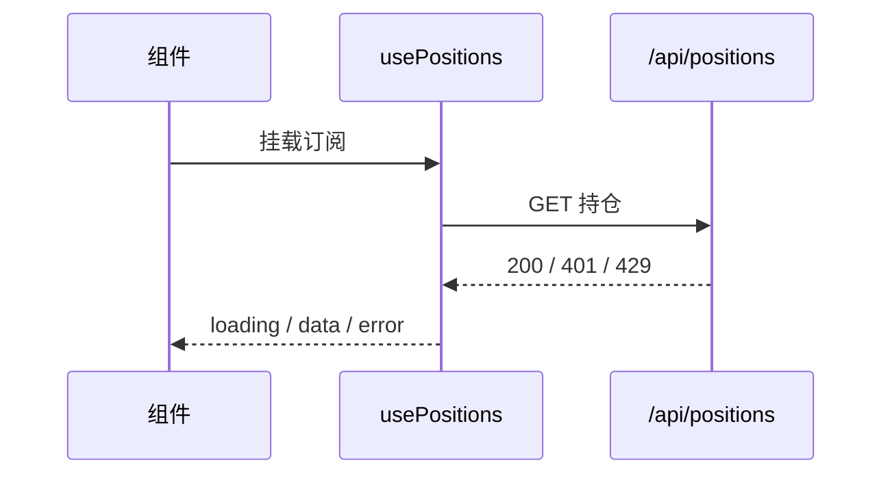

# 前端文档规范（Frontend Documentation Standard）

> 本规范是 `docs-spec`（工程文档机制层）在前端子域的**落地细则**。凡 `docs-spec` 已规定的通用条款（frontmatter 时效、Mermaid 唯一图表、废弃 Tombstone、README 纯结构索引、写后 lint）在本仓前端文档中**同样强制**，本文只补充前端特有部分，不重复通用规则。

## 1. 定位与适用范围

- 适用对象：本仓前端代码（React + TypeScript + Vite + Tailwind；含少量 Vue 遗留页面）。
- 三条总纲，贯穿全篇：
  - **类型即文档**：导出的 `interface` / `type` 是契约，优先于大段文字描述；
  - **就近即文档**：组件 / Hook / 工具函数的说明写在它上方（TSDoc / JSDoc），不在别处复述；
  - **可视化即文档**：UI 组件必须配可运行样例（Storybook 或最小 demo），比长文字更可靠。
- 与代码注释的边界：仅当逻辑**非显然**（算法、隐式契约、踩坑）才写代码注释；宏观架构、跨模块契约、API 约定落 `docs/`。

## 2. 文档分层（该写在哪里）

| 层 | 载体 | 写什么 |
|---|---|---|
| 代码内契约 | TSDoc + TS 类型 | 组件 Props、Hook 签名、工具函数、错误类型 |
| 可视化样例 | Storybook / 最小 demo | UI 组件外观、交互态、边界态 |
| 工程文档 | `docs/`（本文所在体系） | 架构决策、状态设计、API 契约、构建/部署、设计规范 |
| 图 | Mermaid 代码块 | 组件树、数据流、状态机、请求时序 |

原则：能由类型推导的不写文档；能由样例展示的不写文字；文档只补类型与样例承载不了的部分（为什么、权衡、约束）。

## 3. 必写文档类型与最小模板

### 3.1 组件文档（Component）

每个**对外/复用**组件，于其文件顶部写 TSDoc，并维护一份 Props 表（仓库 `docs/` 内的组件级说明文按需建）：

```ts
/**
 * 持仓卡片：展示单只标的的市值、盈亏与预警态。
 * @remarks 仅负责展示；数据获取与写入由调用方经 store 注入。
 * @a11y 卡片可聚焦，回车触发 onSelect；预警态需额外 aria-label。
 */
export function PositionCard(props: PositionCardProps) { /* ... */ }
```

Props 表（写进 `docs/` 对应文档或 Storybook notes）：

| 名称 | 类型 | 必填 | 默认值 | 说明 |
|---|---|---|---|---|
| `position` | `Position` | 是 | — | 单持仓数据（见 `types/position`） |
| `onSelect` | `(id: string) => void` | 否 | — | 选中回调 |
| `variant` | `'default' \| 'compact'` | 否 | `'default'` | 紧凑模式用于列表 |

要点：边界/异常态（空数据、加载中、错误）、依赖的设计 token、可访问性要求。

### 3.2 Hook 文档

说明**输入输出、副作用、依赖数组陷阱、示例**：

```ts
/**
 * usePositions：订阅持仓切片，返回数据与刷新方法。
 * @returns [positions, { refresh, loading, error }]
 * @sideEffect 挂载时拉取一次；依赖 token 变化重新订阅。
 * @note 勿在 render 中直接调用 refresh 造成循环。
 */
```

### 3.3 页面 / 路由文档

每个路由级页面记录：路由路径、入参（query/params）、权限要求、关联的 store 切片、涉及组件、数据获取时机（SSR/CSR/懒加载）。用一张 Mermaid `flowchart` 串起「进入 → 取数 → 渲染 → 失败分支」。

### 3.4 状态管理文档

记录 store 切片：state shape（直接引 TS 类型）、actions、selectors、副作用、持久化策略。state shape **以类型为准**，文档只描述类型表达不了的部分（何时清空、跨切片依赖）。

### 3.5 API 契约文档（前端视角）

前端侧的接口文档**以 TypeScript 类型 + 后端 OpenAPI 为准**，禁止在组件里散落字段猜测。每个外部接口记录：

| 项 | 内容 |
|---|---|
| 端点 / 方法 | `GET /api/positions` |
| 请求类型 | `ListPositionsReq`（引类型） |
| 响应类型 | `ListPositionsRes` |
| 错误码映射 | 401→重新登录；429→退避重排 |
| 前端状态映射 | loading / error / empty 三态如何落到 UI |

变化时：先改类型与契约文档，再改调用处（类型报错即文档生效）。

### 3.6 构建 / 开发环境文档（Vite）

记录：脚本（dev/build/preview）、`import.meta.env` 环境变量清单（含 `.env` / `.env.production` 来源，见全局 `params.env` 机制）、dev server 代理、产物结构与部署目标。

### 3.7 样式 / 设计 token 文档（Tailwind）

- 颜色 / 间距 / 字号一律走 `tailwind.config.js` 的设计变量，**禁止组件内硬编码色值 / 魔法数字**；
- 暗色模式、响应式断点、RTL 的约定；
- 若引入新 token，先在 config 注册并补一句语义说明。

### 3.8 测试文档

单测（Vitest）/ 组件测试 / E2E 的**策略边界**：哪些必须单测、mock 到哪一层（API client 还是 store）、可视化回归如何触发。避免"为覆盖率而测"。

## 4. 前端专属写作原则

1. **类型优先**：导出类型并被引用；能用 `type` 表达的不写散文；`any` 视为文档缺失，需注释说明为何不可类型化。
2. **就近不重复**：组件/Hook 说明只在其上方 TSDoc 出现一次；`docs/` 里只写跨模块内容，引用类型用相对路径。
3. **可视化优先**：UI 组件无样例不视为完成；截图/Storybook 链接优于大段文字。
4. **状态与副作用显式化**：数据流、订阅关系用 Mermaid，忌口述"数据从哪来"。
5. **可访问性与国际化必写**：aria、键盘可达、焦点管理、`i18n` key 的命名与缺失兜底。
6. **性能预算可查**：首屏 / 包体 / 长列表虚拟化等指标写在相关文档，CI 超限即告警。

## 5. 图表标准（前端视角，强制 Mermaid，禁 ASCII）

| 场景 | 图类型 |
|---|---|
| 组件组合 / 页面结构 | `flowchart TD` |
| 数据流 / 请求时序 | `sequenceDiagram` |
| 组件内部状态机（加载/错误/空） | `stateDiagram-v2` |
| 路由与权限 | `flowchart TD` |



## 6. 时效与废弃

- 严格按 `docs-spec`：frontmatter 仅 `status` / `updated`；**实质修改正文同轮刷新 `updated`**。
- 废弃组件 / Hook：代码侧标 `@deprecated` TSDoc + 指向继任；`docs/` 对应文走 Tombstone（改 `status: deprecated` + 标题下墓碑行），不删不改正文。
- API 契约随后端版本演进，前端文档与类型一并更新，避免"文档说一套、类型另一套"。

## 7. 写后自检清单（lint）

- [ ] 对外组件 / Hook 有 TSDoc，Props / 签名表齐全；
- [ ] 导出的关键类型被引用，无孤立 `any` 未说明；
- [ ] 图均为 Mermaid，无 ASCII 画图（对齐 `docs-spec` §3）；
- [ ] UI 组件有可运行样例或 Storybook 链接；
- [ ] 含 `@a11y` / `i18n` 要点；
- [ ] 文档与 TS 类型一致（字段名、错误码）；
- [ ] frontmatter 合法、`updated` 已刷新；
- [ ] 文档间引用为仓库相对路径。

## 8. 反模式

- ❌ 在组件体内写大段中文说明，而非 TSDoc / 类型；
- ❌ 用 `any` 逃避类型文档（缺失即未文档化）；
- ❌ 组件内硬编码色值 / 间距（应走 Tailwind token）；
- ❌ 文档描述与 TS 类型不一致（字段、错误码对不上）；
- ❌ ASCII 字符画流程图；
- ❌ 忽略可访问性 / 国际化（当然后端无关，但前端必写）；
- ❌ 接口字段在组件里"猜"，不回归契约文档与类型。
